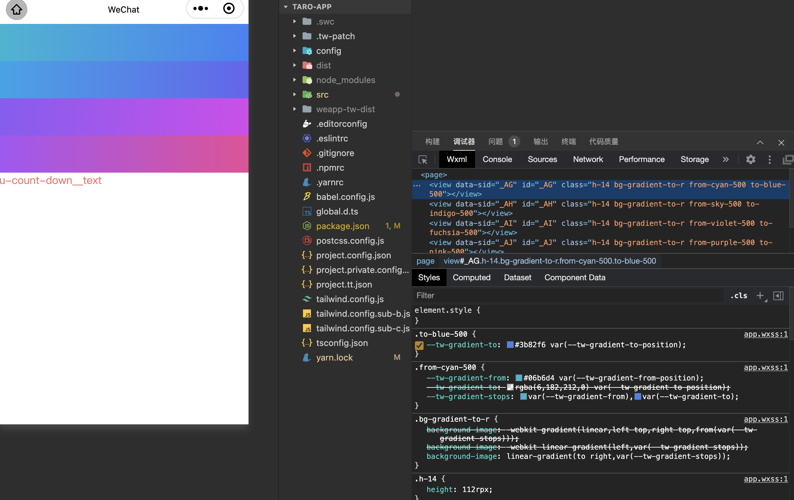

# CSS 变量失效问题

## 问题的现象

在 `Taro`、`uni-app` 等小程序项目中，可能会遇到 Tailwind CSS 变量丢失的问题。

常见表现是渐变类名没有效果。例如下面这些类名在模拟器里没有背景色：

```jsx
<View className='h-14 bg-gradient-to-r from-cyan-500 to-blue-500'></View>
<View className='h-14 bg-gradient-to-r from-sky-500 to-indigo-500'></View>
<View className='h-14 bg-gradient-to-r from-violet-500 to-fuchsia-500'></View>
<View className='h-14 bg-gradient-to-r from-purple-500 to-pink-500'></View>
```

## 原因与处理方式

这些工具类依赖 Tailwind 生成的 CSS 变量。如果最终的 `app.wxss` / `app.css` 里没有变量初始化区域，渐变、阴影、ring、transform 等样式就可能失效。参阅[什么是 Tailwind CSS 变量初始化区域](#什么是-tailwind-css-变量初始化区域)。

一个常见场景是 Taro 项目同时使用 `@tarojs/plugin-html`，构建过程中把 Tailwind 的变量初始化区域删掉了。

可以先在 `WeappTailwindcss` 配置里开启：

```ts
WeappTailwindcss({
  injectAdditionalCssVarScope: true,
})
```

代码片段和配置详情详见[和 NutUI 一起使用](./use-with-nutui)。

## 设置成功后的效果

设置成功之后的效果如下所示，可以观察一下左侧的效果，和右下角的 `inspect` 面板作为参考



## 什么是 Tailwind CSS 变量初始化区域

在 `app.wxss` 样式产物文件中（例如 Taro 或 uni-app 的 `dist` 目录），通常会有一块 Tailwind 变量初始化 CSS。

如果这块区域被删掉，依赖 CSS 变量的工具类就会出问题。

```css
::before,::after {
  --tw-content: "";
}
view,text,::before,::after {
  --tw-border-spacing-x: 0;
  --tw-border-spacing-y: 0;
  --tw-translate-x: 0;
  --tw-translate-y: 0;
  --tw-rotate: 0;
  --tw-skew-x: 0;
  --tw-skew-y: 0;
  --tw-scale-x: 1;
  --tw-scale-y: 1;
  --tw-pan-x:  ;
  --tw-pan-y:  ;
  --tw-pinch-zoom:  ;
  --tw-scroll-snap-strictness: proximity;
  --tw-gradient-from-position:  ;
  --tw-gradient-via-position:  ;
  --tw-gradient-to-position:  ;
  --tw-ordinal:  ;
  --tw-slashed-zero:  ;
  --tw-numeric-figure:  ;
  --tw-numeric-spacing:  ;
  --tw-numeric-fraction:  ;
  --tw-ring-inset:  ;
  --tw-ring-offset-width: 0px;
  --tw-ring-offset-color: #fff;
  --tw-ring-color: rgb(59 130 246 / 0.5);
  --tw-ring-offset-shadow: 0 0 #0000;
  --tw-ring-shadow: 0 0 #0000;
  --tw-shadow: 0 0 #0000;
  --tw-shadow-colored: 0 0 #0000;
  --tw-blur:  ;
  --tw-brightness:  ;
  --tw-contrast:  ;
  --tw-grayscale:  ;
  --tw-hue-rotate:  ;
  --tw-invert:  ;
  --tw-saturate:  ;
  --tw-sepia:  ;
  --tw-drop-shadow:  ;
  --tw-backdrop-blur:  ;
  --tw-backdrop-brightness:  ;
  --tw-backdrop-contrast:  ;
  --tw-backdrop-grayscale:  ;
  --tw-backdrop-hue-rotate:  ;
  --tw-backdrop-invert:  ;
  --tw-backdrop-opacity:  ;
  --tw-backdrop-saturate:  ;
  --tw-backdrop-sepia:  ;
  box-sizing: border-box;
  border-width: 0;
  border-style: solid;
  border-color: currentColor;
}
::backdrop {
  --tw-border-spacing-x: 0;
  --tw-border-spacing-y: 0;
  --tw-translate-x: 0;
  --tw-translate-y: 0;
  --tw-rotate: 0;
  --tw-skew-x: 0;
  --tw-skew-y: 0;
  --tw-scale-x: 1;
  --tw-scale-y: 1;
  --tw-pan-x:  ;
  --tw-pan-y:  ;
  --tw-pinch-zoom:  ;
  --tw-scroll-snap-strictness: proximity;
  --tw-gradient-from-position:  ;
  --tw-gradient-via-position:  ;
  --tw-gradient-to-position:  ;
  --tw-ordinal:  ;
  --tw-slashed-zero:  ;
  --tw-numeric-figure:  ;
  --tw-numeric-spacing:  ;
  --tw-numeric-fraction:  ;
  --tw-ring-inset:  ;
  --tw-ring-offset-width: 0px;
  --tw-ring-offset-color: #fff;
  --tw-ring-color: rgb(59 130 246 / 0.5);
  --tw-ring-offset-shadow: 0 0 #0000;
  --tw-ring-shadow: 0 0 #0000;
  --tw-shadow: 0 0 #0000;
  --tw-shadow-colored: 0 0 #0000;
  --tw-blur:  ;
  --tw-brightness:  ;
  --tw-contrast:  ;
  --tw-grayscale:  ;
  --tw-hue-rotate:  ;
  --tw-invert:  ;
  --tw-saturate:  ;
  --tw-sepia:  ;
  --tw-drop-shadow:  ;
  --tw-backdrop-blur:  ;
  --tw-backdrop-brightness:  ;
  --tw-backdrop-contrast:  ;
  --tw-backdrop-grayscale:  ;
  --tw-backdrop-hue-rotate:  ;
  --tw-backdrop-invert:  ;
  --tw-backdrop-opacity:  ;
  --tw-backdrop-saturate:  ;
  --tw-backdrop-sepia:  ;
}
```

这块区域是 Tailwind 入口展开后生成的变量初始化代码，来自 `@import "tailwindcss";` 对应的生成结果。

丢失这块区域会导致 `bg-gradient-to-r` 这类依赖 CSS 变量的工具类失效。
