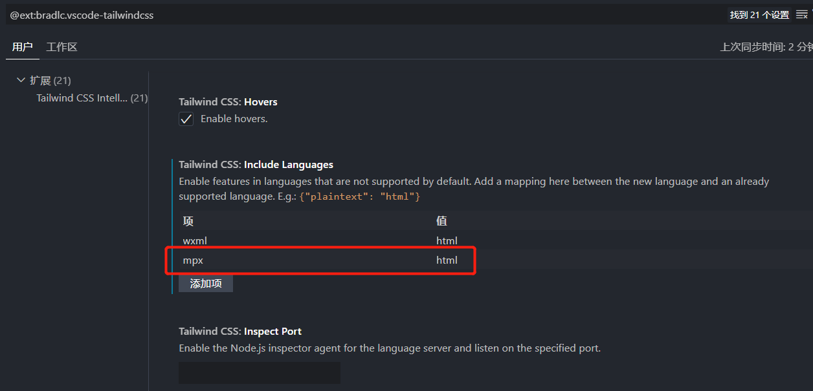

import ExternalClassesReminder from '@site/fragments/ExternalClassesReminder.mdx'

# mpx (原生增强)

<ExternalClassesReminder framework="mpx" />

在 `vue.config.js` 中注册：

```js title="vue.config.js"
const { defineConfig } = require('@vue/cli-service')
const { WeappTailwindcss } = require('weapp-tailwindcss/webpack')
const path = require('node:path')

module.exports = defineConfig({
  // other options
  configureWebpack(config) {
    config.plugins.push(
      new WeappTailwindcss({
        rem2rpx: true,
        appType: 'mpx',
        cssEntries: [
          path.resolve(__dirname, 'src/app.css'),
        ],
      })
    )
  }
})

```

## 引入 Tailwind CSS 样式

Tailwind CSS 3.x 项目继续使用 `@tailwind` 指令，CSS 生成由 `WeappTailwindcss` 接管。

```css title="src/app.css"
@tailwind base;
@tailwind components;
@tailwind utilities;
```

```html title="src/app.mpx"
<style lang="css">
  @import './app.css';
</style>
```

Tailwind CSS 4.x 项目请使用 [Mpx v4 接入文档](/docs/quick-start/v4/mpx)，入口 CSS 使用 `@import "tailwindcss";` 和 `@source`。

## mpx 中的 vscode tailwindcss 智能提示缺失设置

我们知道 `tailwindcss` 最佳实践，是要结合 `vscode`/`webstorm`提示插件一起使用的。

假如你遇到了，在 `vscode` 的 `mpx` 文件中，编写 `class` 没有出智能提示的情况，可以参考以下步骤。

这里我们以 `vscode` 为例:

接着找到 `Tailwind CSS IntelliSense` 的 `扩展设置`

在 `include languages`,手动标记 `mpx` 的类型为 `html`



保存设置，再去`mpx`文件里写`class`的时候，智能提示就出来啦。
