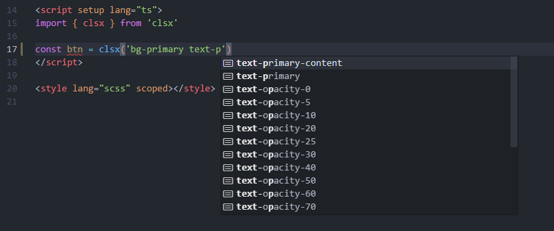

# IDE 智能提示设置

## VS Code

> 首先，确保你已经安装 [`Tailwind CSS IntelliSense 插件`](https://marketplace.visualstudio.com/items?itemName=bradlc.vscode-tailwindcss)

### js,jsx,ts,tsx,vue...这类文件的智能提示

配置好插件后，我们在写代码时，写到那些标签中的 `class=`,`className=`，这种场景时，智能提示一下子就可以出来。

然而我们在写 `js` 代码的时候，很多时候是直接在代码里，去写 `tailwindcss` 字符串字面量，比如:

```jsx
const clsName = 'bg-[#123456] text-[#654321]'

return <div className={clsName}></div>
```

写这种字符串是没有任何的智能提示的，怎么办呢？

这里给出一种基于插件的解决方案：

1. 安装 `clsx`:

```bash
<npm|yarn|pnpm> i clsx
```

2. 进入你的 `vscode` 设置的 [`settings.json`](https://code.visualstudio.com/docs/getstarted/settings)

在里面加入下方的配置:

```json
{
  "tailwindCSS.experimental.classRegex": [
    [
      "clsx\\(([^)]*)\\)",
      "(?:'|\"|`)([^']*)(?:'|\"|`)"
    ]
  ]
}
```

这样配置之后，智能提示就出来了:



[Refer link](https://github.com/lukeed/clsx#tailwind-support)

这种原理也是依赖正则匹配，即 `Tailwind CSS IntelliSense 插件` 匹配到了当前 `vscode` 活动的文本域中，存在着 `clsx()` 方法这个关键词，所以就把智能提示给注入进去。

所以你这样写就不会生效:

```js
import { clsx as AAA } from 'clsx'

const btn = AAA('')
```

另外，你可以依据这个特性，修改/添加 `"tailwindCSS.experimental.classRegex"` 里的正则，然后自行封装一个方法，用来进行 `tailwindcss` 的智能提示。

### wxml 的智能提示

我们知道 `tailwindcss` 最佳实践，是要结合 `vscode`/`webstorm`提示插件一起使用的。

假如你遇到了，在 `vscode` 的 `wxml` 文件中，编写 `class` 没有出智能提示的情况，可以参考以下步骤。

这里我们以 `vscode` 为例:

安装 [`WXML - Language Services 插件`](https://marketplace.visualstudio.com/items?itemName=qiu8310.minapp-vscode)(一搜 wxml 下载量最多的就是了)

接着找到 `Tailwind CSS IntelliSense` 插件的 `扩展设置`

在 `include languages`,手动标记 `wxml` 的类型为 `html`


智能提示就出来了:


## WebStorm

> 和 `vscode` 方式类似，同样使用 `clsx` 函数

1. 确保你的版本大于等于 [WebStorm 2023.1](https://www.jetbrains.com/webstorm/whatsnew/#version-2023-1-tailwind-css-configuration)

2. 打开设置，前往 [Languages and Frameworks | Style Sheets | Tailwind CSS](https://www.jetbrains.com/help/webstorm/tailwind-css.html#ws_css_tailwind_configuration)

3. 添加以下的配置:

```json
{
  "experimental": {
    "classRegex": ["clsx\\(([^)]*)\\)", "[\"'`]([^\"'`]*).*?[\"'`]"]
  }
}
```

> 如果你使用 `class-variance-authority` 的 `cva` 函数，只需再添加 `"cva\\(([^)]*)\\)"` 正则即可。

## HbuilderX

<https://ext.dcloud.net.cn/plugin?id=8560>
