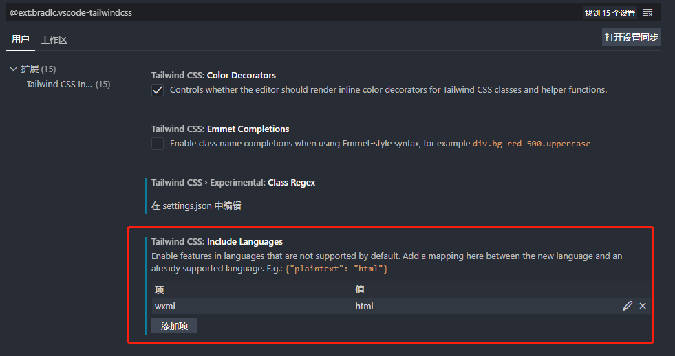
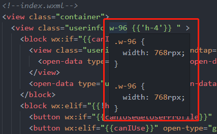
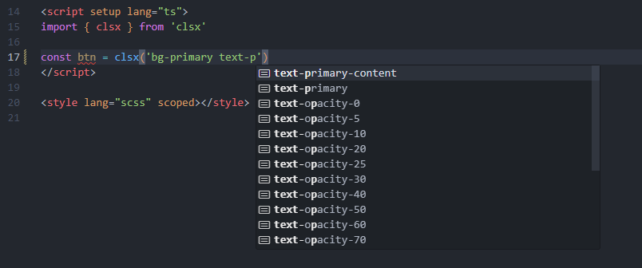

# IDE 智能提示设置

## VS Code

> 首先，确保你已经安装 [`Tailwind CSS IntelliSense 插件`](https://marketplace.visualstudio.com/items?itemName=bradlc.vscode-tailwindcss)

### 让 `Tailwind CSS IntelliSense` 识别 weapp-tailwindcss v4

`tailwindcss-intellisense` 在 v4 中必须看到 `@import "tailwindcss"` 才会将工作区视为 Tailwind 根文件。从 v4.7.10 起，`weapp-tailwindcss` 默认会在构建阶段把这些 `@import 'tailwindcss'` 自动改写成 `@import 'weapp-tailwindcss'`（可通过 `rewriteCssImports: false` 关闭）。这意味着你可以直接在项目入口写 `@import 'tailwindcss';` 以获得 IntelliSense，而插件会在最早的 PostCSS 流程中替换成小程序可用的样式。

如果仍希望与源码解耦，也可以使用 CLI 为 VS Code 生成一个仅供扩展使用的辅助 CSS：

```bash npm2yarn
npx weapp-tailwindcss vscode-entry --css src/app.css
```

- 默认输出在 `.vscode/weapp-tailwindcss.intellisense.css`，其中包含 `@import 'tailwindcss';`、常见的 `@source` globs 以及你传入的 CSS 入口（例如 `src/app.css`）。
- 该文件只用于激活 IntelliSense，不需要、也不应该被打包流程引用。
- 若需自定义文件名或额外的 `@source`，可通过 `--output`、`--source`、`--force` 等参数调整，运行 `npx weapp-tailwindcss vscode-entry --help` 查看全部选项。
- 如果不想生成独立文件，可以直接在真实入口写 `@import 'tailwindcss';`，默认启用的 `rewriteCssImports` 会让 webpack/vite 在 CSS 解析阶段把它映射到 `weapp-tailwindcss`（只影响样式导入，JS/TS `import 'tailwindcss'` 不会被修改）。

保存/重载任意文件后 VS Code 会检测到该辅助文件，从而让 `@import 'weapp-tailwindcss';` 的项目享受到完整的补全、悬浮和跳转体验。

如果你希望显式告诉 `Tailwind CSS IntelliSense`“某个 CSS 根文件对应哪些源码目录”，可以继续补充 `tailwindCSS.experimental.configFile`：

```json title=".vscode/settings.json"
{
  "tailwindCSS.experimental.configFile": {
    ".vscode/weapp-tailwindcss.intellisense.css": "src/**"
  }
}
```

- 键名是给 `Tailwind CSS IntelliSense` 使用的 CSS 入口文件路径，它通常需要包含 `@import "tailwindcss";`。
- 键值是这个入口生效的源码范围，支持 glob；上面的配置表示，当你编辑 `src/**` 下的文件时，扩展会使用 `.vscode/weapp-tailwindcss.intellisense.css` 作为 Tailwind 根文件。
- 在 monorepo 或一个工作区里有多个 Tailwind 入口时，这种写法比“让扩展自动猜测”更稳定，也适合配合 `npx weapp-tailwindcss vscode-entry` 生成的辅助 CSS 一起使用。

### wxml 的智能提示

我们知道 `tailwindcss` 最佳实践，是要结合 `vscode`/`webstorm`提示插件一起使用的。

假如你遇到了，在 `vscode` 的 `wxml` 文件中，编写 `class` 没有出智能提示的情况，可以参考以下步骤。

这里我们以 `vscode` 为例:

安装 [`WXML - Language Services 插件`](https://marketplace.visualstudio.com/items?itemName=qiu8310.minapp-vscode)(一搜 wxml 下载量最多的就是了)

然后下方提供了 `2` 种方式, `全局设置` 和 `工作区设置`, 根据你的需求仍选其一即可

#### 全局设置

点击 `vscode` 左下角的设置图标里，通过搜索关键词 `tailwindcss` ，找到 `Tailwind CSS IntelliSense` 插件的 `扩展设置`

在 `include languages`,手动标记 `wxml` 的类型为 `html`



智能提示就出来了:



#### 工作区设置

在你的打开的工作区目录的根目录里，创建 `.vscode` 文件夹，然后添加 `settings.json` 内容如下:

```json
{
  "tailwindCSS.includeLanguages": {
    "wxml": "html"
  }
}
```

这样就通过你工作区的 `vscode` 设置，去覆盖了你全局的 `vscode` 设置，也能够达到上图中的效果。

### js,jsx,ts,tsx,vue...这类文件的智能提示

#### 场景

在安装配置好插件后，我们在写代码时，写到那些标签中的 `class=`,`className=`，这种场景时，智能提示一下子就可以出来。

然而我们在写 `js` 代码的时候，很多时候是直接在代码里，去写 `tailwindcss` 字符串字面量，比如:

```jsx
const clsName = 'bg-[#123456] text-[#654321]'

return <div className={clsName}></div>
```

写这种字符串是没有任何的智能提示的，怎么办呢？

#### 解决方案

这里给出一种基于插件的解决方案：

1. 安装 `clsx`:

```bash npm2yarn
npm i clsx
```

2. 进入你的 `vscode` 设置的 [`settings.json`](https://code.visualstudio.com/docs/getstarted/settings)

在里面加入下方的配置:

```json
{
  "tailwindCSS.experimental.classRegex": [
    [
      "clsx\\(([^)]*)\\)",
      "(?:'|\"|`)([^']*)(?:'|\"|`)"
    ]
  ]
}
```

这样配置之后，智能提示就出来了:



[Refer link](https://github.com/lukeed/clsx#tailwind-support)

#### 存在问题

这种原理也是依赖正则匹配，即 `Tailwind CSS IntelliSense 插件` 匹配到了当前 `vscode` 活动的文本域中，存在着 `clsx()` 方法这个关键词，所以就把智能提示给注入进去。

所以你这样写就不会生效:

```js
import { clsx as AAA } from 'clsx'

const btn = AAA('')
```

另外，你可以依据这个特性，修改/添加 `"tailwindCSS.experimental.classRegex"` 里的正则，然后自行封装一个方法，用来进行 `tailwindcss` 的智能提示。

## WebStorm

> 和 `vscode` 方式类似，同样使用 `clsx` 函数

1. 确保你的版本大于等于 [WebStorm 2023.1](https://www.jetbrains.com/webstorm/whatsnew/#version-2023-1-tailwind-css-configuration)

2. 打开设置，前往 [Languages and Frameworks | Style Sheets | Tailwind CSS](https://www.jetbrains.com/help/webstorm/tailwind-css.html#ws_css_tailwind_configuration)

3. 添加以下的配置:

```json
{
  "experimental": {
    "classRegex": ["clsx\\(([^)]*)\\)", "[\"'`]([^\"'`]*).*?[\"'`]"]
  }
}
```

> 如果你使用 `class-variance-authority` 的 `cva` 函数，只需再添加 `"cva\\(([^)]*)\\)"` 正则即可。

## HbuilderX

<https://ext.dcloud.net.cn/plugin?id=8560>
