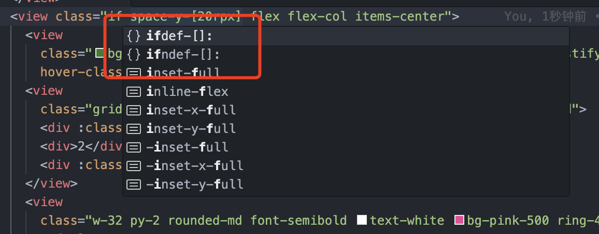
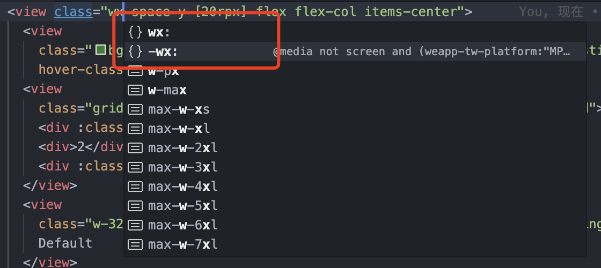

# uni-app 条件编译语法糖插件

> 版本需求 2.10.0+

## 这是什么玩意?

在 `uni-app` 里，存在一种类似宏指令的[样式条件编译写法](https://uniapp.dcloud.net.cn/tutorial/platform.html#%E6%A0%B7%E5%BC%8F%E7%9A%84%E6%9D%A1%E4%BB%B6%E7%BC%96%E8%AF%91):

```css
/*  #ifdef  %PLATFORM%  */
平台特有样式
/*  #endif  */
```

> uni-app `%PLATFORM%` 的所有取值可以参考这个[链接](https://uniapp.dcloud.net.cn/tutorial/platform.html#preprocessor)

在 `weapp-tailwindcss@2.10.0+` 版本中内置了一个 `css-macro` 功能，可以让你的 `tailwindcss` 自动生成带有条件编译的样式代码，来辅助你进行多平台的适配开发，效果类似如下方式:

```html
<!-- 默认 -->
<view class="ifdef-[H5||MP-WEIXIN]:bg-blue-400">Web和微信小程序平台蓝色背景</view>
<view class="ifndef-[MP-WEIXIN]:bg-red-500">非MP-WEIXIN平台红色背景</view>
<view class="ifdef-[MP-WEIXIN]:bg-blue-500 ifndef-[MP-WEIXIN]:bg-red-500">微信小程序为蓝色，不是微信小程序为红色<view>
<!-- 自定义 -->
<view class="wx:bg-blue-400 -wx:bg-red-400">微信小程序为蓝色，不是微信小程序为红色</view>
<view class="tt:bg-blue-400">头条小程序蓝色</view>
```

或者这样的条件样式代码:

```css
/*只在 H5 和 MP-WEIXIN, 背景为蓝色，否则为红色 */
.apply-test-0 {
  @apply ifdef-[H5||MP-WEIXIN]:bg-blue-400 ifndef-[H5||MP-WEIXIN]:bg-red-400;
}
/* 自定义 */
.apply-test-1 {
  @apply mv:bg-blue-400 -mv:bg-red-400 wx:text-blue-400 -wx:text-red-400;
}
```

让我们看看如何使用吧！

## 如何使用

现在只需要在 Tailwind CSS 侧声明 `weapp-tailwindcss/css-macro`。`weapp-tailwindcss` 会在生成样式时自动感应这个声明，并内置执行条件编译注释转换，不需要再额外注册 `weapp-tailwindcss/css-macro/postcss`。

新版本的宏变体不会再通过伪 `@media (weapp-tw-platform:...)` 表达平台条件，而是由 `weapp-tailwindcss` 在生成阶段直接输出内部条件节点，再转换为 `/* #ifdef */` / `/* #ifndef */` / `/* #endif */` 注释。存量自定义 PostCSS 流程中的旧 `@media` 写法仍会被兼容处理。

### tailwind.config.js 注册

首先在你的 `tailwind.config.js` 注册插件 `cssMacro`:

#### Tailwind CSS 3.x 配置

```js
const cssMacro = require('weapp-tailwindcss/css-macro');
/** @type {import('tailwindcss').Config} */
module.exports = {
  // ...
  plugins: [
    /* 这里可以传入配置项，默认只包括 ifdef 和 ifndef */
    cssMacro(),
  ],
};
```

#### Tailwind CSS 4.x 配置

> v4 推荐直接在入口 CSS 中通过 `@plugin` 引入。

```css
/* tailwind.css */
@import "tailwindcss";
@plugin "weapp-tailwindcss/css-macro";

/* 可选：为常用平台创建语义别名 */
@utility platform-weixin:(value) {
  @apply ifdef-[MP-WEIXIN]:$(value);
}
@utility not-alipay:(value) {
  @apply ifndef-[MP-ALIPAY]:$(value);
}
```

若需要自定义更多静态变体，可额外保留一个 `tailwind.config.ts` 以传入参数：

```ts
import cssMacro from 'weapp-tailwindcss/css-macro'

export default {
  plugins: {
    cssMacro: cssMacro({
      variantsMap: {
        wx: 'MP-WEIXIN',
        '-wx': { value: 'MP-WEIXIN', negative: true },
      },
    }),
  },
}
```

> [!TIP]
> `cssMacro` 的动态变体（`ifdef:` / `ifndef:`）依赖 Tailwind 内置的 `matchVariant`，请确保 Tailwind 版本 ≥ 3.2；在 v4 中该 API 同样可用。

### PostCSS 配置说明

新版本不再要求你手动注册 `weapp-tailwindcss/css-macro/postcss`。只要满足下面任一条件，`weapp-tailwindcss` 就会自动开启宏转换：

| Tailwind 版本 | 感应方式 | 示例 |
| --- | --- | --- |
| v3 | `tailwind.config.js` 的 `plugins` 中注册 `cssMacro()` | `plugins: [cssMacro()]` |
| v4 | CSS 入口中声明 `@plugin "weapp-tailwindcss/css-macro"` | `@plugin "weapp-tailwindcss/css-macro";` |

如果项目里还保留了旧的 PostCSS 注册项，可以直接删除：

```diff
// vite.config.ts / postcss.config.js
plugins: [
-  require('weapp-tailwindcss/css-macro/postcss'),
]
```

> 提示：`weapp-tailwindcss/css-macro/postcss` 仍然作为导出入口保留，方便存量自定义 PostCSS 流程继续使用；常规 Vite / Webpack / Gulp 集成不再需要手动配置它。

### 配置完成

现在 Tailwind 侧配置完成后，就可以直接使用 `ifdef` 和 `ifndef` 的条件编译写法了！

```html
<!-- 默认 -->
<view class="ifdef-[H5||MP-WEIXIN]:bg-blue-400">Web和微信小程序平台蓝色背景</view>
<view class="ifndef-[MP-WEIXIN]:bg-red-500">非MP-WEIXIN平台红色背景</view>
<view class="ifdef-[MP-WEIXIN]:bg-blue-500 ifndef-[MP-WEIXIN]:bg-red-500">微信小程序为蓝色，不是微信小程序为红色<view>
<!-- 自定义 -->
<view class="wx:bg-blue-400 -wx:bg-red-400">微信小程序为蓝色，不是微信小程序为红色</view>
<view class="tt:bg-blue-400">头条小程序蓝色</view>
```

不过你肯定会觉得这种默认写法很烦！要写很多，不要紧，我还为你提供了自定义的方式，接下来来看看配置项吧！

## 配置项

这里提供了一份示例，

> uni-app `%PLATFORM%` 的所有取值可以参考这个[链接](https://uniapp.dcloud.net.cn/tutorial/platform.html#preprocessor)

```js
const cssMacro = require('weapp-tailwindcss/css-macro');
/** @type {import('tailwindcss').Config} */
module.exports = {
  // ...
  plugins: [
    /* 这里可以传入配置项，默认只包括 ifdef 和 ifndef */
    cssMacro({
      // 是否包含 ifdef 和 ifndef，默认为 true
      // dynamic: true,
      // 传入一个 variantsMap
      variantsMap: {
        // wx 对应的 %PLATFORM% 为 'MP-WEIXIN'
        // 有了这个配置，你就可以使用 wx:bg-red-300
        wx: 'MP-WEIXIN',
        // -wx，语义上为非微信
        // 那就传入一个 obj 把 negative 设置为 true
        // 就会编译出 ifndef 的指令
        // 有了这个配置，你就可以使用 -wx:bg-red-300
        '-wx': {
          value: 'MP-WEIXIN',
          negative: true
        },
        mv: {
          // 可以使用表达式
          value: 'H5 || MP-WEIXIN'
        },
        '-mv': {
          // 可以使用表达式
          value: 'H5 || MP-WEIXIN',
          negative: true
        }
      }
    }),
  ],
};
```

## IDE智能提示

只要你使用 `vscode`/`webstorm` 这类IDE，加上安装了 `tailwindcss` 的官方插件。

智能提示会根据你对 `cssMacro` 这个插件的配置，直接生成出来！

> 假如没有下方的智能提示出现，有可能是 `tailwindcss` 插件挂了，这时候可以改好配置之后 **重启** `vscode` 以重新运行插件

这里我们以上面 `配置项` 为例:

### 动态提示: ifdef-[] 和 ifndef-[]



### 配置的静态提示: wx 和 -wx


