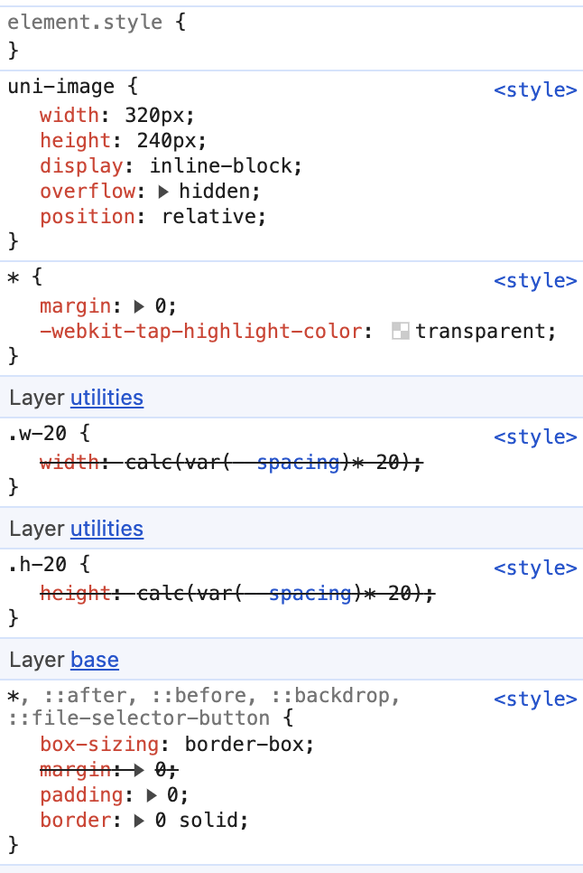

# 开发参考手册

:::warning
由于 `tailwindcss@4.x` 本身还在快速的开发迭代中，即使是小版本也可能带有一些意外的 `Breaking Change`

所以以下内容可能会经常变更，如果发现已经过时，请提 `issue` 或者直接修复提 `pr`
:::

<!-- ## 出于兼容性考虑，请使用 `tailwindcss@3.x`

目前用户汇报了部分手机，可能是由于内部使用的 `webview` 版本太低，或者一些其他的因素，导致了样式不生效的问题，尤其是华为手机。

`tailwindcss@4.x` 生成的样式，对现代的浏览器来说刚刚好，可是对那些移动设备来说，就不一定了。 -->

所以假如你要兼容更多的手机机型，请使用 `tailwindcss@3.x`。

## 定位的变化: 样式预处理器

相对于 `tailwindcss@3` 版本， `tailwindcss@4` 存在定位的重大变更

它直接变成了一个样式预处理器，和原生 `css` 已经它的规范相结合，相辅相成。

所以你在 `4.x` 版本中，不应该让 `tailwindcss` 和 `sass`,`less`,`stylus` 一起使用

详见: https://tailwindcss.com/docs/compatibility#sass-less-and-stylus

## 集成选择

`tailwindcss` 集成上提供了多种选择 (`cli`,`vite`,`postcss`)，这里我们主要选择 `@tailwindcss/postcss`，原因如下:

1. `@tailwindcss/postcss` 兼容性更好，开发打包器使用 `vite` 和 `webpack` 的都能用，而 `@tailwindcss/vite` 这里只有 `vite` 能用。
2. `@tailwindcss/vite` 很容易和其他的 `vite` 插件起冲突，尤其是和 `uni-app` / `taro` 一起使用的时候，依赖注册的顺序和编译 `hook` 注册的顺序
3. `uni-app`/`taro` 这种框架，默认都是 `cjs` 加载的，而 `@tailwindcss/vite` 只提供了 `esm` 的版本，所以集成上可能会遇到问题
4. `tailwindcss@3.x` 是 `postcss` 插件，`@tailwindcss/postcss` 也是 `postcss` 插件，所以选择它，项目迁移升级的成本会更低。

所以，综合考虑下来，我们主要选择 `@tailwindcss/postcss`。

当然，你也完全可以使用 `uni-app vite vue3` + `@tailwindcss/vite` 这种组合。从编译速度出发, `@tailwindcss/vite` 会更快，但是可能需要一些额外的配置，行为也有可能和 `tailwindcss@3.x` 不一致。

## 小程序样式引入 `weapp-tailwindcss` 不同点

在小程序场景下，`tailwindcss@4` 的文档示例建议直接写成 `@import "weapp-tailwindcss/index.css"`，而不是继续使用 `@import "tailwindcss"` 再依赖 `rewriteCssImports` 做二次改写。

### 有什么区别?

`@import "weapp-tailwindcss/index.css"` 本质上会解析到 `weapp-tailwindcss` 提供的小程序适配入口。相比 `@import "tailwindcss"`，主要区别是:

1. `"weapp-tailwindcss"` 没有 `"tailwindcss"` 中 `h5` `preflight` 的类(这些都是给 `h5` 用的，小程序用不到)
2. `"weapp-tailwindcss"` 中，不使用 `tailwindcss` 默认的 `@layer` 来控制样式优先级。这是因为小程序本身不支持 `css` `@layer` 这个特性，强行启用会造成一些样式难以覆盖的问题。

### 多端开发

假如你需要进行多端的开发，那么可以使用对应框架的样式条件编译写法，比如 `uni-app`:

```css
/*  #ifdef  H5  */
@import "tailwindcss";
/*  #endif  */
/*  #ifndef  H5  */
@import "weapp-tailwindcss/index.css";
/*  #endif  */
```

详见 https://uniapp.dcloud.net.cn/tutorial/platform.html

## css 作为配置文件

由于在 `tailwindcss@4` 中，配置文件默认为一个 `css` 文件，所以你需要显式的告诉 `weapp-tailwindcss` 你的入口 `css` 文件的绝对路径。

来让 `weapp-tailwindcss` 和 `tailwindcss` 保持一致的处理模式

> `cssEntries` 为一个数组，就是你写 `@import "weapp-tailwindcss/index.css";` 的那些文件，可以有多个

```ts
{
  cssEntries: [
    // 就是你 @import "weapp-tailwindcss/index.css"; 那个文件
    // 比如 tarojs
    path.resolve(__dirname, '../src/app.css')
    // 比如 uni-app (没有 app.css 需要先创建，然后让 `main` 入口文件引入)
    // path.resolve(__dirname, './src/app.css')
  ],
}
```

假如不添加这个，会造成 `tailwindcss` 插件生成的样式，转义不了的问题。

:::warning 只注册到 CSS，不要注册到预处理样式文件
`tailwindcss@4` 的入口请只放在 `.css` 文件里，例如 `app.css`。

不要把 `@import "weapp-tailwindcss/index.css"`、`@tailwindcss/postcss`，或者对应的 `cssEntries` 指向 `scss`、`less`、`sass` 这类预处理样式文件，否则很容易导致最终样式生成失败，或者 `weapp-tailwindcss` 转译失效。

推荐做法是：

1. 新建一个纯 `css` 入口文件，例如 `src/app.css`
2. 只在这个 `css` 文件里写 `@import "weapp-tailwindcss/index.css";`
3. 再让业务里的 `scss` / `less` 去间接引用这个 `css`，或者由主入口文件引入它
:::

> 插件会自动根据已安装的 Tailwind 版本开启 v4 模式。只有在调试自定义 `tailwindcss` 目录或多版本共存时，才需要在 `tailwindcss` 配置里手动指定 `version`。

## 使用 @apply

如果你想在 页面或者组件独立的 `CSS` 模块中使用 `@apply` 或 `@variant`，你需要使用 `@reference` 指令，来导入主题变量、自定义工具和自定义变体，以使这些值在该上下文中可用。

```css
/* 到你引入 tailwindcss 的 css 相对路径 */
@reference "../../app.css";
/* 如果你只使用默认主题，没有自定义，你可以直接 reference tailwindcss */
@reference "tailwindcss";
```

详见: https://tailwindcss.com/docs/functions-and-directives#reference-directive

## @layer 在小程序的降级方案

`tailwindcss@4` 使用原生的 `@layer` 去控制样式的优先级

> 如果你不知道什么是 `@layer`，你可以阅读这篇文档 https://developer.mozilla.org/zh-CN/docs/Web/CSS/@layer

但是像 `uni-app` / `taro` 这种框架，默认都是直接引入很多内置样式的。

于是就会出现下方尴尬的情况: 优先级 `(0,1,0)` 的 `class` 选择器样式无法覆盖 `(0,0,1)` 的标签选择器样式:



这种情况，你就非常需要兼容性降级方案，即使用 [`postcss-preset-env`](https://www.npmjs.com/package/postcss-preset-env) (`weapp-tailwindcss` 已经内置了这个插件了，你可以直接使用它的配置，详见 [cssPresetEnv](/docs/api/options/important#csspresetenv))

这在开发需要兼容低版本移动端 h5 的时候很重要。

## 使用 pnpm

默认使用 `pnpm` 的时候，由于 `pnpm` 是无法使用幽灵依赖的

但是 `uni-app`/`taro` 出于一些历史原因，是需要幽灵依赖的，这时候可以在项目下创建 `.npmrc` 添加内容如下

```txt title=".npmrc"
shamefully-hoist=true
```

然后重新执行 `pnpm i` 安装包即可运行

## 智能提示

目前 `tailwindcss@4` 的 VS Code `Tailwind CSS IntelliSense` 插件，会优先从它识别到的 Tailwind 入口里推导配置与候选类名。

在小程序项目里，我们现在推荐直接写 `@import "weapp-tailwindcss/index.css";`。这样运行时和转译链路更直接，但当前插件自动扫描时并不会把它稳定识别为 Tailwind 4 的显式入口，所以经常出现智能提示失效。

相关修复可以关注这个 PR：

- https://github.com/tailwindlabs/tailwindcss-intellisense/pull/1557

根据 `tailwindcss-intellisense` 当前实现，真正生效的做法是显式配置 `tailwindCSS.experimental.configFile`。对于 `tailwindcss@4`，这里传入的不是 `tailwind.config.js`，而是你的 **CSS 入口文件**。

如果项目只有一个入口，直接把它指向实际在 `cssEntries` 里使用的那个 `app.css` 即可：

```json title=".vscode/settings.json"
{
  "tailwindCSS.experimental.configFile": "src/app.css"
}
```

这样配置后，扩展会直接把 `src/app.css` 当成 Tailwind 4 项目入口来加载，即使它里面写的是 `@import "weapp-tailwindcss/index.css"`，也能恢复补全、悬浮提示和诊断。

如果你的项目有多个 Tailwind 入口，则改用对象写法，把每个 CSS 入口映射到对应的文件范围：

```json title=".vscode/settings.json"
{
  "tailwindCSS.experimental.configFile": {
    "packages/a/src/app.css": "packages/a/src/**",
    "packages/b/src/app.css": "packages/b/src/**"
  }
}
```

如果你仍然想额外创建一个只给编辑器使用的 CSS 文件，也必须把这个文件写进 `tailwindCSS.experimental.configFile`，仅仅在 `App.vue` 里引入它并不会让 IntelliSense 绑定到该入口。

下面是一个编辑器专用入口的可选写法：

```css title="main.css"
@import "tailwindcss";
@source not "dist";
@source not "../src/uni_modules";
```

```json title=".vscode/settings.json"
{
  "tailwindCSS.experimental.configFile": "src/main.css"
}
```

这个 `main.css` 只用于 IntelliSense，不需要也不应该在实际应用入口里引入。业务真正生效的入口仍然是你的 `app.css` 里的 `@import "weapp-tailwindcss/index.css"`。

这里必须使用 `@import "tailwindcss"`，而不是 `@import "weapp-tailwindcss/index.css"` 或 `@import "weapp-tailwindcss/theme.css"`。原因是 `tailwindcss-intellisense` 当前源码里，真正决定是否按 v4 设计系统加载的是 `packages/tailwindcss-language-server/src/util/v4/design-system.ts` 里的 `isMaybeV4()`，它只检查：

- `@import "tailwindcss"`
- `@theme {}`

也就是说：

- `@import "weapp-tailwindcss/index.css"`：不会触发这段 v4 识别
- `@import "weapp-tailwindcss/theme.css"`：同样不会触发
- `@import "tailwindcss"`：可以稳定触发 v4 IntelliSense

如果你的项目不是 `dist` 目录，而是 `unpackage`、`build` 等其他输出目录，请把 `@source not "dist";` 改成自己的实际产物目录。

## `uni-app` / `uni-app x` 项目里的 `@source` 扫描范围排障

### 问题现象

当 `uni-app` 项目把第三方插件或依赖放在 `src/uni_modules` 下，或者 `HBuilderX` / `uni-app x` 项目把依赖放在根目录 `uni_modules` 下时，如果 Tailwind 4 的 CSS 入口没有显式排除这些目录，扫描阶段就可能把依赖源码中的正则片段、README 示例文本或构建产物误识别为候选。

最终表现通常不是业务代码真的写了这些类名，而是产物里平白多出很多无意义样式，增加排查成本。

### 根因

根因和 Tailwind v3 的 `content` 误扫描一致，都是因为扫描范围过宽，把第三方源码、README 示例文本或构建产物误当成候选。

### 推荐配置

命令行 `uni-app` 项目推荐：

```css
@source not "../src/uni_modules";
```

`HBuilderX` / `uni-app x` 项目推荐：

```css
@source not "uni_modules";
```

同时保留对实际构建产物目录的排除，例如：

```css
@source not "dist";
```

或：

```css
@source not "unpackage";
```

### 最佳实践

- `@source` 应尽量只覆盖业务源码目录
- 默认排除 `uni_modules`、`node_modules`、`dist`、`unpackage`、文档和生成产物
- 如果必须扫描某个 `uni_modules` 包，应只精确包含真正承载模板类名的文件，而不是全量扫描整个目录

> **注意**：从 `tailwindcss-intellisense` 的源码来看，`experimental.configFile` 在 v4 下支持 `string` 和 `object` 两种形式，路径会相对于工作区或 `.code-workspace` 文件解析。关键是“显式声明 CSS 入口”，并且这个入口本身要满足它的 v4 识别条件。

## 如何去除 preflight 样式

在引入 `@import "weapp-tailwindcss/index.css"` 时，默认会引入 `preflight` 样式。

### 什么是 preflight 样式

一些全局的 `reset` 样式，用来让一些标签行为统一的，比如你在你的样式中，看到的:

```css
view,text,::before,::after,::backdrop {
  box-sizing: border-box;
  margin: 0;
  padding: 0;
  border: 0 solid;
}
```

类似这样的就是 `weapp-tailwindcss` 给你的应用注入的 `preflight` 样式

### 解决方案

`@import "weapp-tailwindcss/index.css"` 本质上由三个部分组成:

```css
@import 'weapp-tailwindcss/theme.css';
@import 'weapp-tailwindcss/preflight.css';
@import 'weapp-tailwindcss/utilities.css';
```

所以想要去除 `preflight` 样式，只需像下面一样写即可

```diff
- @import "weapp-tailwindcss/index.css";
+ @import 'weapp-tailwindcss/theme.css';
+ @import 'weapp-tailwindcss/utilities.css';
```

## 使用大写单位 (h-[100PX]) 无效问题

默认情况下，在 `process.env.NODE_ENV === 'production'` 的时候， `tailwindcss` 会自动进入优化模式

它会进行 `CSS` 单位的校准，比如把大写的 `PX` 转化为小写的 `px`，你要禁用这个行为可以这样传入。

```js
export default {
  plugins: {
    "@tailwindcss/postcss": {
      optimize: false
    },
  }
}
```

详见: [@tailwindcss/postcss](https://github.com/tailwindlabs/tailwindcss/blob/7779d3d080cae568c097e87b50e4a730f4f9592b/packages/%40tailwindcss-postcss/src/index.ts#L73C35-L73C72)
