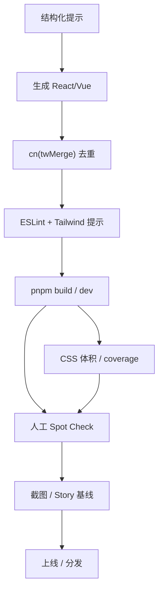

import Tabs from '@theme/Tabs'
import TabItem from '@theme/TabItem'

## 让模型写得像人

- 原子类的可组合性降低了 AI 生成的复杂度，但要给足「轨道」：提示模板、黑名单/白名单、`tailwind-merge`/lint 校验链、固定的 tokens/variants。
- React/Vue Demo 在 `apps/react-app`、`apps/vue-app`，包含主题切换、卡片/表单/数据块，`cva`/`tailwind-variants` 思路都能直接看到。

## 提示模板（示例）

```
目标：使用 Tailwind 原子类，遵守设计 tokens（不要写裸色值），用 `cn`/`tailwind-merge` 合并类。
必须：
- 仅使用已存在的色板/间距/圆角 tokens。
- 封装变体时用 `cva` 或 `tailwind-variants`，声明 defaultVariants/compoundVariants。
- 状态类优先 aria/data（示例：`aria-invalid:border-destructive`）。
- 禁止在运行时拼接未声明的动态类。
输出：React/Vue 代码块 + 关键 class 解释。
```

> 小技巧：附上 1-2 段「示范类名」，模型会按节奏输出；再给一段「不要做什么」黑名单（例如：不要输出内联 style，不要写随机 16 进制色）。

## 结构化提示（即贴即用）

```
你将为原子化 CSS 专题编写组件，遵守现有 tokens/variants。

上下文：
- 仓库：weapp-tailwindcss，React 在 apps/react-app，Vue 在 apps/vue-app。
- 工具链：Tailwind v4 JIT，`cn` 内置 tailwind-merge，Button/Badge 已用 cva 定义。
- 设计：使用 OKLCH 色板、`--radius`，暗色通过 `.dark` 或 `data-theme` 切换。

必须：
- 仅用已有 tokens（不要写裸色/px），类名可组合但需可读。
- 变体用 `cva`/`tailwind-variants`，声明 defaultVariants + compoundVariants。
- 状态优先 `aria-` / `data-` / `group` / `peer`，最多两层关系类。
- 给出 React + Vue 代码块，附 1-2 行解释，禁止 inline style/随机色值。

禁用：
- 运行时字符串拼接类名、未注册的自定义色值、超过两层的关系类。
- 依赖未在仓库中的第三方 UI 库（shadcn-ui 已内置）。

输出：
- React 代码块（tsx）+ Vue 代码块（vue SFC），包含 class 解释或推荐检查清单。
- 若需要安装/运行命令，给出 `pnpm --filter react-app dev` / `pnpm --filter vue-app dev`。
```

## 示例输出（React/Vue，对应提示）

<Tabs>
  <TabItem value="react" label="React">

```tsx
import { cva } from 'class-variance-authority'
import { cn } from '@/lib/utils'

const banner = cva('flex items-center justify-between rounded-xl border px-4 py-3 text-sm', {
  variants: {
    tone: {
      neutral: 'bg-muted text-muted-foreground',
      success: 'bg-emerald-50 text-emerald-900 dark:bg-emerald-500/10',
    },
  },
  defaultVariants: { tone: 'neutral' },
})

export function Promo() {
  return (
    <div className={cn(banner({ tone: 'success' }), 'data-[state=pending]:opacity-70')} data-state="pending">
      <span>已启用原子化工作流</span>
      <button className="underline decoration-dotted">查看指南</button>
    </div>
  )
}
```

  </TabItem>
  <TabItem value="vue" label="Vue">

```html
<script setup lang="ts">
import { cva } from 'class-variance-authority'
import { cn } from '@/lib/utils'

const banner = cva('flex items-center justify-between rounded-xl border px-4 py-3 text-sm', {
  variants: {
    tone: {
      neutral: 'bg-muted text-muted-foreground',
      success: 'bg-emerald-50 text-emerald-900 dark:bg-emerald-500/10',
    },
  },
  defaultVariants: { tone: 'neutral' },
})
</script>

<template>
  <div :class="cn(banner({ tone: 'success' }), 'data-[state=pending]:opacity-70')" data-state="pending">
    <span>已启用原子化工作流</span>
    <button class="underline decoration-dotted">查看指南</button>
  </div>
</template>
```

  </TabItem>
</Tabs>

## 常见错误与防护

- 类冲突：使用 `cn` 包装 `tailwind-merge`，避免 `p-2 p-4` 并存；检查自定义色/尺寸是否在 merge 规则里。
- 断点缺失：Mobile-first 书写，必要时添加 `sm:/md:/lg:`，并自检核心段；提示里明确「默认是 mobile」。
- 未注册色值：统一从 tokens 取色，禁止 `text-[#123456]`；在提示里声明「禁用 hex/rgb」。
- 动态类膨胀：在后端/渲染层避免字符串拼接类名；若必须动态，改用 `cva`/`tv` 参数化，并限制枚举值。
- 关系类过深：`group/peer` 不要超过两层；提示里写「最多两层关系类」。

## React/Vue 运行与查看

- 安装依赖（首次）：`pnpm install`
- 运行 React Demo：`pnpm --filter react-app dev`
- 运行 Vue Demo：`pnpm --filter vue-app dev`
- 构建文档（可选）：`pnpm --filter website build` 或 `pnpm build:docs`（若有别名）
- 截图占位：`<!-- screenshot: tailwindcss-react-demo -->`、`<!-- screenshot: tailwindcss-vue-demo -->`

## Demo 内容速览

- 主题切换：通过 `.dark` 切换 tokens，组件自动继承，观感差异明显。
- 变体封装：Button/Badge/Input 使用 `cva`，可观察 `tailwind-merge` 去重；可在 UI 中切换 variant/size 看类名组合效果。
- 交互：表单验证态（aria-invalid）、数据卡片、清单列表、小型表格/统计。可按提示模板让模型补充新卡片，验证 merge/lint 是否兜底。

## 关键代码片段

```tsx title="React：variants + merge"
import { cva } from 'class-variance-authority'
import { cn } from '@/lib/utils'

const pill = cva('inline-flex items-center rounded-full text-xs font-medium', {
  variants: {
    tone: { info: 'bg-blue-50 text-blue-900', success: 'bg-emerald-50 text-emerald-900' },
    dense: { true: 'px-2 py-1', false: 'px-3 py-1.5' },
  },
  defaultVariants: { dense: false, tone: 'info' },
})

export function Pill({ className, ...rest }: { className?: string }) {
  return <span className={cn(pill(rest), className)}>AI-ready</span>
}
```

```html title="Vue：cva + data 状态"
<script setup lang="ts">
import { cva } from 'class-variance-authority'
import { cn } from '@/lib/utils'

const banner = cva('flex items-center justify-between rounded-xl border px-4 py-3 text-sm', {
  variants: {
    tone: {
      neutral: 'bg-muted text-muted-foreground',
      success: 'bg-emerald-50 text-emerald-900 dark:bg-emerald-500/10',
    },
  },
  defaultVariants: { tone: 'neutral' },
})
</script>

<template>
  <div :class="cn(banner({ tone: 'success' }), 'data-[state=pending]:opacity-70')" data-state="pending">
    <span>已启用原子化工作流</span>
    <button class="underline decoration-dotted">查看指南</button>
  </div>
</template>
```

## 校验链建议（让 AI 结果可交付）

- 静态校验：ESLint + Tailwind IntelliSense + `tailwind-merge` 包装的 `cn`；对 `content` 目录有 lint 或脚本检查，避免通配符。
- 人工 spot-check：每个 PR 至少抽查 1-2 个组件，确认类名来自 tokens，没有裸色/裸间距。
- 产物验证：构建后记录 CSS 体积、主色板是否命中 tokens（可用简单脚本扫描 CSS 中的裸色值）。
- 回归用例：为按钮/表单等高频组件加一两个 Story/截图，用来对比后续 AI 产出是否偏离风格。

### 流程示意

<div style={{ maxWidth: 860, margin: '0 auto', textAlign: 'center' }}>



</div>
