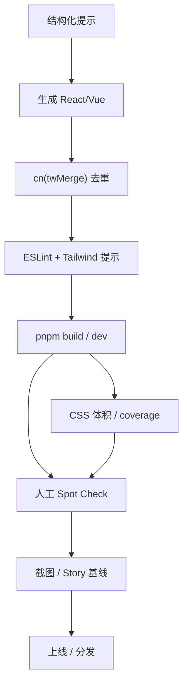

import Tabs from '@theme/Tabs'
import TabItem from '@theme/TabItem'

## 让模型写得像人

- 原子类天然适合 AI 生成，因为它们是稳定、可组合、低歧义的语料。
- 但“适合生成”不等于“适合交付”。如果没有边界，模型会很快产出看起来能跑、实际上很难维护的代码。
- 所以这页真正讨论的是：怎样给 AI 足够明确的轨道，让输出既快，又还能被人接手。
- React/Vue Demo 在 `apps/react-app`、`apps/vue-app`，可以直接拿来做提示实验、人工复核和类名对照。

## 先抓住 4 个原则

- 给模型上下文，不要只给结果要求。它需要知道你有哪些 token、哪些组件、哪些工具。
- 给模型边界，不要只说“用 Tailwind 写一个组件”。要明确哪些能做，哪些不能做。
- 给模型示范，不要期待它自己猜出你们团队的风格。1 到 2 段高质量示例往往比长篇说明更有效。
- 给模型校验链，不要把“看起来差不多”当作通过。merge、lint、构建和人工抽查都要接上。

如果你准备马上把这套方法用起来，最小可行版本其实很简单：

1. 给模型一段结构化提示。
2. 附一段你认可的组件示例。
3. 明确黑名单和边界。
4. 最后用 `cn`、lint 和构建做一次兜底。

## 提示模板（示例）

```
目标：使用 Tailwind 原子类，遵守设计 tokens（不要写裸色值），用 `cn`/`tailwind-merge` 合并类。
必须：
- 仅使用已存在的色板/间距/圆角 tokens。
- 封装变体时用 `cva` 或 `tailwind-variants`，声明 defaultVariants/compoundVariants。
- 状态类优先 aria/data（示例：`aria-invalid:border-destructive`）。
- 禁止在运行时拼接未声明的动态类。
输出：React/Vue 代码块 + 关键 class 解释。
```

> 小技巧：给 1 到 2 段你认可的“示范类名”，通常比补充一大段抽象原则更有效；再补一个黑名单，能明显降低跑偏概率。

## 结构化提示（即贴即用）

```
你将为原子化 CSS 专题编写组件，遵守现有 tokens/variants。

上下文：
- 仓库：weapp-tailwindcss，React 在 apps/react-app，Vue 在 apps/vue-app。
- 工具链：Tailwind v4 JIT，`cn` 内置 tailwind-merge，Button/Badge 已用 cva 定义。
- 设计：使用 OKLCH 色板、`--radius`，暗色通过 `.dark` 或 `data-theme` 切换。

必须：
- 仅用已有 tokens（不要写裸色/px），类名可组合但需可读。
- 变体用 `cva`/`tailwind-variants`，声明 defaultVariants + compoundVariants。
- 状态优先 `aria-` / `data-` / `group` / `peer`，最多两层关系类。
- 给出 React + Vue 代码块，附 1-2 行解释，禁止 inline style/随机色值。

禁用：
- 运行时字符串拼接类名、未注册的自定义色值、超过两层的关系类。
- 依赖未在仓库中的第三方 UI 库（shadcn-ui 已内置）。

输出：
- React 代码块（tsx）+ Vue 代码块（vue SFC），包含 class 解释或推荐检查清单。
- 若需要安装/运行命令，给出 `pnpm --filter react-app dev` / `pnpm --filter vue-app dev`。
```

## 示例输出（React/Vue，对应提示）

<Tabs>
  <TabItem value="react" label="React">

```tsx
import { cva } from 'class-variance-authority'
import { cn } from '@/lib/utils'

const banner = cva('flex items-center justify-between rounded-xl border px-4 py-3 text-sm', {
  variants: {
    tone: {
      neutral: 'bg-muted text-muted-foreground',
      success: 'bg-emerald-50 text-emerald-900 dark:bg-emerald-500/10',
    },
  },
  defaultVariants: { tone: 'neutral' },
})

export function Promo() {
  return (
    <div className={cn(banner({ tone: 'success' }), 'data-[state=pending]:opacity-70')} data-state="pending">
      <span>已启用原子化工作流</span>
      <button className="underline decoration-dotted">查看指南</button>
    </div>
  )
}
```

  </TabItem>
  <TabItem value="vue" label="Vue">

```html
<script setup lang="ts">
import { cva } from 'class-variance-authority'
import { cn } from '@/lib/utils'

const banner = cva('flex items-center justify-between rounded-xl border px-4 py-3 text-sm', {
  variants: {
    tone: {
      neutral: 'bg-muted text-muted-foreground',
      success: 'bg-emerald-50 text-emerald-900 dark:bg-emerald-500/10',
    },
  },
  defaultVariants: { tone: 'neutral' },
})
</script>

<template>
  <div :class="cn(banner({ tone: 'success' }), 'data-[state=pending]:opacity-70')" data-state="pending">
    <span>已启用原子化工作流</span>
    <button class="underline decoration-dotted">查看指南</button>
  </div>
</template>
```

  </TabItem>
</Tabs>

## 常见错误与防护

- 类冲突：统一通过 `cn` 包装 `tailwind-merge`，避免 `p-2 p-4` 这类冲突类残留；自定义尺寸和色板也要补 merge 规则。
- 断点缺失：明确 mobile-first，必要时补 `sm:`、`md:`、`lg:`，并把“默认按移动端先写”写进提示里。
- 未注册色值：统一从 token 取值，明确禁止 `text-[#123456]` 或任意 `rgb(...)`。
- 动态类膨胀：避免字符串拼类；如果确实需要动态，改成 `cva` / `tv` 的枚举参数。
- 关系类过深：`group` / `peer` 超过两层后可读性会明显下降，最好直接写进提示约束。

## 失败案例长什么样

下面这类输出，通常看起来“像是完成了任务”，但很难进入正式工程：

```tsx title="失败示例：常见的 AI 跑偏写法"
export function Banner({ type, active }: { type: string; active: boolean }) {
  return (
    <div
      className={`rounded-[17px] bg-[#4f46e5] px-[17px] py-[11px] text-[15px] text-white ${
        active ? 'group hover:bg-[#4338ca]' : ''
      } ${type === 'warn' ? 'bg-[#f59e0b]' : ''} ${type === 'danger' ? 'bg-[#ef4444]' : ''}`}
    >
      <span className="group-hover:peer-hover:text-white">状态提示</span>
    </div>
  )
}
```

这段代码的问题通常包括：

- 随机 hex 色值，脱离 token 体系。
- 任意值过多，缺少复用空间。
- 运行时字符串拼类，构建和审查都不稳定。
- `group` / `peer` 关系乱用，读者很难判断真实意图。

更稳的做法通常是：

- 先给模型 token 和 builder 的上下文。
- 限制动态空间，只允许枚举值。
- 明确禁止随机色值和超过两层的关系类。
- 最后让 `cn`、lint 和构建做兜底。

## React/Vue 运行与查看

- 安装依赖（首次）：`pnpm install`
- 运行 React Demo：`pnpm --filter react-app dev`
- 运行 Vue Demo：`pnpm --filter vue-app dev`
- 构建文档（可选）：`pnpm --filter website build` 或 `pnpm build:docs`（若有别名）
- 截图占位：`<!-- screenshot: tailwindcss-react-demo -->`、`<!-- screenshot: tailwindcss-vue-demo -->`

## Demo 内容速览

- 主题切换：通过 `.dark` 切换 tokens，组件自动继承，观感差异明显。
- 变体封装：Button/Badge/Input 使用 `cva`，可观察 `tailwind-merge` 去重；可在 UI 中切换 variant/size 看类名组合效果。
- 交互：表单验证态（aria-invalid）、数据卡片、清单列表、小型表格/统计。可按提示模板让模型补充新卡片，验证 merge/lint 是否兜底。

如果你只是想快速验证一遍，不需要全看完：

- 先运行一个 Demo。
- 用上面的提示模板让 AI 生成一个小组件。
- 检查有没有裸色、字符串拼类、过深的关系类。
- 最后跑一次构建，确认结果能进工程。

## 关键代码片段

```tsx title="React：variants + merge"
import { cva } from 'class-variance-authority'
import { cn } from '@/lib/utils'

const pill = cva('inline-flex items-center rounded-full text-xs font-medium', {
  variants: {
    tone: { info: 'bg-blue-50 text-blue-900', success: 'bg-emerald-50 text-emerald-900' },
    dense: { true: 'px-2 py-1', false: 'px-3 py-1.5' },
  },
  defaultVariants: { dense: false, tone: 'info' },
})

export function Pill({ className, ...rest }: { className?: string }) {
  return <span className={cn(pill(rest), className)}>AI-ready</span>
}
```

```html title="Vue：cva + data 状态"
<script setup lang="ts">
import { cva } from 'class-variance-authority'
import { cn } from '@/lib/utils'

const banner = cva('flex items-center justify-between rounded-xl border px-4 py-3 text-sm', {
  variants: {
    tone: {
      neutral: 'bg-muted text-muted-foreground',
      success: 'bg-emerald-50 text-emerald-900 dark:bg-emerald-500/10',
    },
  },
  defaultVariants: { tone: 'neutral' },
})
</script>

<template>
  <div :class="cn(banner({ tone: 'success' }), 'data-[state=pending]:opacity-70')" data-state="pending">
    <span>已启用原子化工作流</span>
    <button class="underline decoration-dotted">查看指南</button>
  </div>
</template>
```

## 校验链建议（让 AI 结果可交付）

- 静态校验：ESLint、Tailwind IntelliSense、`cn` 包装的 `tailwind-merge`，以及对 `content` 目录的规则检查。
- 人工抽查：每个 PR 至少抽查 1 到 2 个组件，确认没有裸色、裸间距和失控的关系类。
- 产物验证：构建后记录 CSS 体积，并检查主色板是否真的来自 tokens。
- 回归基线：对按钮、表单、卡片等高频组件保留 Story 或截图，方便判断 AI 输出是否开始漂移。

### <span className="mr-2 inline-block align-middle text-primary dark:text-primary-200 icon-[mdi--chart-timeline]" aria-hidden="true" /> 流程示意

<div style={{ maxWidth: 860, margin: '0 auto', textAlign: 'center' }}>


```mermaid
%%{ init: { "flowchart": { "curve": "basis", "nodeSpacing": 55, "rankSpacing": 75 } } }%%
flowchart TB
  Prompt["结构化提示"]
  Gen["生成 React/Vue"]
  Merge["cn(twMerge) 去重"]
  Lint["ESLint + Tailwind 提示"]
  Build["pnpm build / dev"]
  Review["人工 Spot Check"]
  Snapshot["截图 / Story 基线"]
  Deploy["上线 / 分发"]
  Metrics["CSS 体积 / coverage"]

  Prompt --> Gen --> Merge --> Lint --> Build --> Review --> Snapshot --> Deploy
  Build --> Metrics --> Review
```

</div>

<div className="mt-3 grid gap-2 text-sm text-muted-foreground">
  <div className="flex items-start gap-2">
    <span className="icon-[mdi--lightbulb-on-outline] text-lg text-primary dark:text-primary-200" aria-hidden="true" />
    <span>Prompt/Gen：给出结构化提示，产出 React/Vue 代码。</span>
  </div>
  <div className="flex items-start gap-2">
    <span className="icon-[mdi--link] text-lg text-primary dark:text-primary-200" aria-hidden="true" />
    <span>Merge/Lint：cn(twMerge) 去重 + ESLint/Tailwind 提示兜底。</span>
  </div>
  <div className="flex items-start gap-2">
    <span className="icon-[mdi--laptop] text-lg text-primary dark:text-primary-200" aria-hidden="true" />
    <span>Build/Review：构建验证 + 人工 spot check，再做截图基线。</span>
  </div>
  <div className="flex items-start gap-2">
    <span className="icon-[mdi--chart-bar] text-lg text-primary dark:text-primary-200" aria-hidden="true" />
    <span>Metrics：记录 CSS 体积/覆盖率，支撑迭代。</span>
  </div>
</div>
