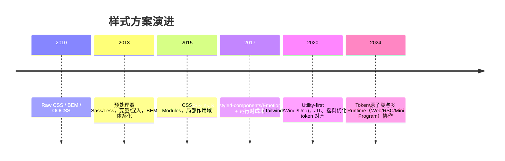

## TL;DR

- 样式方案从「全局命名」走向「模块化/组件化」再到「原子化」，每一步都在降低耦合与认知成本。
- 组件库从「重样式」到「Headless」：API 与样式解耦，让原子类和设计系统更容易落地。
- 原子化 CSS 的价值：更好的可组合性与摇树优化；风险在于约束失效后的 class 泛滥与设计漂移。

## 样式方案时间轴

## 组件库演进对比

| 阶段 | 代表 | 特点 | 问题 |
| --- | --- | --- | --- |
| 传统 UI 套件 | Element, AntD | 样式随组件绑定，主题切换成本高 | 自定义成本高，覆盖样式易碎 |
| 设计体系化 | Chakra, MUI | 主题与 tokens，部分可组合 | 仍有样式耦合，深层改造困难 |
| Headless/UI primitives | Headless UI, shadcn/ui, reka-ui, Radix Primitives | API 与样式解耦，留出 design layer | 需要自己的 design system 与类名约束 |

**对齐点**：在 Headless/无样式组件上叠加 `cva`/`tailwind-variants`，把 variants（尺寸/语义/状态）集中声明，再配合 `tailwind-merge` 兜底合并，形成稳定的 class builder。

## 原子化 CSS 解决/未解决的问题

- ✅ 解决：
  - 认知负担：类名即样式，无需跳转文件。
  - 漂移与覆盖：减少全局样式泄漏；`content` 精准扫描，摇树删除未用类。
  - 设计对齐：tokens 与 variants 让「设计 → 类名」有映射。
- ⚠️ 风险：
  - 可读性：类名过长、无约束导致审阅困难。
  - 一致性：不同人随意取值，导致色板/间距失控。
  - 体积：动态类或 content 过宽会失去摇树收益。
- 🚫 不推荐使用的场景：
  - 需要强隔离的可发布组件库（可用 CSS Modules/vanilla-extract）。
  - 极简静态站点，对运行时无需求，模板类名冗长反而成本高。
  - 无法建立 design token/规范的团队，原子类易失控。

## 与运行时/平台的适配

- Web/RSC：优先静态生成、`content` 精准匹配 server 侧模板；避免在服务器计算随机类名。
- 小程序/多端：注意 class length 限制；预生成静态类，不依赖动态模板拼接。
- SSR/HMR：Tailwind v4 JIT 足够快；UnoCSS 具更灵活的即时模式，但生态/插件差异需权衡。
