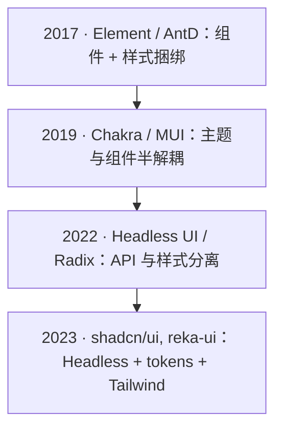

## 要点

- 组件库从「组件 + 样式捆绑」到「主题化」再到「Headless Primitives」，逐步把 API、样式与 design tokens 解耦。
- Headless + tokens 让原子类/设计体系可落地，需通过 `cva`/`tailwind-variants` 等集中声明 variants，配合 `tailwind-merge` 兜底。
- 迁移策略：先抽离公共 tokens，再为组件提供 class 注入/无样式模式，最后用 Headless 模板替换关键组件。

> 样式方案本身的演化见：[样式方案的演化](/docs/tailwindcss/history)。

##  演进阶段与对比

| 阶段 | 代表 | 特点 | 问题 |
| --- | --- | --- | --- |
| 传统 UI 套件 | Element, AntD | 样式随组件绑定，主题切换成本高 | 自定义成本高，覆盖样式易碎 |
| 设计体系化 | Chakra, MUI | 主题与 tokens，部分可组合 | 仍有样式耦合，深层改造困难 |
| Headless/UI primitives | Headless UI, shadcn/ui, reka-ui, Radix Primitives | API 与样式解耦，留出 design layer | 需要自己的 design system 与类名约束 |

  

    
    2017：传统组件库，样式与组件强绑定。
  

  

    
    2019：主题化/设计体系化的组件库。
  

  

    
    2022：Headless Primitives，API 与样式解耦。
  

  

    
    2023：shadcn/ui 等模板化方案，Headless + tokens + Tailwind。
  

## Headless 组合范式的优劣

- 优势：
  - API 与样式拆分，样式完全交给 Tailwind/Uno + tokens；易于多品牌/暗色切换。
  - 与 `cva`/`tailwind-variants` 配合，变体集中声明，降低审阅成本。
  - 对 AI 生成友好：模板固定，类名受 merge/lint 保护。
- 劣势：
  - 需要自建设计系统与 token 表，否则不同页面风格易漂移。
  - 文档/示例建设成本高，需要给出「推荐类名组合」。
  - 对初学者，class 可读性与语义化需要额外培训。

## 迁移与落地建议

- 抽离 tokens：把色板/间距/字号等设计变量收敛到配置文件，组件仅消费 tokens。
- 无样式接口：为现有组件增加 `className`/`classes` 注入或「unstyled」模式，逐步剥离耦合样式。
- 变体集中：用 `cva`/`tailwind-variants` 建立按钮、输入、卡片等核心组件的变体表，配合 `tailwind-merge` 兜底。
- 评审清单：检查是否仍有深度覆盖、是否存在自定义色值泄漏、是否出现无法复用的 ad-hoc class。
