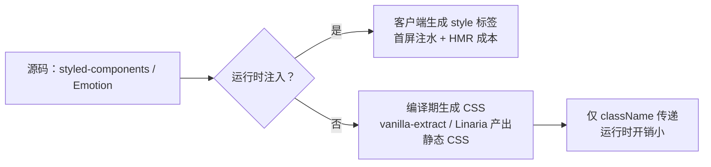

## 要点

- 组件边界天然隔离，props 可驱动样式；动态主题/状态友好。
- 成本：运行时/SSR 注水体积、构建链复杂；类名可读性差。
- 适合需要高度动态样式、主题切换、设计系统与组件强绑定的团队。
- 代表性包：运行时流派（`styled-components`、`Emotion`、`JSS`）、编译期/零运行时流派（`vanilla-extract`、`Linaria`、`Astro/Uno + scoped` 混合方案）。

## 优势 / 劣势 / 何时使用

| 项 | 内容 |
| --- | --- |
| 优势 | 组件粒度隔离；props 驱动；可在 JS 里复用逻辑/常量 |
| 劣势 | 运行时开销；SSR 注水；类名调试性差；可能影响 HMR 速度 |
| 适用 | 需要复杂动态样式、主题即逻辑的设计系统；部分 SSR/CSR 混合场景 |
| 不适用 | 对首屏体积极敏感、运行时预算极小的多端/小程序场景 |

## 代表性包与用法

- **styled-components（运行时）**：模板字符串 + props；支持 `ThemeProvider` 统一主题。

```tsx title="styled-components 主题"
import styled, { ThemeProvider } from 'styled-components'

const theme = { primary: '#111827', radius: '12px' }
const Button = styled.button`
  padding: 10px 16px;
  border-radius: ${({ theme }) => theme.radius};
  background: ${({ theme }) => theme.primary};
`

export function Demo() {
  return (
    <ThemeProvider theme={theme}>
      <Button>Dark Button</Button>
    </ThemeProvider>
  )
}
```

- **Emotion（运行时 + 编译模式）**：`css` prop 与 `@emotion/babel-plugin` 编译模式减少运行时。

```tsx title="Emotion css prop"
import { css } from '@emotion/react'

const card = css({
  border: '1px solid #e5e7eb',
  borderRadius: 16,
  padding: 16,
})

export const Card = () => <section css={card}>Emotion css prop</section>
```

- **vanilla-extract（零运行时）**：TypeScript API 生成 CSS，运行时仅使用 className。

```ts title="vanilla-extract button.css.ts"
import { style, createVar } from '@vanilla-extract/css'

export const color = createVar()
export const button = style({
  vars: { [color]: '#111827' },
  background: color,
  borderRadius: '8px',
  color: '#fff',
})
```

- **Panda CSS（编译期 / 零运行时）**：Chakra 团队推出的 TS-first 原子化方案，`css`/`cva`/`recipes` API 将设计 Token 编译成静态类名。

```tsx title="Panda CSS recipes"
import { css, cva } from '../styled-system/css'

const badge = css({
  borderRadius: 'full',
  fontWeight: 'semibold',
  px: '3',
  py: '1.5',
  bg: 'blue.50',
  color: 'blue.700',
})

const button = cva({
  base: { borderRadius: 'xl', fontWeight: 'semibold', px: '4', py: '3' },
  variants: {
    intent: {
      solid: { bg: 'blue.600', color: 'white', _hover: { bg: 'blue.700' } },
      ghost: { color: 'blue.700', border: '1px solid #bfdbfe', bg: 'transparent' },
    },
  },
})

export function PandaSection() {
  return (
    <section className={css({ display: 'flex', gap: '3', alignItems: 'center' })}>
      <span className={badge}>token 驱动</span>
      <button className={button({ intent: 'solid' })}>Panda Button</button>
    </section>
  )
}
```

- **styled-jsx（Next.js 内置，编译期作用域 + 轻量运行时注入）**：JSX 内联 `<style jsx>`，Babel 在编译时生成作用域类名，运行时插入局部 style。

```tsx title="styled-jsx 局部作用域"
export default function StyledJsxCard({ title }: { title: string }) {
  return (
    <div className="card">
      <h3>{title}</h3>
      <p>Next.js 默认支持，SSR 时自动收集样式。</p>
      <style jsx>{`
        .card {
          padding: 16px;
          border-radius: 12px;
          background: #fff;
          box-shadow: 0 10px 30px rgba(0, 0, 0, 0.06);
        }
        h3 { margin: 0 0 8px; }
      `}</style>
    </div>
  )
}
```

- **stylex（编译期原子化，零运行时）**：Meta 发布的跨 React Web/Native 工具，受限的 StyleX 语法在编译时拆成原子类，运行时只保留 `stylex.props`。

```tsx title="stylex 原子类"
import * as stylex from '@stylexjs/stylex'

const styles = stylex.create({
  base: {
    backgroundColor: 'var(--blue-600)',
    borderRadius: 12,
    color: '#fff',
    paddingBlock: 10,
    paddingInline: 16,
    transitionDuration: '150ms',
  },
  hoverable: {
    ':hover': { backgroundColor: 'var(--blue-700)' },
  },
})

export function StylexButton({ hoverable = true }) {
  return <button {...stylex.props(styles.base, hoverable && styles.hoverable)}>StyleX</button>
}
```

## <span className="mr-2 inline-block align-middle text-primary dark:text-primary-200 icon-[mdi--layers-triple-outline]"></span> 运行时 vs 编译期（示意）



<div className="mt-3 grid gap-2 text-sm text-muted-foreground">
  <div className="flex items-start gap-2">
    <span className="icon-[mdi--download] text-lg text-primary dark:text-primary-200" aria-hidden="true" />
    <span>运行时注入：在客户端生成 style，首屏注水 + HMR 有额外成本。</span>
  </div>
  <div className="flex items-start gap-2">
    <span className="icon-[mdi--file-code-outline] text-lg text-primary dark:text-primary-200" aria-hidden="true" />
    <span>编译期生成：静态 CSS 提前产出，JS 只保留 className 映射。</span>
  </div>
</div>

### 方案对比（运行时/编译期，七选）

| 方案 | 类型 | 写法/入口 | 动态与主题 | 产物/性能 | 适用 | 
| --- | --- | --- | --- | --- | --- |
| styled-components | 运行时 | `styled` 模板字符串 | 强：props + `ThemeProvider` | JS 注入 style，SSR 需注水 | 组件库、主题切换频繁 |
| Emotion | 运行时/编译混合 | `css` prop / `styled` | 强，Babel 插件可提前抽离 | 默认运行时注入，编译模式减少开销 | React/Next 需要灵活度 |
| styled-jsx | 编译期作用域 + 轻量运行时 | `<style jsx>` 内联 CSS | 中：支持插值但鼓励静态 | 按组件生成作用域 class + style 标签 | Next.js 局部隔离样式 |
| Panda CSS | 编译期 / 零运行时 | `css`/`cva`/`recipes` TS API | 中：受 Token/受限表达式约束 | 产出原子 CSS + class 映射 | 设计 Token 驱动、追求首屏体积 |
| stylex | 编译期原子化 / 零运行时 | `stylex.create` + `stylex.props` | 中：受限语法，推荐 Token | 编译成原子类，运行时极薄 | 性能敏感、跨 Web/Native 代码复用 |
| vanilla-extract | 编译期 / 零运行时 | `style`/`createVar` TS API | 中：静态值 + 变量 | 生成静态 CSS，引入 className | 追求零 runtime、与构建深度集成 |
| Linaria | 编译期 / 零运行时 | `css`/`styled` 模板字符串 | 弱：表达式需可静态求值，props 通过切换 class | 生成静态 CSS，JS 仅类名映射 | 想要 CSS-in-JS 写法但首屏/SSR 预算敏感 |

### 写法与产物对照

- 运行时（styled-components/Emotion）：
  - 写法：模板字符串或对象样式，允许使用 props / theme 计算样式；开发态插入 `<style>`，生产态可能提取 critical CSS。
  - 产物：JS bundle + 内联 style 标签，类名在运行时生成（`sc-abc123`），首屏注水与 HMR 需要样式注入开销。
- 编译期（Linaria/vanilla-extract）：
  - 写法：受限的模板字符串或 TS API（`css`/`style`），编译器提前求值并生成 `.css`，JS 中只保留 `className` 映射。
  - 产物：静态 CSS 文件（或内联 chunk）+ 极薄的 className 映射，运行时不再注入 style，SSR 直接 link CSS。

### Linaria 示例（编译期）

源码（编译前）：

```tsx title="card.tsx"
import { css } from '@linaria/core'

const card = css`
  border: 1px solid #e5e7eb;
  border-radius: 16px;
  padding: 16px;
  background: white;
  transition: box-shadow 150ms ease;

  &:hover {
    box-shadow: 0 10px 30px rgba(0, 0, 0, 0.06);
  }
`

export function Card({ children }: { children: React.ReactNode }) {
  return <section className={card}>{children}</section>
}
```

编译产物（示意）：

```css title="card.linaria.css"
.card_h3dj1z {
  border: 1px solid #e5e7eb;
  border-radius: 16px;
  padding: 16px;
  background: white;
  transition: box-shadow 150ms ease;
}
.card_h3dj1z:hover {
  box-shadow: 0 10px 30px rgba(0, 0, 0, 0.06);
}
```

```js title="card.tsx (compiled excerpt)"
import './card.linaria.css'
const card = 'card_h3dj1z'
export function Card({ children }) {
  return <section className={card}>{children}</section>
}
```

特点：CSS 被提前生成，JS 仅保留类名字符串；运行时不再注入 `<style>`，与传统静态 CSS 链路类似。

## 示例（styled-components）

```tsx
import styled from 'styled-components'

const Card = styled.section`
  border: 1px solid #e5e7eb;
  border-radius: 16px;
  padding: 16px;
  box-shadow: ${({ elevated }) => (elevated ? '0 10px 30px rgba(0,0,0,0.06)' : 'none')};
`

const Button = styled.button`
  padding: 10px 16px;
  border-radius: 8px;
  border: 1px solid #111827;
  background: #111827;
  color: #fff;
  &:hover { background: #0f172a; }
`

export const Demo = () => (
  <Card elevated>
    <p className="eyebrow">CSS-in-JS</p>
    <h2>动态样式，组件边界</h2>
    <Button>查看详情</Button>
  </Card>
)
```

### styled-components 的 SWC 插件提示

`@swc/plugin-styled-components`（或 Next.js `compiler.styledComponents`）在编译阶段处理标签模板，保持运行时链路但优化可读性与 SSR 稳定性：

```json title=".swcrc"
{
  "jsc": {
    "experimental": {
      "plugins": [
        ["@swc/plugin-styled-components", { "displayName": true, "ssr": true, "minify": true, "pure": true }]
      ]
    }
  }
}
```

- `displayName`：开发态易调试；`ssr`：确保类名/注入顺序稳定，减少水合不一致。
- `minify`/`pure`：压缩模板输出，帮助摇树减轻运行时体积，但依旧属于运行时注入流派。

## 常见坑与对策

- 运行时体积：优先选择编译模式或零运行时方案（如 vanilla-extract），或开启 Babel SWC 优化。
- SSR 注水：衡量首屏样式注入体积；必要时提取静态样式或开启样式缓存。
- 类名调试：在开发环境打开 displayName/label；在生产环境启用最小化。
- HMR 性能：减少过深的动态表达式；拆分组件，降低热更范围。
