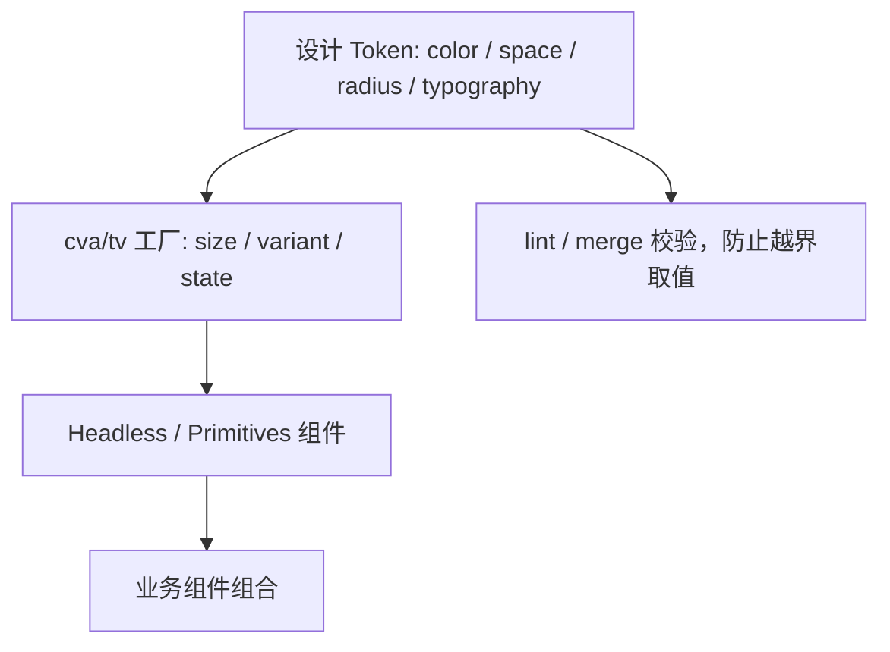

## 要点

- API 与样式解耦的 Headless 组件（Radix、Headless UI、shadcn/ui、reka-ui）+ Tailwind/Uno，让设计 token 可直连类名。
- `cva`/`tailwind-variants` 集中声明 variants/default/compound，配合 `tailwind-merge` 兜底；最利于 AI/脚本生成。
- 适合多品牌/暗色/大规模设计体系；前提是 tokens、lint/merge/评审链到位。
- 代表性包：Primitives（`@radix-ui/react-*`、`@ark-ui/react`、`@zag-js`）、Headless 组件库（`@headlessui/react`）、样式模板化方案（`shadcn/ui`、`reka-ui`、`vaul`），加上 class 构造器（`class-variance-authority`、`tailwind-variants`、`tailwind-merge`）。

## 优势 / 劣势 / 何时使用

| 项 | 内容 |
| --- | --- |
| 优势 | API 与样式分离；变体集中；对 AI/自动化友好；跨品牌/主题低成本 |
| 劣势 | 需要维护 token 表与规范；初学者心智负担高；文档/范式建设成本高 |
| 适用 | 需要统一体验、多产品线、多主题/品牌、希望自动化生成 UI 的团队 |
| 不适用 | 极简站点或无设计体系、无法投入规范建设的团队 |

## 代表性包与组合方式

- **Radix Primitives / Ark UI**：提供无样式、可访问性完善的组件原件。

```tsx title="Radix + Tailwind"
import * as Tabs from '@radix-ui/react-tabs'

export function TabsDemo() {
  return (
    <Tabs.Root defaultValue="code" className="w-full">
      <Tabs.List className="inline-flex gap-2 rounded-lg bg-muted p-1">
        <Tabs.Trigger value="code" className="rounded-md px-3 py-2 text-sm data-[state=active]:bg-card data-[state=active]:shadow">
          代码
        </Tabs.Trigger>
        <Tabs.Trigger value="preview" className="rounded-md px-3 py-2 text-sm data-[state=active]:bg-card data-[state=active]:shadow">
          预览
        </Tabs.Trigger>
      </Tabs.List>
    </Tabs.Root>
  )
}
```

- **Headless UI**：Vue/React 可组合的无样式组件，常与 Tailwind 搭配。

```tsx title="Headless UI + Tailwind"
import { Menu } from '@headlessui/react'

export function MenuDemo() {
  return (
    <Menu as="div" className="relative inline-block text-left">
      <Menu.Button className="inline-flex items-center gap-2 rounded-lg border px-3 py-2">操作</Menu.Button>
      <Menu.Items className="absolute right-0 mt-2 w-40 rounded-xl border bg-card p-2 shadow-xl">
        <Menu.Item>
          {({ active }) => <button className={`w-full rounded-lg px-3 py-2 text-sm ${active ? 'bg-muted' : ''}`}>编辑</button>}
        </Menu.Item>
      </Menu.Items>
    </Menu>
  )
}
```

- **shadcn/ui / reka-ui 模板化**：基于 Tailwind + `cva`/`tailwind-variants` 预置 class，直接复制到项目。

```tsx title="tailwind-variants 组合"
import { tv } from 'tailwind-variants'
import { Slot } from '@radix-ui/react-slot'
import { cn } from '@/lib/utils'

const badge = tv({
  base: 'inline-flex items-center gap-1 rounded-full px-3 py-1 text-xs font-medium',
  variants: {
    tone: {
      neutral: 'bg-muted text-foreground',
      success: 'bg-emerald-50 text-emerald-700 dark:bg-emerald-900/30 dark:text-emerald-100',
      danger: 'bg-rose-50 text-rose-700 dark:bg-rose-900/30 dark:text-rose-100',
    },
  },
  defaultVariants: { tone: 'neutral' },
})

export function Badge({ asChild, className, ...props }: { asChild?: boolean } & React.HTMLAttributes<HTMLElement>) {
  const Comp = asChild ? Slot : 'span'
  return <Comp className={cn(badge(props), className)} {...props} />
}
```

## tokens → variants → primitives 流程（示意）



## 示例（Button with cva，React）

```tsx
import { cva } from 'class-variance-authority'
import { cn } from '@/lib/utils'

const button = cva(
  'inline-flex items-center gap-2 rounded-lg border bg-primary px-4 py-2 text-sm text-primary-foreground shadow-sm transition',
  {
    variants: {
      variant: { default: '', outline: 'bg-transparent text-foreground border-border', ghost: 'bg-transparent hover:bg-muted' },
      size: { sm: 'h-8 px-3', md: 'h-10 px-4', lg: 'h-11 px-5' },
    },
    compoundVariants: [{ variant: 'outline', size: 'lg', class: 'shadow-none' }],
    defaultVariants: { variant: 'default', size: 'md' },
  }
)

export function Button({ className, ...props }: React.ButtonHTMLAttributes<HTMLButtonElement>) {
  return <button className={cn(button(props), className)} {...props} />
}
```

## 对齐建议

- tokens：颜色/间距/圆角/阴影/字号写成 tokens（CSS 变量或 `@theme`），保持「设计稿 → token 名」映射。
- variants：所有状态/尺寸/语义集中到工厂（`cva`/`tv`），业务组件只消费 builder；默认值写死。
- merge：统一使用 `cn`（含 `tailwind-merge`）兜底，避免 class 冲突。
- 资产：记录推荐组合（例如按钮/表单/卡片的标准类名），便于 AI/新人沿用。
