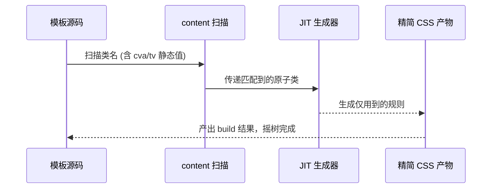

## 要点

- 类名即样式，JIT + content 精准摇树；与设计 tokens/variants 易对齐。
- 生态差异：Tailwind（插件/merge/社区资产） vs UnoCSS（高度自定义、需自养规则）。
- 风险：可读性、class 爆炸、content 过宽、动态类失控；需要 tokens/variants/merge 的约束。
- 代表性包：`Tailwind CSS`（JIT + 官方插件）、`Windi CSS`（早期即时模式）、`UnoCSS`（preset/attributify + 自定义规则）、`twin.macro`（将 Tailwind 写在 CSS-in-JS 内）。

## 优势 / 劣势 / 何时使用

| 项 | 内容 |
| --- | --- |
| 优势 | 低认知切换；JIT 产物小；生态丰富；与 Headless 组合好 |
| 劣势 | 约束缺失时可读性差；动态类膨胀；需 lint/merge/评审配合 |
| 适用 | 高迭代速度、需要设计体系对齐、跨端/多产品线场景 |
| 不适用 | 极简静态站点、无法建立 tokens/规范的团队 |

## 代表性包与用法

- **Tailwind CSS**：官方插件/merge/IDE 提示最完善，适合团队基线。

```js title="tailwind.config.ts"
export default {
  content: ['./src/**/*.{ts,tsx,html}'],
  theme: {
    extend: {
      colors: { brand: '#111827' },
      borderRadius: { xl: '16px' },
    },
  },
  plugins: [require('@tailwindcss/typography'), require('@tailwindcss/forms')],
}
```

- **UnoCSS**：preset + 自定义规则；`attributify` 让属性即类名。

```ts title="UnoCSS 配置 unocss.config.ts"
import { defineConfig, presetUno, presetAttributify, presetIcons } from 'unocss'

export default defineConfig({
  presets: [presetUno(), presetAttributify(), presetIcons()],
  rules: [['btn', { padding: '10px 16px', 'border-radius': '8px', background: '#111827', color: '#fff' }]],
})
```

```html title="UnoCSS attributify"
<section grid gap-3 rounded-2xl border p-4 shadow-sm>
  <p text="xs muted uppercase" tracking="0.2em">UnoCSS</p>
  <h2 text="lg semibold">Attributify + Preset</h2>
  <button btn hover="bg-#0f172a">查看详情</button>
</section>
```

- **twin.macro**：在 styled-components/Emotion 中写 Tailwind，兼顾原子化与 CSS-in-JS 开发体验。

```tsx title="twin.macro"
import tw, { styled } from 'twin.macro'

const Card = styled.section(() => [tw`grid gap-3 rounded-2xl border bg-white/80 p-4 shadow-sm`])

export function TwinDemo() {
  return (
    <Card>
      <p tw="text-xs uppercase tracking-[0.2em] text-gray-500">twin.macro</p>
      <h2 tw="text-lg font-semibold">Tailwind 写在 CSS-in-JS 里</h2>
    </Card>
  )
}
```

## JIT 摇树流程示意



## 示例（Tailwind 基础卡片）

```tsx
export function TailwindCard() {
  return (
    <section className="grid gap-3 rounded-2xl border bg-card/80 p-4 shadow-sm">
      <p className="text-xs uppercase tracking-[0.2em] text-muted-foreground">Tailwind</p>
      <h2 className="text-lg font-semibold">类名即样式</h2>
      <p className="text-sm text-muted-foreground">JIT + tokens；类名一目了然，摇树后产物小。</p>
      <button className="inline-flex items-center gap-2 rounded-lg bg-primary px-4 py-2 text-sm text-primary-foreground hover:bg-primary/90">
        查看详情
      </button>
    </section>
  )
}
```

## Tailwind vs UnoCSS（补充要点）

- 生态：Tailwind 拥有 typography/forms/animate 等插件、`tailwind-merge`、丰富的 preset 和组件范式；UnoCSS 更灵活但规则/merge/IDE 提示需自养。
- 类型提示：Tailwind 官方 language-service 覆盖全面；UnoCSS 依赖 preset/插件质量。
- Merge 去重：Tailwind 配合 `tailwind-merge` 规则完善；Uno 默认不处理 class 去重，需要自定义。
- 运行时：Tailwind v4 产物稳定，适配 RSC/SSR；UnoCSS 即时模式极快，适合高度定制。

## 常见坑与对策

- content 过宽：精确到模板目录，避免全局通配导致产物膨胀。
- 动态类：优先 `cva`/`tailwind-variants` 参数化，禁用字符串自由拼接。
- 可读性：建立 tokens/variants/推荐组合，评审时对齐；必要时为复杂关系类加注释。
- 体积：构建后查看 CSS 体积或浏览器 Coverage；必要时开启分析工具。
- 设计稿映射：把常用 spacing/颜色/圆角提炼为设计 token，并在 `cva` 默认值上锁定，避免“随手取值”。
