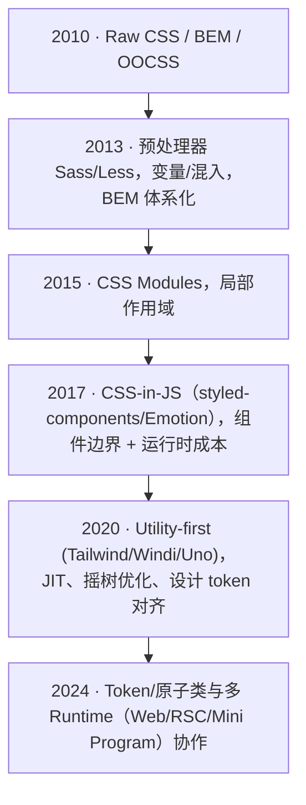
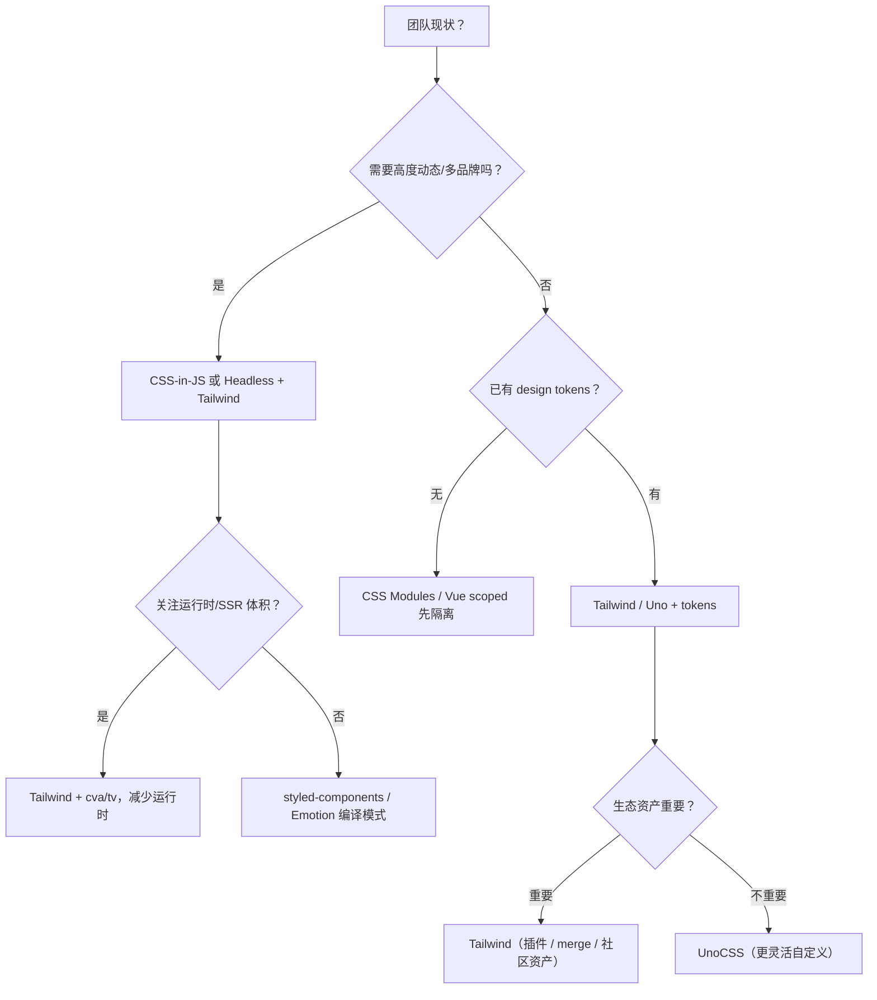

## 要点

- 样式方案从「全局命名」走向「模块化/组件化」再到「原子化」，每一步都在降低耦合与认知成本。
- 原子化 CSS 的价值：更好的可组合性与摇树优化；风险在于约束失效后的 class 泛滥与设计漂移。它不是风口产物，而是长期向「更小粒度、更好约束」演进的结果。
- 多 runtime（Web/RSC/小程序）下，需要把 tokens 抽象到样式方案之外，避免在构建或运行时动态拼类。

> 组件库部分已拆为独立页面：[组件库的演进](/docs/tailwindcss/history/component-evolution)。

## <span className="mr-2 inline-block align-middle text-primary dark:text-primary-200 icon-[mdi--calendar-month]"></span> 样式方案时间轴



<div className="mt-3 grid gap-2 text-sm text-muted-foreground">
  <div className="flex items-start gap-2">
    <span className="icon-[mdi--pencil] text-lg text-primary dark:text-primary-200" aria-hidden="true" />
    <span>2010：Raw CSS / BEM / OOCSS，语义命名 + 手写层级。</span>
  </div>
  <div className="flex items-start gap-2">
    <span className="icon-[mdi--layers] text-lg text-primary dark:text-primary-200" aria-hidden="true" />
    <span>2013：Sass/Less 变量与混入，BEM 体系化。</span>
  </div>
  <div className="flex items-start gap-2">
    <span className="icon-[mdi--shield-check] text-lg text-primary dark:text-primary-200" aria-hidden="true" />
    <span>2015：CSS Modules 作用域隔离。</span>
  </div>
  <div className="flex items-start gap-2">
    <span className="icon-[mdi--code-tags] text-lg text-primary dark:text-primary-200" aria-hidden="true" />
    <span>2017：CSS-in-JS，组件边界 + 运行时成本。</span>
  </div>
  <div className="flex items-start gap-2">
    <span className="icon-[mdi--star-four-points] text-lg text-primary dark:text-primary-200" aria-hidden="true" />
    <span>2020：Utility-first，JIT、摇树、tokens 对齐。</span>
  </div>
  <div className="flex items-start gap-2">
    <span className="icon-[mdi--timeline-clock-outline] text-lg text-primary dark:text-primary-200" aria-hidden="true" />
    <span>2024：Token/原子类跨 Web/RSC/小程序协作。</span>
  </div>
</div>

### 现场感：几段常见的「升级理由」

- BEM 项目重构时，遇到 `.btn--primary` 在四个文件里被覆盖，且 hover 颜色不一致；引入 Utility-first 后把按钮拆成变体，类名归到 `cva` 工厂，审阅时一眼能看出状态组合。
- CSS-in-JS 方案在 SSR 下首屏注水 60KB，改为 Tailwind + tokens 后，首屏 CSS 控制在 8KB 以内，且通过 `content` 精准扫描避免动态膨胀。
- Mini Program 场景 class 长度有限，原子类 + 预生成模板替换了动态拼接的 style 字符串，稳定性提高，构建速度更快。

## 各阶段优势 / 劣势 / 适用场景

| 阶段 | 核心优势 | 主要劣势 | 适用场景 | 常见坑 & 规避 |
| --- | --- | --- | --- | --- |
| Raw CSS + BEM/OOCSS | 简单直观；命名带语义 | 全局污染、样式覆盖难排查；复用弱 | 小体量页面、低复杂度站点 | 命名规则不统一 → 制定前缀/分块；避免长选择器链 |
| 预处理器（Sass/Less） | 变量/混入/函数提高复用；BEM 更容易落地 | 仍是全局；易出现嵌套地狱；编译体积膨胀 | 需要一定复用，但没有组件边界要求 | 限制嵌套层级；lint 禁止 `#id`/深度选择器；保持色板集中 |
| CSS Modules | 作用域隔离，防止全局污染；类名可组合 | 样式与组件耦合，跨组件复用要额外抽象；难对齐统一 design token | 可发布组件库、需要隔离的中大型项目 | 建立 shared variables 文件；避免在组件内声明全局变量；主题切换需额外管线 |
| CSS-in-JS | 组件边界天然隔离；props 驱动样式；SSR 友好（视库而定） | 运行时开销；编译链复杂；类名可读性差；热更/缓存成本 | 需要强动态样式、主题切换、设计系统与组件强绑定 | 使用零运行时方案（vanilla-extract）或编译模式；监控包体；限定动态样式范围 |
| Utility-first（Tailwind/Uno） | 类名即样式，低认知切换；JIT/摇树；与 tokens 对齐；生态丰富 | 可读性与约束依赖团队规范；content 不精准会膨胀；动态类易失控 | 需要高迭代速度、设计体系对齐、组件组合化的前后端/多端项目 | 建立 tokens/variants 规范；统一 `cn` + merge；禁止字符串拼类；content 精准匹配；保留「推荐组合」文档 |
| Token + Headless 组件（shadcn/ui, reka-ui） | API 与样式解耦；通过 `cva`/`tailwind-variants` 集中管理变体；易被 AI/脚本生成 | 需要自建 design system；无约束时风格漂移 | 需要统一体验的多产品线、希望可插拔主题/品牌的团队 | 维护 tokens 表；评审类名；为 AI 提示加入黑名单/白名单；保留 merge/lint 校验链 |

> 迁移建议：如果已有 CSS Modules/组件库想拥抱原子化，可先将公共 tokens 抽出，再在 Headless 组件上叠加 `cva`/`tailwind-variants`，逐步替换局部样式。

## 深入阅读（按阶段拆分）

- [Raw CSS / BEM / OOCSS](/docs/tailwindcss/history/raw-css)
- [Sass / Less 预处理](/docs/tailwindcss/history/preprocessors)
- [CSS Modules 阶段](/docs/tailwindcss/history/css-modules)
- [CSS-in-JS 阶段](/docs/tailwindcss/history/css-in-js)
- [Utility-first / Tailwind / UnoCSS](/docs/tailwindcss/history/utility-first)
- [Token 化与 Headless 组件](/docs/tailwindcss/history/headless-tokens)
- [生成式 CSS / 原生能力融合](/docs/tailwindcss/history/future-generative-css)

## 阶段代表性包速览与跳转

| 阶段 | 包 | 常见用法 | Demo/图表 |
| --- | --- | --- | --- |
| Raw CSS | normalize.css, Bootstrap, Bulma | 全局命名 + 组件 class | 本页 BEM 例子 + Reset 引入 |
| 预处理器 | Sass, Less, PostCSS, Stylus | 变量/混入、`modifyVars` 主题 | Sass 片段 & PostCSS 插件链 |
| CSS Modules | webpack/Vite modules, Next.js, vanilla-extract | 作用域哈希、零运行时 | 模块化 Card 组件 |
| CSS-in-JS | styled-components, Emotion, JSS, vanilla-extract | 运行时/编译期动态样式 | 主题 Button + 运行时 vs 编译期图 |
| Utility-first | Tailwind, Windi, UnoCSS, twin.macro | JIT 原子类、attributify、宏模式 | Tailwind 卡片 + Uno attributify + JIT 时序图 |
| Headless + tokens | Radix, Headless UI, shadcn/ui, tailwind-variants | tokens → variants → primitives | Radix Tabs、Menu Demo、tokens 流程图 |

## 阶段 Demo：把「方式」落到机制

### Raw CSS / BEM：零构建 + 约定

```html title="index.html"
<link rel="stylesheet" href="/reset.css" />
<section class="card card--elevated">
  <p class="card__eyebrow">Raw CSS</p>
  <h2 class="card__title">全局命名</h2>
</section>
```

### 预处理器：脚本化编译与 tokens 复用

```json title="package.json"
{
  "scripts": {
    "build:css": "sass src/styles/index.scss dist/index.css --no-source-map && postcss dist/index.css -o dist/index.css",
    "watch:css": "sass --watch src/styles/index.scss:dist/index.css"
  }
}
```

```scss title="src/styles/index.scss"
@use './tokens' as *;
.card { border: 1px solid lighten($color-primary, 65%); border-radius: $radius-lg; }
```

### CSS Modules：编译期隔离 + 组件消费

```ts title="vite.config.ts"
export default { css: { modules: { generateScopedName: '[name]__[local]___[hash:base64:5]' } } }
```

```tsx title="Card.tsx"
import styles from './card.module.css'
export const Card = () => <section className={`${styles.card} ${styles.elevated}`}>CSS Modules</section>
```

### CSS-in-JS：主题运行时 + 编译模式

```tsx title="styled-components + ThemeProvider"
import styled, { ThemeProvider } from 'styled-components'
const theme = { primary: '#111827', radius: '12px' }
const Button = styled.button`border-radius: ${({ theme }) => theme.radius}; background: ${({ theme }) => theme.primary};`
export const Demo = () => <ThemeProvider theme={theme}><Button>动态主题</Button></ThemeProvider>
```

### Utility-first：Tailwind + cva 生成变体

```ts title="tailwind.config.ts"
export default { content: ['./src/**/*.{ts,tsx,html}'], theme: { extend: { colors: { brand: '#111827' } } } }
```

```tsx title="components/button.tsx"
import { cva } from 'class-variance-authority'
const button = cva('rounded-lg px-4 py-2 text-sm font-medium', { variants: { tone: { brand: 'bg-brand text-white' } }, defaultVariants: { tone: 'brand' } })
export const Button = ({ tone = 'brand', ...props }) => <button className={button({ tone })} {...props} />
```

### Token + Headless：tokens 文件 + Headless 组件装饰

```css title="src/styles/tokens.css"
:root { --color-primary: #111827; --radius-lg: 12px; }
[data-theme="dark"] { --color-primary: #e5e7eb; }
```

```tsx title="components/menu.tsx"
import { Menu } from '@headlessui/react'
import { tv } from 'tailwind-variants'
const item = tv({ base: 'flex items-center rounded-lg px-3 py-2 text-sm', variants: { active: { true: 'bg-muted text-foreground' } } })
export const MenuDemo = () => (
  <Menu>
    <Menu.Button className="rounded-lg border px-3 py-2">操作</Menu.Button>
    <Menu.Items className="mt-2 w-40 rounded-xl border bg-card p-2 shadow-xl">
      <Menu.Item>{({ active }) => <button className={item({ active })}>编辑</button>}</Menu.Item>
    </Menu.Items>
  </Menu>
)
```

### <span className="mr-2 inline-block align-middle text-primary dark:text-primary-200 icon-[mdi--source-branch]" aria-hidden="true" /> 决策树：选择样式方案



## 语义化 vs 信息密度（跨方案视角）

- 语义化：类名/文件/组件名是否能表达意图，调试定位是否直观。
- 信息密度：相同视觉/语义信息写几次，是否集中在 tokens/variants 而非分散在模板里。

| 方案 | 语义化 | 信息密度 | 典型优势 | 典型劣势/风险 |
| --- | --- | --- | --- | --- |
| Raw CSS / BEM/OOCSS | 命名可读性高，靠规范维持 | 中：样式分散，重复值常见 | 直观、零构建 | 全局覆盖难控，命名漂移 |
| 预处理器（Sass/Less） | 语义取决于命名；嵌套过深反降语义 | 中：变量/混入提升复用但易散落 | 复用能力上升，写法顺手 | 嵌套地狱，tokens 未集中 |
| CSS Modules | 类名哈希弱语义，组件/文件名补偿 | 中偏高：作用域隔离，重复值要抽公用模块 | 防止全局污染，调试靠映射 | 公共 tokens 不集中时易重复 |
| CSS-in-JS（运行时） | 组件名/`displayName` 强语义；生成类名弱 | 中：模板内联值多，复用靠 mixin/主题 | 动态/主题灵活 | 运行时注入 + 样式分散，信息密度不足 |
| CSS-in-JS（编译/零运行时：Linaria/stylex/vanilla-extract） | 导出常量或 style key 提供语义 | 高：静态求值 + Token 化，重复度低 | 零运行时+类型友好 | 写法受限，表达式需静态 |
| Utility-first（Tailwind/Uno） | 单个原子语义弱，组合+组件名补偿 | 高：同一视觉只写一次类组合；配合 `cva/tv` 更高 | JIT/摇树、省重复 | content 不准时膨胀，class 漂移 |
| Token + Headless（shadcn/ui, tailwind-variants） | 组件 API 命名语义强，类名在工厂内隐藏 | 高：信息集中在 tokens/variants；调用处低重复 | 统一体验，AI/脚本友好 | 需要维护 tokens/recipes，失控会漂移 |

## 原子化 CSS 解决/未解决的问题

- ✅ 解决：
  - 认知负担：类名即样式，无需跳转文件。
  - 漂移与覆盖：减少全局样式泄漏；`content` 精准扫描，摇树删除未用类。
  - 设计对齐：tokens 与 variants 让「设计 → 类名」有映射。
- ⚠️ 风险：
  - 可读性：类名过长、无约束导致审阅困难。
  - 一致性：不同人随意取值，导致色板/间距失控。
  - 体积：动态类或 content 过宽会失去摇树收益。
- 🚫 不推荐使用的场景：
  - 需要强隔离的可发布组件库（可用 CSS Modules/vanilla-extract）。
  - 极简静态站点，对运行时无需求，模板类名冗长反而成本高。
  - 无法建立 design token/规范的团队，原子类易失控。

## 与运行时/平台的适配

- Web/RSC：优先静态生成、`content` 精准匹配 server 侧模板；避免在服务器计算随机类名。
- 小程序/多端：注意 class length 限制；预生成静态类，不依赖动态模板拼接。
- SSR/HMR：Tailwind v4 JIT 足够快；UnoCSS 具更灵活的即时模式，但生态/插件差异需权衡。
