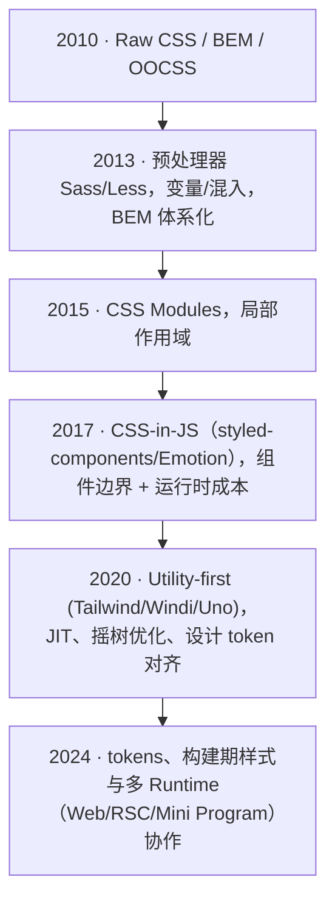
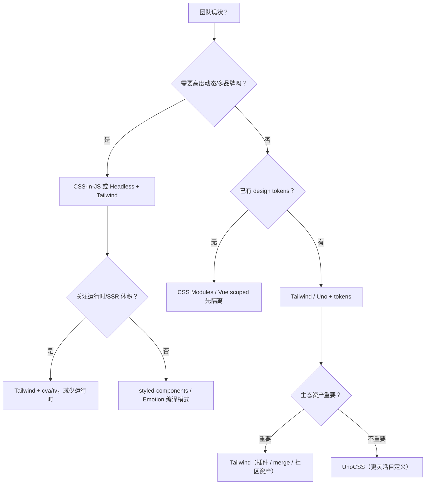

## 要点

- 这页不是为了背历史，而是为了回答一个现实问题：为什么今天越来越多团队会走向原子化 CSS。
- 样式方案的主流实践，整体确实从「全局命名」走向「模块化 / 组件化」再到更强的组合化与原子化，但这更像常见演进路径，而不是所有团队都遵循的一条单线历史。
- 原子化 CSS 的价值不只在于写得快，更在于它更适合和 tokens、JIT、组件变体、AI 生成这些现代工作流接起来。
- 但它也不是终点。多 runtime（Web、RSC、小程序）场景下，真正稳定的核心通常是 token、组件边界与构建约束，而不是某一种具体写法。

## 建议怎么读这页

- 如果你在做技术选型，重点看“各阶段优势 / 劣势 / 适用场景”。
- 如果你在做团队分享，重点看时间轴和“原子化 CSS 解决 / 未解决的问题”。
- 如果你已经决定用 Tailwind，这页可以帮助你向团队解释“为什么要建立约束”，而不只是说它流行。

> 组件库部分已拆为独立页面：[组件库的演进](/docs/tailwindcss/history/component-evolution)。
>
> 说明：这页的时间线更适合看作“常见演进路径”。截至 2026 年 2 月 27 日更新的 Next.js 官方文档，仍把 Tailwind CSS、CSS Modules、Global CSS、Sass 与 CSS-in-JS 并列列为当前可选方案，而不是线性替代关系。

:::info 资料参考
- [Next.js: How to use CSS in your application](https://nextjs.org/docs/app/getting-started/css)
- [Next.js: CSS Modules](https://nextjs.org/docs/14/app/building-your-application/styling/css-modules)
- [State of CSS 2024: Tools](https://2024.stateofcss.com/en-US/tools/)
:::

## <span className="mr-2 inline-block align-middle text-primary dark:text-primary-200 icon-[mdi--calendar-month]"></span> 样式方案时间轴


```mermaid
%%{ init: { "flowchart": { "curve": "basis", "nodeSpacing": 32, "rankSpacing": 24 } } }%%
flowchart TB
  A["2010 · Raw CSS / BEM / OOCSS"]
  B["2013 · 预处理器 Sass/Less，变量/混入，BEM 体系化"]
  C["2015 · CSS Modules，局部作用域"]
  D["2017 · CSS-in-JS（styled-components/Emotion），组件边界 + 运行时成本"]
  E["2020 · Utility-first (Tailwind/Windi/Uno)，JIT、摇树优化、设计 token 对齐"]
  F["2024 · tokens、构建期样式与多 Runtime（Web/RSC/Mini Program）协作"]

  A --> B --> C --> D --> E --> F
```

<div className="mt-3 grid gap-2 text-sm text-muted-foreground">
  <div className="flex items-start gap-2">
    <span className="icon-[mdi--pencil] text-lg text-primary dark:text-primary-200" aria-hidden="true" />
    <span>2010：Raw CSS / BEM / OOCSS，语义命名 + 手写层级。</span>
  </div>
  <div className="flex items-start gap-2">
    <span className="icon-[mdi--layers] text-lg text-primary dark:text-primary-200" aria-hidden="true" />
    <span>2013：Sass/Less 变量与混入，BEM 体系化。</span>
  </div>
  <div className="flex items-start gap-2">
    <span className="icon-[mdi--shield-check] text-lg text-primary dark:text-primary-200" aria-hidden="true" />
    <span>2015：CSS Modules 作用域隔离。</span>
  </div>
  <div className="flex items-start gap-2">
    <span className="icon-[mdi--code-tags] text-lg text-primary dark:text-primary-200" aria-hidden="true" />
    <span>2017：CSS-in-JS，组件边界 + 运行时成本。</span>
  </div>
  <div className="flex items-start gap-2">
    <span className="icon-[mdi--star-four-points] text-lg text-primary dark:text-primary-200" aria-hidden="true" />
    <span>2020：Utility-first，JIT、摇树、tokens 对齐。</span>
  </div>
  <div className="flex items-start gap-2">
    <span className="icon-[mdi--timeline-clock-outline] text-lg text-primary dark:text-primary-200" aria-hidden="true" />
    <span>2024：tokens、构建期样式与多 Runtime 协作继续加强。</span>
  </div>
</div>

### 几段常见的「升级理由」

- BEM 项目重构时，遇到 `.btn--primary` 在四个文件里被覆盖，且 hover 颜色不一致；引入 Utility-first 后把按钮拆成变体，类名归到 `cva` 工厂，审阅时一眼能看出状态组合。
- CSS-in-JS 方案在 SSR 下首屏注水 60KB，改为 Tailwind + tokens 后，首屏 CSS 控制在 8KB 以内，且通过 `content` 精准扫描避免动态膨胀。
- Mini Program 场景 class 长度有限，原子类 + 预生成模板替换了动态拼接的 style 字符串，稳定性提高，构建速度更快。

## 各阶段优势 / 劣势 / 适用场景

如果你是手机上快速扫读，这里先看这 6 条就够了：

- `Raw CSS + BEM/OOCSS`：最直观，适合小体量页面；问题是全局污染和命名漂移。
- `Sass/Less`：复用能力更强，适合还没进入组件化的项目；问题是仍然容易掉进全局和嵌套地狱。
- `CSS Modules`：隔离更好，适合中大型项目和组件库；问题是跨组件复用和主题切换会更依赖额外抽象。
- `CSS-in-JS`：动态能力强，适合主题和状态很多的设计系统；问题是运行时、编译链和体积成本更高。
- `Utility-first`：迭代快、与 tokens 对齐、生态强；问题是没有约束时很容易 class 漂移。
- `Token + Headless`：这不是单独的样式范式，更像与多种样式方案并行发展的组件封装趋势；优点是更适合统一体验和 AI 协作，代价是必须认真维护 design system。

如果你需要更细一点的判断，可以看下面这份分段版速查：

### Raw CSS + BEM/OOCSS

- 优势：简单直观，命名自带语义。
- 劣势：全局污染明显，样式覆盖难排查，复用能力弱。
- 适用：小体量页面、低复杂度站点。
- 规避：先定前缀和命名规则，避免长选择器链。

### 预处理器（Sass / Less）

- 优势：变量、混入、函数提高复用，BEM 更容易落地。
- 劣势：仍然是全局样式，容易出现嵌套地狱和编译体积膨胀。
- 适用：需要一定复用，但还没有强组件边界要求的项目。
- 规避：限制嵌套层级，lint 禁止 `#id` 和深层选择器，保持色板集中。

### CSS Modules

- 优势：作用域隔离明确，天然减少全局污染。
- 劣势：样式与组件绑定更紧，跨组件复用和主题切换要额外抽象。
- 适用：中大型应用、可发布组件库、需要样式隔离的项目。
- 规避：抽 shared variables，避免在组件里声明全局变量。

### CSS-in-JS

- 优势：组件边界天然清晰，适合强动态样式和主题系统。
- 劣势：运行时和编译链更复杂，类名可读性通常较弱。
- 适用：需要强动态样式、多品牌、多主题的设计系统。
- 规避：尽量选零运行时方案或编译模式，严格限制动态样式范围。

### Utility-first（Tailwind / Uno）

- 优势：低认知切换、JIT、摇树优化、与 tokens 对齐、生态丰富。
- 劣势：可读性高度依赖团队约束，`content` 不准时体积容易失控。
- 适用：高迭代速度、设计体系对齐、组件组合化明显的前后端或多端项目。
- 规避：建立 tokens 和 variants 规范，统一 `cn` + merge，禁止字符串拼类。

### Token + Headless 组件趋势

- 定位：它更像组件抽象与设计系统趋势，不是独立替代 Tailwind、CSS Modules 或 CSS-in-JS 的“下一代样式方案”。
- 优势：组件 API 与样式解耦，变体集中管理，适合统一设计语言。
- 劣势：需要持续维护 design system，没有约束时仍会漂移。
- 适用：多产品线、需要可插拔主题、希望被 AI 或脚本稳定消费的团队。
- 规避：维护 tokens 表，评审类名和变体工厂，保留 merge / lint 校验链。

> 参考方向：`Headless UI`、`Radix Primitives`、`shadcn/ui` 这类方案，本质上更偏组件抽象与设计系统分层，而不是单独的样式语言。

> 迁移建议：如果已有 CSS Modules/组件库想拥抱原子化，可先将公共 tokens 抽出，再在 Headless 组件上叠加 `cva`/`tailwind-variants`，逐步替换局部样式。

## 深入阅读（按阶段拆分）

- [Raw CSS / BEM / OOCSS](/docs/tailwindcss/history/raw-css)
- [Sass / Less 预处理](/docs/tailwindcss/history/preprocessors)
- [CSS Modules 阶段](/docs/tailwindcss/history/css-modules)
- [CSS-in-JS 阶段](/docs/tailwindcss/history/css-in-js)
- [Utility-first / Tailwind / UnoCSS](/docs/tailwindcss/history/utility-first)
- [Token 化与 Headless 组件](/docs/tailwindcss/history/headless-tokens)
- [生成式 CSS / 原生能力融合](/docs/tailwindcss/history/future-generative-css)

## 阶段代表性包速览

- `Raw CSS`：`normalize.css`、`Bootstrap`、`Bulma`
  常见用法：全局命名 + 组件 class。
- `预处理器`：`Sass`、`Less`、`PostCSS`、`Stylus`
  常见用法：变量、混入、主题定制。
- `CSS Modules`：Vite / webpack modules、Next.js、`vanilla-extract`
  常见用法：作用域哈希、编译期隔离。
- `CSS-in-JS`：`styled-components`、`Emotion`、`JSS`、`vanilla-extract`
  常见用法：运行时或编译期动态样式。
- `Utility-first`：`Tailwind`、`Windi`、`UnoCSS`、`twin.macro`
  常见用法：JIT 原子类、attributify、宏模式。
- `Headless + tokens`：`Radix`、`Headless UI`、`shadcn/ui`、`tailwind-variants`
  常见用法：作为组件抽象层，和 Tailwind、CSS Modules、vanilla-extract 等方案配合。

## 阶段 Demo：把「方式」落到机制

### Raw CSS / BEM：零构建 + 约定

```html title="index.html"
<link rel="stylesheet" href="/reset.css" />
<section class="card card--elevated">
  <p class="card__eyebrow">Raw CSS</p>
  <h2 class="card__title">全局命名</h2>
</section>
```

### 预处理器：脚本化编译与 tokens 复用

```json title="package.json"
{
  "scripts": {
    "build:css": "sass src/styles/index.scss dist/index.css --no-source-map && postcss dist/index.css -o dist/index.css",
    "watch:css": "sass --watch src/styles/index.scss:dist/index.css"
  }
}
```

```scss title="src/styles/index.scss"
@use './tokens' as *;
.card { border: 1px solid lighten($color-primary, 65%); border-radius: $radius-lg; }
```

### CSS Modules：编译期隔离 + 组件消费

```ts title="vite.config.ts"
export default { css: { modules: { generateScopedName: '[name]__[local]___[hash:base64:5]' } } }
```

```tsx title="Card.tsx"
import styles from './card.module.css'
export const Card = () => <section className={`${styles.card} ${styles.elevated}`}>CSS Modules</section>
```

### CSS-in-JS：主题运行时 + 编译模式

```tsx title="styled-components + ThemeProvider"
import styled, { ThemeProvider } from 'styled-components'
const theme = { primary: '#111827', radius: '12px' }
const Button = styled.button`border-radius: ${({ theme }) => theme.radius}; background: ${({ theme }) => theme.primary};`
export const Demo = () => <ThemeProvider theme={theme}><Button>动态主题</Button></ThemeProvider>
```

### Utility-first：Tailwind + cva 生成变体

```ts title="tailwind.config.ts"
export default { content: ['./src/**/*.{ts,tsx,html}'], theme: { extend: { colors: { brand: '#111827' } } } }
```

```tsx title="components/button.tsx"
import { cva } from 'class-variance-authority'
const button = cva('rounded-lg px-4 py-2 text-sm font-medium', { variants: { tone: { brand: 'bg-brand text-white' } }, defaultVariants: { tone: 'brand' } })
export const Button = ({ tone = 'brand', ...props }) => <button className={button({ tone })} {...props} />
```

### Token + Headless：作为组件抽象层配合样式方案

```css title="src/styles/tokens.css"
:root { --color-primary: #111827; --radius-lg: 12px; }
[data-theme="dark"] { --color-primary: #e5e7eb; }
```

```tsx title="components/menu.tsx"
import { Menu } from '@headlessui/react'
import { tv } from 'tailwind-variants'
const item = tv({ base: 'flex items-center rounded-lg px-3 py-2 text-sm', variants: { active: { true: 'bg-muted text-foreground' } } })
export const MenuDemo = () => (
  <Menu>
    <Menu.Button className="rounded-lg border px-3 py-2">操作</Menu.Button>
    <Menu.Items className="mt-2 w-40 rounded-xl border bg-card p-2 shadow-xl">
      <Menu.Item>{({ active }) => <button className={item({ active })}>编辑</button>}</Menu.Item>
    </Menu.Items>
  </Menu>
)
```

### <span className="mr-2 inline-block align-middle text-primary dark:text-primary-200 icon-[mdi--source-branch]" aria-hidden="true" /> 决策树：选择样式方案


```mermaid
flowchart TD
  A["团队现状？"] --> B{"需要高度动态/多品牌吗？"}
  B -->|是| C["CSS-in-JS 或 Headless + Tailwind"]
  B -->|否| D{"已有 design tokens？"}
  D -->|有| E["Tailwind / Uno + tokens"]
  D -->|无| F["CSS Modules / Vue scoped 先隔离"]
  C --> G{"关注运行时/SSR 体积？"}
  G -->|是| H["Tailwind + cva/tv，减少运行时"]
  G -->|否| I["styled-components / Emotion 编译模式"]
  E --> J{"生态资产重要？"}
  J -->|重要| K["Tailwind（插件 / merge / 社区资产）"]
  J -->|不重要| L["UnoCSS（更灵活自定义）"]
```

## 语义化 vs 信息密度（跨方案视角）

- 语义化：类名、文件名、组件名是否能表达意图，调试时是否容易定位。
- 信息密度：同样的信息写了几次，是否集中在 tokens / variants，而不是散落在模板里。

快速判断可以直接看这几条：

- `Raw CSS / BEM`：语义化高，但信息容易分散。
- `预处理器`：复用比 Raw CSS 好，但容易把复杂度藏进嵌套里。
- `CSS Modules`：隔离性更强，语义主要靠组件名和文件名补偿。
- `CSS-in-JS`：动态能力强，但运行时方案通常信息密度一般。
- `Utility-first`：单个类名语义弱，但整体信息密度高，适合配合组件工厂。
- `Token + Headless`：语义和信息密度都高，但它更适合被理解为“设计系统与组件抽象层”，而不是单独的样式时代。

## 原子化 CSS 解决/未解决的问题

- ✅ 解决：
  - 认知负担：在很多场景里，类名即样式，减少模板与样式文件来回跳转。
  - 漂移与覆盖：通过更细粒度的类、`content` 扫描与组件工厂，减少一部分全局泄漏和重复声明。
  - 设计对齐：配合 tokens 与 variants，能让「设计 → 组件接口 / 类名」更容易建立映射。
- ⚠️ 风险：
  - 可读性：类名过长、无约束导致审阅困难。
  - 一致性：不同人随意取值，导致色板/间距失控。
  - 体积：动态类或 content 过宽会失去摇树收益。
- 🚫 不推荐直接作为唯一方案的场景：
  - 需要强隔离的可发布组件库（通常更适合 CSS Modules、vanilla-extract，或与 Tailwind 组合使用）。
  - 极简静态站点，对运行时无需求，模板类名冗长反而成本高。
  - 无法建立 design token/规范的团队，原子类易失控。

## 与运行时/平台的适配

- Web/RSC：优先静态生成、`content` 精准匹配 server 侧模板；避免在服务器计算随机类名。
- 小程序/多端：注意 class length 限制；预生成静态类，不依赖动态模板拼接。
- SSR/HMR：Tailwind v4 JIT 足够快；UnoCSS 具更灵活的即时模式，但生态/插件差异需权衡。
