## 要点

- `tailwind-merge` 负责 class 冲突/去重，是安全拼 class 的底座；推荐封装 `cn = twMerge(clsx(...))`。
- `cva`/`tailwind-variants` 把 variants/default/compound 集中声明，输出 class builder，避免状态散落；`tv` 内置 merge + slots，适合多槽组件。
- 闭环：tokens → 原子类/variants → builder → 组件 → content 扫描 → JIT → merge → 产物。

## tailwind-merge：去重与边界

- 意义：让「后写覆盖前写」成为可预测规则，避免动态组合时出现 `p-4 p-2` 这类冲突导致的随机样式；类名越多越需要去重。
- 作用：`p-4 p-2` → `p-2`；自定义 tokens/尺寸时需同步规则。
- 建议：在所有 class 拼接入口统一用 `cn`；对常见自定义（色板、spacing、radius）写额外 merge config 并加用例验证。
- 快测：在 Demo 按钮里故意写 `p-4 p-2`，观察输出；对自定义色板 class 也做覆盖测试。

### 没有 tailwind-merge 时

```tsx
import clsx from 'clsx'

function Button({ size = 'md', className, ...props }) {
  // 难以保证调用方不会传入冲突类（如 px-2），只能靠约定
  const base = 'inline-flex items-center rounded-md px-3 py-2 text-sm font-medium'
  const sizeClass = size === 'lg' ? 'px-4 py-2.5 text-base' : 'px-3 py-2 text-sm'
  return <button className={clsx(base, sizeClass, className)} {...props} />
}

// 使用方
// 这里传了 px-2，最终输出 class 顺序取决于 props 位置，样式不可控
;<Button className="px-2 text-red-600" />
```

### 引入 tailwind-merge 之后

```tsx
import { twMerge } from 'tailwind-merge'
import clsx from 'clsx'
const cn = (...inputs: clsx.ClassValue[]) => twMerge(clsx(...inputs))

function Button({ size = 'md', className, ...props }) {
  const base = 'inline-flex items-center rounded-md px-3 py-2 text-sm font-medium'
  const sizeClass = size === 'lg' ? 'px-4 py-2.5 text-base' : 'px-3 py-2 text-sm'
  return <button className={cn(base, sizeClass, className)} {...props} />
}

// 使用方
// 即便传入 px-2，tailwind-merge 也会保留「最后的有效值」，变为 px-2，行为可预测
;<Button className="px-2 text-red-600" />
```

## cva：轻量变体工厂

```ts
import { cva } from 'class-variance-authority'

export const badge = cva('inline-flex items-center rounded-md text-xs font-medium', {
  variants: {
    tone: {
      subtle: 'bg-muted text-muted-foreground border border-border',
      brand: 'bg-primary text-primary-foreground',
      danger: 'bg-destructive text-white',
    },
    size: { sm: 'px-2 py-1', md: 'px-2.5 py-1.5' },
  },
  compoundVariants: [{ tone: 'brand', size: 'md', class: 'shadow-sm' }],
  defaultVariants: { tone: 'subtle', size: 'md' },
})
```

- 场景：单槽组件（按钮、Badge、Input 等）；与 `cn` 组合解决冲突。

## tailwind-variants (tv)：内置 merge + slots

```ts
import { tv } from 'tailwind-variants'

export const card = tv({
  base: 'rounded-2xl border bg-card/80 shadow-sm transition',
  slots: {
    header: 'flex items-center justify-between gap-2',
    body: 'space-y-2 text-sm text-muted-foreground',
    footer: 'flex items-center gap-2',
  },
  variants: {
    tone: { neutral: 'border-border', brand: 'border-primary/40 shadow-lg', subtle: 'border-muted bg-muted/60' },
    interactive: { true: 'hover:-translate-y-0.5 hover:shadow-md' },
  },
  defaultVariants: { tone: 'neutral', interactive: true },
})
```

- 场景：多槽组件（Card、Modal、List item），需要 slots/recipes 与自动 merge。

## cva vs tv 对照

| 项 | cva | tailwind-variants |
| --- | --- | --- |
| Merge | 无内置，需要 `cn` 包装 | 内置 tailwind-merge |
| 多槽 | 不支持 slots | 支持 slots/recipes |
| 心智负担 | 轻，语法简单 | 略重，类型更严格 |
| 适用 | 按钮/Badge 等单槽 | 卡片/模态/多槽组件，设计系统 |

```mermaid
%%{ init: { "flowchart": { "curve": "basis" } } }%%
flowchart LR
  Tokens["Design Tokens / @theme"] --> Variants["原子类 + variants"]
  Variants --> Builders["cva / tailwind-variants"]
  Builders --> Components["React/Vue 组件"]
  Components --> Content["content 精准扫描"]
  Content --> JIT["Tailwind JIT 生成按需 CSS"]
  JIT --> Merge["tailwind-merge 去重"]
  Merge --> Output["最终 CSS/HTML 产物"]
```

## 从设计到产物（示意图）



## 实用检查清单

- 所有动态 class 是否经 `cn`（含 `tailwind-merge`）合并？
- 是否存在散落的 `clsx`/字符串拼接 class？是否可迁移到 `cva`/`tv`？
- `variants/defaultVariants/compoundVariants` 是否集中在 builder 文件，业务组件不再拼装状态？
- 自定义 tokens 是否同步到 merge 规则？是否有用例验证覆盖顺序？
