## 要点

- `tailwind-merge` 负责 class 冲突/去重，是安全拼 class 的底座；推荐封装 `cn = twMerge(clsx(...))`。
- `cva`/`tailwind-variants` 把 variants/default/compound 集中声明，输出 class builder，避免状态散落；`tv` 内置 merge + slots，适合多槽组件。
- 闭环：tokens → 原子类/variants → builder → 组件 → content 扫描 → JIT → merge → 产物。

## tailwind-merge：去重与边界

- 定义：一段针对 Tailwind 类名的「冲突解析器」，根据官方生成顺序和自定义配置判断哪些类互斥、保留最后一条有效值。
- 意义：让「后写覆盖前写」成为可预测规则，避免动态组合时出现 `p-4 p-2` 这类冲突导致的随机样式；类名越多越需要去重。也是 shadcn/ui 这类组件库能安全暴露 `className` 扩展点的基石。
- 典型用法：封装 `cn = twMerge(clsx(...))`，组件内部先写好「官方默认」，调用方传入的 `className`/`slot` 覆盖时，`tailwind-merge` 会清理掉冲突类，只留下最后的意图。

### 为什么它是「基石」

- 组件库必须开放 `className` 让消费者定制，如果没有 merge，任何「兜底样式」都可能被调用方的冲突类覆盖，且覆盖关系取决于 Tailwind 内部排序而非调用方意图。
- shadcn/ui 的所有组件都通过 `cn` 暴露覆盖点，`tailwind-merge` 才能保证「库默认 + 用户覆盖」是可预期的；不然需要禁止调用方使用部分类名或写大量 `!important`。
- 对 tokens 自定义（例如新增 `radius-4xl` 或品牌色）时，`tailwind-merge` 也能根据扩展配置正确识别冲突，避免出现「自定义类永远不会覆盖掉默认类」的问题。
- 作用：`p-4 p-2` → `p-2`；自定义 tokens/尺寸时需同步规则。
- 建议：在所有 class 拼接入口统一用 `cn`；对常见自定义（色板、spacing、radius）写额外 merge config 并加用例验证。
- 快测：在 Demo 按钮里故意写 `p-4 p-2`，观察输出；对自定义色板 class 也做覆盖测试。

### 没有 tailwind-merge 时

```tsx
import clsx from 'clsx'

function Button({ size = 'md', className, ...props }) {
  // 难以保证调用方不会传入冲突类（如 px-2），只能靠约定
  const base = 'inline-flex items-center rounded-md px-3 py-2 text-sm font-medium'
  const sizeClass = size === 'lg' ? 'px-4 py-2.5 text-base' : 'px-3 py-2 text-sm'
  return <button className={clsx(base, sizeClass, className)} {...props} />
}

// 使用方
// 这里传了 px-2，最终输出 class 顺序取决于 props 位置，样式不可控
;<Button className="px-2 text-red-600" />
```

#### 示例：生成产物的「顺序陷阱」

Tailwind 会按内部规则排序候选（如 `p-0 → p-1 → p-2 → p-4 ...`），与 class 字符串的顺序无关：

```html
<!-- 期待 p-2 覆盖 p-4，但生成的 CSS 顺序仍是 p-2 在前、p-4 在后 -->
<button class="p-4 p-2 bg-blue-500 bg-red-500">示例</button>
```

```css
/* Tailwind 生成的片段（节选） */
.p-2 { padding: 0.5rem; }
.p-4 { padding: 1rem; } /* 出现在后面，仍然生效，覆盖掉 p-2 */
.bg-blue-500 { background-color: #3b82f6; }
.bg-red-500 { background-color: #ef4444; } /* 同样覆盖蓝色 */
```

即便 class 写成「后者想覆盖前者」，最终仍由 Tailwind 的排序决定，无法满足「调用方最后一项赢」的诉求。

### 引入 tailwind-merge 之后

```tsx
import { twMerge } from 'tailwind-merge'
import clsx from 'clsx'
const cn = (...inputs: clsx.ClassValue[]) => twMerge(clsx(...inputs))

function Button({ size = 'md', className, ...props }) {
  const base = 'inline-flex items-center rounded-md px-3 py-2 text-sm font-medium'
  const sizeClass = size === 'lg' ? 'px-4 py-2.5 text-base' : 'px-3 py-2 text-sm'
  return <button className={cn(base, sizeClass, className)} {...props} />
}

// 使用方
// 即便传入 px-2，tailwind-merge 也会保留「最后的有效值」，变为 px-2，行为可预测
;<Button className="px-2 text-red-600" />
```

#### 示例：merge 后的产物

```html
<button class="p-2 bg-red-500">示例</button>
```

```css
.p-2 { padding: 0.5rem; }
.bg-red-500 { background-color: #ef4444; }
```

通过删除冲突类，最终产物只包含用户期望的「最后一份声明」，不再受 Tailwind 内部排序影响。

### shadcn 风格组件的常见模式

```tsx
// utils/cn.ts
import { clsx, type ClassValue } from 'clsx'
import { twMerge } from 'tailwind-merge'
export const cn = (...inputs: ClassValue[]) => twMerge(clsx(...inputs))

// components/button.tsx
const base = 'inline-flex items-center gap-2 rounded-md px-3 py-2 text-sm font-medium'
const tones = {
  default: 'bg-primary text-primary-foreground hover:bg-primary/90',
  ghost: 'bg-transparent text-foreground hover:bg-accent',
}
const sizes = { sm: 'h-8 px-2.5', md: 'h-10 px-3', lg: 'h-12 px-4 text-base' }

export function Button({ tone = 'default', size = 'md', className, ...props }) {
  return (
    <button
      className={cn(base, tones[tone], sizes[size], className)}
      {...props}
    />
  )
}

// 使用方：随意传入自定义类，默认与覆盖可预测
;<Button tone="ghost" className="px-10 bg-yellow-400 text-black" />
```

在上例中，调用方传入的 `px-10` 会去掉默认的 `px-3/px-4`，`bg-yellow-400` 也会覆盖默认的 `bg-primary`。`tailwind-merge` 让「库的默认 + 用户的覆盖」成为可靠的组合，避免写 `!important` 或约束文档里硬性禁止某些类名，从而成为这类可扩展组件模式的基石。


## cva：轻量变体工厂

```ts
import { cva } from 'class-variance-authority'

export const badge = cva('inline-flex items-center rounded-md text-xs font-medium', {
  variants: {
    tone: {
      subtle: 'bg-muted text-muted-foreground border border-border',
      brand: 'bg-primary text-primary-foreground',
      danger: 'bg-destructive text-white',
    },
    size: { sm: 'px-2 py-1', md: 'px-2.5 py-1.5' },
  },
  compoundVariants: [{ tone: 'brand', size: 'md', class: 'shadow-sm' }],
  defaultVariants: { tone: 'subtle', size: 'md' },
})
```

- 场景：单槽组件（按钮、Badge、Input 等）；与 `cn` 组合解决冲突。

## tailwind-variants (tv)：内置 merge + slots

```ts
import { tv } from 'tailwind-variants'

export const card = tv({
  base: 'rounded-2xl border bg-card/80 shadow-sm transition',
  slots: {
    header: 'flex items-center justify-between gap-2',
    body: 'space-y-2 text-sm text-muted-foreground',
    footer: 'flex items-center gap-2',
  },
  variants: {
    tone: { neutral: 'border-border', brand: 'border-primary/40 shadow-lg', subtle: 'border-muted bg-muted/60' },
    interactive: { true: 'hover:-translate-y-0.5 hover:shadow-md' },
  },
  defaultVariants: { tone: 'neutral', interactive: true },
})
```

- 场景：多槽组件（Card、Modal、List item），需要 slots/recipes 与自动 merge。

## cva vs tv 对照

| 项 | cva | tailwind-variants |
| --- | --- | --- |
| Merge | 无内置，需要 `cn` 包装 | 内置 tailwind-merge |
| 多槽 | 不支持 slots | 支持 slots/recipes |
| 心智负担 | 轻，语法简单 | 略重，类型更严格 |
| 适用 | 按钮/Badge 等单槽 | 卡片/模态/多槽组件，设计系统 |

```mermaid
%%{ init: { "flowchart": { "curve": "basis" } } }%%
flowchart LR
  Tokens["Design Tokens / @theme"] --> Variants["原子类 + variants"]
  Variants --> Builders["cva / tailwind-variants"]
  Builders --> Components["React/Vue 组件"]
  Components --> Content["content 精准扫描"]
  Content --> JIT["Tailwind JIT 生成按需 CSS"]
  JIT --> Merge["tailwind-merge 去重"]
  Merge --> Output["最终 CSS/HTML 产物"]
```

## <span className="mr-2 inline-block align-middle text-primary dark:text-primary-200 icon-[mdi--chart-timeline]" aria-hidden="true" /> 从设计到产物（示意图）



<div className="mt-3 grid gap-2 text-sm text-muted-foreground">
  <div className="flex items-start gap-2">
    <span className="icon-[mdi--palette-swatch] text-lg text-primary dark:text-primary-200" aria-hidden="true" />
    <span>Tokens：色板/间距/半径/排版等设计变量。</span>
  </div>
  <div className="flex items-start gap-2">
    <span className="icon-[mdi--widgets] text-lg text-primary dark:text-primary-200" aria-hidden="true" />
    <span>Variants/Builders：用 cva/tv 封装 size、tone、state 等变体。</span>
  </div>
  <div className="flex items-start gap-2">
    <span className="icon-[mdi--monitor] text-lg text-primary dark:text-primary-200" aria-hidden="true" />
    <span>Components/Content/JIT：组件消费 builder，content 精准扫描驱动 JIT 生成。</span>
  </div>
  <div className="flex items-start gap-2">
    <span className="icon-[mdi--check-circle-outline] text-lg text-primary dark:text-primary-200" aria-hidden="true" />
    <span>Merge/Output：tailwind-merge 清理冲突，产出可预期的最终样式。</span>
  </div>
</div>

## 实用检查清单

- 所有动态 class 是否经 `cn`（含 `tailwind-merge`）合并？
- 是否存在散落的 `clsx`/字符串拼接 class？是否可迁移到 `cva`/`tv`？
- `variants/defaultVariants/compoundVariants` 是否集中在 builder 文件，业务组件不再拼装状态？
- 自定义 tokens 是否同步到 merge 规则？是否有用例验证覆盖顺序？
