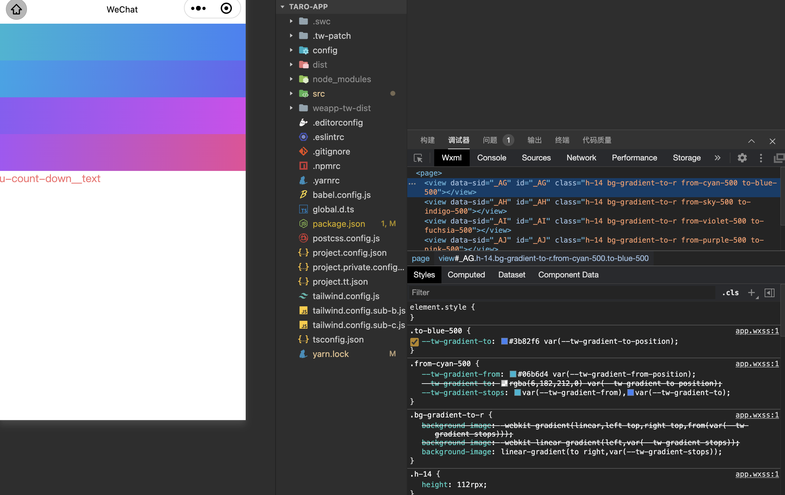

# CSS variable invalidation problem

## Symptoms of the problem

In small program projects such as `Taro` and `uni-app`, you may encounter the problem of Tailwind CSS variables being lost.

A common symptom is that the gradient class name has no effect. For example, the following class names have no background color in the simulator:

```jsx
<View className='h-14 bg-gradient-to-r from-cyan-500 to-blue-500'></View>
<View className='h-14 bg-gradient-to-r from-sky-500 to-indigo-500'></View>
<View className='h-14 bg-gradient-to-r from-violet-500 to-fuchsia-500'></View>
<View className='h-14 bg-gradient-to-r from-purple-500 to-pink-500'></View>
```

## Reasons and solutions

These utility classes rely on CSS variables generated by Tailwind. If there is no variable initialization area in the final `app.wxss` / `app.css`, styles such as gradient, shadow, ring, and transform may fail. See [What is the Tailwind CSS variable initialization area](#What is-tailwind-css-variable initialization area).

A common scenario is that the Taro project also uses `@tarojs/plugin-html`, and the variable initialization area of Tailwind is deleted during the construction process.

You can first open it in `WeappTailwindcss` of `cssOptions`:

```ts
WeappTailwindcss({
  cssOptions: {
    injectAdditionalCssVarScope: true,
  },
})
```

See [Using with NutUI](./use-with-nutui) for code snippets and configuration details.

## Effect after successful setting

The effect after successful setting is as follows. You can observe the effect on the left and the `inspect` panel in the lower right corner as a reference.



## What is the Tailwind CSS variable initialization area?

In the `app.wxss` style product file (such as Taro or the `dist` directory of uni-app), there is usually a Tailwind variable initialization CSS.

If this area is deleted, utility classes that rely on CSS variables will have problems.

```css
::before,::after {
  --tw-content: "";
}
view,text,::before,::after {
  --tw-border-spacing-x: 0;
  --tw-border-spacing-y: 0;
  --tw-translate-x: 0;
  --tw-translate-y: 0;
  --tw-rotate: 0;
  --tw-skew-x: 0;
  --tw-skew-y: 0;
  --tw-scale-x: 1;
  --tw-scale-y: 1;
  --tw-pan-x:  ;
  --tw-pan-y:  ;
  --tw-pinch-zoom:  ;
  --tw-scroll-snap-strictness: proximity;
  --tw-gradient-from-position:  ;
  --tw-gradient-via-position:  ;
  --tw-gradient-to-position:  ;
  --tw-ordinal:  ;
  --tw-slashed-zero:  ;
  --tw-numeric-figure:  ;
  --tw-numeric-spacing:  ;
  --tw-numeric-fraction:  ;
  --tw-ring-inset:  ;
  --tw-ring-offset-width: 0px;
  --tw-ring-offset-color: #fff;
  --tw-ring-color: rgb(59 130 246 / 0.5);
  --tw-ring-offset-shadow: 0 0 #0000;
  --tw-ring-shadow: 0 0 #0000;
  --tw-shadow: 0 0 #0000;
  --tw-shadow-colored: 0 0 #0000;
  --tw-blur:  ;
  --tw-brightness:  ;
  --tw-contrast:  ;
  --tw-grayscale:  ;
  --tw-hue-rotate:  ;
  --tw-invert:  ;
  --tw-saturate:  ;
  --tw-sepia:  ;
  --tw-drop-shadow:  ;
  --tw-backdrop-blur:  ;
  --tw-backdrop-brightness:  ;
  --tw-backdrop-contrast:  ;
  --tw-backdrop-grayscale:  ;
  --tw-backdrop-hue-rotate:  ;
  --tw-backdrop-invert:  ;
  --tw-backdrop-opacity:  ;
  --tw-backdrop-saturate:  ;
  --tw-backdrop-sepia:  ;
  box-sizing: border-box;
  border-width: 0;
  border-style: solid;
  border-color: currentColor;
}
::backdrop {
  --tw-border-spacing-x: 0;
  --tw-border-spacing-y: 0;
  --tw-translate-x: 0;
  --tw-translate-y: 0;
  --tw-rotate: 0;
  --tw-skew-x: 0;
  --tw-skew-y: 0;
  --tw-scale-x: 1;
  --tw-scale-y: 1;
  --tw-pan-x:  ;
  --tw-pan-y:  ;
  --tw-pinch-zoom:  ;
  --tw-scroll-snap-strictness: proximity;
  --tw-gradient-from-position:  ;
  --tw-gradient-via-position:  ;
  --tw-gradient-to-position:  ;
  --tw-ordinal:  ;
  --tw-slashed-zero:  ;
  --tw-numeric-figure:  ;
  --tw-numeric-spacing:  ;
  --tw-numeric-fraction:  ;
  --tw-ring-inset:  ;
  --tw-ring-offset-width: 0px;
  --tw-ring-offset-color: #fff;
  --tw-ring-color: rgb(59 130 246 / 0.5);
  --tw-ring-offset-shadow: 0 0 #0000;
  --tw-ring-shadow: 0 0 #0000;
  --tw-shadow: 0 0 #0000;
  --tw-shadow-colored: 0 0 #0000;
  --tw-blur:  ;
  --tw-brightness:  ;
  --tw-contrast:  ;
  --tw-grayscale:  ;
  --tw-hue-rotate:  ;
  --tw-invert:  ;
  --tw-saturate:  ;
  --tw-sepia:  ;
  --tw-drop-shadow:  ;
  --tw-backdrop-blur:  ;
  --tw-backdrop-brightness:  ;
  --tw-backdrop-contrast:  ;
  --tw-backdrop-grayscale:  ;
  --tw-backdrop-hue-rotate:  ;
  --tw-backdrop-invert:  ;
  --tw-backdrop-opacity:  ;
  --tw-backdrop-saturate:  ;
  --tw-backdrop-sepia:  ;
}
```

This area is the variable initialization code generated after the Tailwind entry is expanded, from the generated result corresponding to `@import "tailwindcss";`.

Losing this area will cause utility classes such as `bg-gradient-to-r` that rely on CSS variables to fail.
