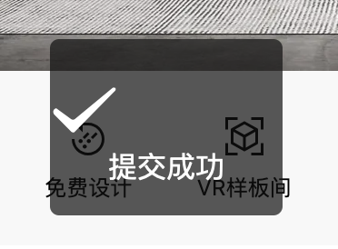

# H5 side native toast style offset problem

When using `tailwindcss`, compile to the `h5` platform, and use `uni.toast` / `taro.toast`, the following effects will occur



`tailwindcss` in `base` of `preflight` affects the style of this `uni.toast`

This is because the following styles are added by default in `preflight.css`

```css
img,
svg,
video,
canvas,
audio,
iframe,
embed,
object {
  display: block; /* 1 */
  vertical-align: middle; /* 2 */
}
```

This causes `svg` to become `display: block;`

The solution is also very simple, use styles to override `app.wxss`:

```scss
.uni-toast{
  svg {
display: initial; // Reinitialize the style in uni-toast to overwrite it.
  }
}
```

If you are using `uni-app`, you can also use style conditional compilation:

```scss
/*  #ifdef  H5  */
svg {
  display: initial;
}
/*  #endif  */
```
