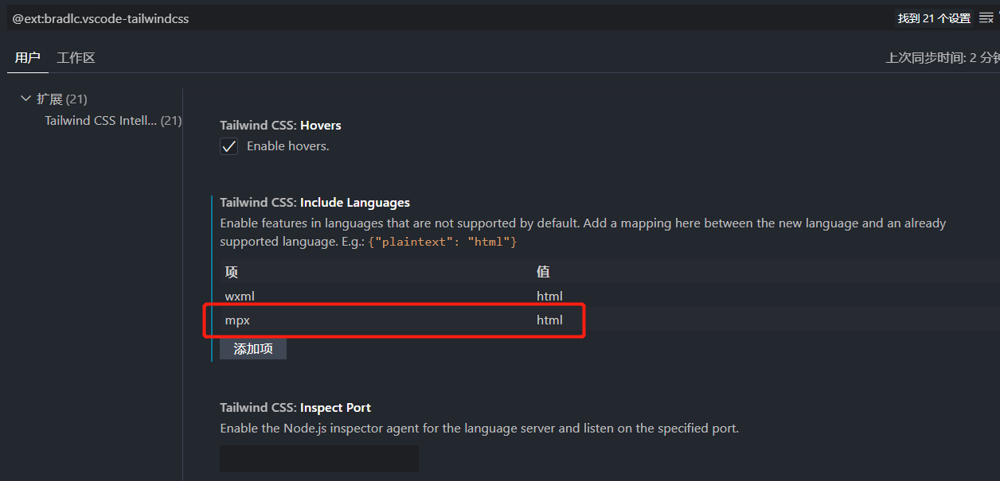

import ExternalClassesReminder from '@site/fragments/ExternalClassesReminder.mdx'

# Mpx

<ExternalClassesReminder framework="mpx" />

Mpx uses Webpack link, `cssEntries` should be configured explicitly so that `weapp-tailwindcss` can stably locate the Tailwind CSS entry.

## Register plugin

Register in `vue.config.js`:

```js title="vue.config.js"
const { defineConfig } = require('@vue/cli-service')
const { WeappTailwindcss } = require('weapp-tailwindcss/webpack')
const path = require('node:path')

module.exports = defineConfig({
  // other options
  configureWebpack(config) {
    config.plugins.push(
      new WeappTailwindcss({
        cssOptions: {
          rem2rpx: true,
        },
        appType: 'mpx',
        cssEntries: [
          path.resolve(__dirname, 'src/app.css'),
        ],
      })
    )
  }
})

```

## Introduce Tailwind CSS style

Tailwind CSS generation is taken over by `WeappTailwindcss`. Do not register the Tailwind official PostCSS generation plug-in.

The current documentation only maintains Tailwind CSS 4 access instructions.

```css title="src/app.css"
@import "tailwindcss";
@source "../src";
@source not "../dist";
@source not "../node_modules";
```

Please put the Tailwind 4 entry in the pure `.css` file. Do not put it directly into the `scss`, `less`, and `sass` entries.

### Introduced in app.mpx

```html title="src/app.mpx"
<style lang="css">
  @import './app.css';
</style>
```

## vscode tailwindcss smart prompt missing setting in mpx

If there is no smart prompt when writing `mpx` in the `class` file, you can handle it in the `Tailwind CSS IntelliSense` extension settings of VS Code.

In `include languages`, mark `mpx` as `html`.



After saving the settings, write `mpx` in the `class` file to see the smart prompt.
