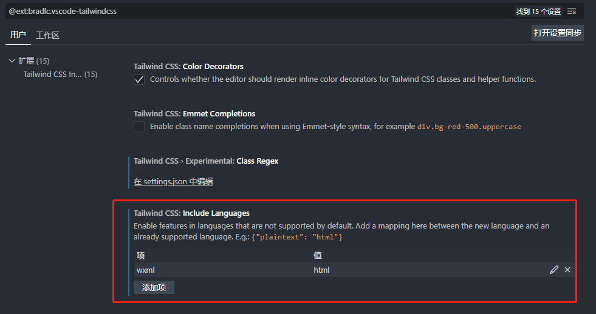
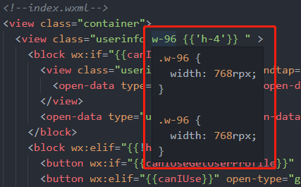
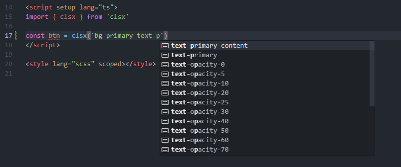

# IDE smart prompt settings

## VS Code

> First, make sure you have installed [`Tailwind CSS IntelliSense plug-in`](https://marketplace.visualstudio.com/items?itemName=bradlc.vscode-tailwindcss)

### Make `Tailwind CSS IntelliSense` recognize Tailwind CSS v4

`tailwindcss-intellisense` You must see `@import "tailwindcss"` in Tailwind CSS 4 for the workspace to be considered the Tailwind root file. In the generation mode, it is also recommended to directly write `@import 'tailwindcss';` in the real entry, and then use `WeappTailwindcss` to output the applet target CSS.

If you still want to be decoupled from the source code, you can also use the CLI to generate an extension-only auxiliary CSS for VS Code:

```bash npm2yarn
npx weapp-tailwindcss vscode-entry --css src/app.css
```

- The default output is at `.vscode/weapp-tailwindcss.intellisense.css`, which contains `@import 'tailwindcss';`, the common `@source` globs, and the CSS entries you pass in (e.g. `src/app.css`).
- This file is only used to activate IntelliSense and does not need to and should not be referenced by the packaging process.
- If you need to customize the file name or additional `@source`, you can adjust parameters such as `--output`, `--source`, `--force`, etc., and run `npx weapp-tailwindcss vscode-entry --help` to view all options.
- If you do not want to generate a separate file, you can directly write `@import 'tailwindcss';` in the real entry, and write this entry `tailwindCSS.experimental.configFile`.

VS Code will detect the auxiliary file after saving/reloading any file, allowing Tailwind CSS 4 projects to enjoy a complete completion, hover and jump experience.

If you want to explicitly tell `Tailwind CSS IntelliSense` "which source code directories a certain CSS root file corresponds to", you can continue to add `tailwindCSS.experimental.configFile`:

```json title=".vscode/settings.json"
{
  "tailwindCSS.experimental.configFile": {
    ".vscode/weapp-tailwindcss.intellisense.css": "src/**"
  }
}
```

- The key name is the CSS entry file path used by `Tailwind CSS IntelliSense`, which usually needs to contain `@import "tailwindcss";`.
- The key value is the source code range in which this entry takes effect, and supports glob; the above configuration indicates that when you edit a file under `src/**`, the extension will use `.vscode/weapp-tailwindcss.intellisense.css` as the Tailwind root file.
- When there are multiple Tailwind entries in a monorepo or a workspace, this writing method is more stable than "let the extension automatically guess", and is also suitable for use with the auxiliary CSS generated by `npx weapp-tailwindcss vscode-entry`.

### Smart prompts for wxml

We know that the best practice of `tailwindcss` is to be used in conjunction with the `vscode`/`webstorm` prompt plug-in.

If you encounter a situation where no smart prompt appears when writing `vscode` in the `wxml` file of `class`, you can refer to the following steps.

Here we take `vscode` as an example:

Install [`WXML - Language Services plug-in`](https://marketplace.visualstudio.com/items?itemName=qiu8310.minapp-vscode) (just search for wxml which has the most downloads)

Then there are `2` methods, `Global settings` and `Workspace settings`, provided below. You can choose one according to your needs.

#### Global settings

Click the settings icon in the lower left corner of `vscode` and search for the keyword `tailwindcss` to find the `Tailwind CSS IntelliSense` of the `Extended settings` plug-in

In `include languages`, manually mark `wxml` as type `html`



The smart prompt comes out:



#### Workspace settings

In the root directory of your open workspace directory, create the `.vscode` folder, and then add `settings.json` with the following content:

```json
{
  "tailwindCSS.includeLanguages": {
    "wxml": "html"
  }
}
```

In this way, the `vscode` setting in your workspace will overwrite your global `vscode` setting, and the effect in the picture above can also be achieved.

### Smart prompts for js, jsx, ts, tsx, vue...such files

#### Scene

After installing and configuring the plug-in, when we write code, we write `class=` and `className=` in those tags. In this scenario, smart prompts will appear immediately.

However, when we write `js` code, we often write `tailwindcss` string literals directly in the code, such as:

```jsx
const clsName = 'bg-[#123456] text-[#654321]'

return <div className={clsName}></div>
```

There is no intelligent prompt when writing this kind of string. What should I do?

#### Solution

Here is a plug-in based solution:

1. Install `clsx`:

```bash npm2yarn
npm i clsx
```

2. Go to [`vscode`](https://code.visualstudio.com/docs/getstarted/settings) in your `settings.json` settings

Add the following configuration inside:

```json
{
  "tailwindCSS.experimental.classRegex": [
    [
      "clsx\\(([^)]*)\\)",
      "(?:'|\"|`)([^']*)(?:'|\"|`)"
    ]
  ]
}
```

After this configuration, the smart prompt will appear:



[Refer link](https://github.com/lukeed/clsx#tailwind-support)

#### There is a problem

This principle also relies on regular matching, that is, `Tailwind CSS IntelliSense plug-in` matches the text field of the current `vscode` activity, and the keyword `clsx()` method exists, so the smart prompt is injected into it.

So it won't work if you write it like this:

```js
import { clsx as AAA } from 'clsx'

const btn = AAA('')
```

In addition, you can modify/add the regular rules in `"tailwindCSS.experimental.classRegex"` based on this feature, and then encapsulate a method yourself for intelligent prompting of `tailwindcss`.

## WebStorm

> Similar to `vscode`, also use `clsx` function

1. Make sure your version is greater than or equal to [WebStorm 2023.1](https://www.jetbrains.com/webstorm/whatsnew/#version-2023-1-tailwind-css-configuration)

2. Open settings and go to [Languages and Frameworks | Style Sheets | Tailwind CSS](https://www.jetbrains.com/help/webstorm/tailwind-css.html#ws_css_tailwind_configuration)

3. Add the following configuration:

```json
{
  "experimental": {
    "classRegex": ["clsx\\(([^)]*)\\)", "[\"'`]([^\"'`]*).*?[\"'`]"]
  }
}
```

> If you use the `class-variance-authority` function of `cva`, just add the `"cva\\(([^)]*)\\)"` regular expression.

## HbuilderX

<**PROTECTED_0**>
