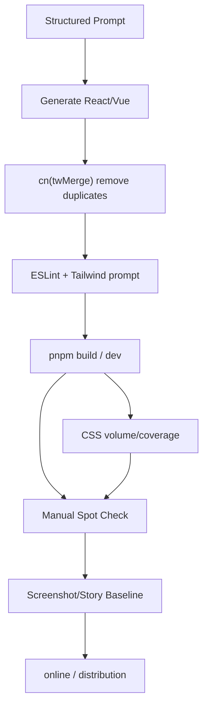

import TailwindTopicHero from '@site/src/components/docs/TailwindTopicHero'
import Tabs from '@theme/Tabs'
import TabItem from '@theme/TabItem'

<TailwindTopicHero topicId="tailwindcss/ai-friendly-and-demos" title="AI Friendly tips and Demo Operation guide" />

## Make the model write like a human

- Atomic classes are naturally suitable for AI generation because they are stable, composable, and low-ambiguity corpora.
- But "fit to generate" does not equal "fit to deliver." Without boundaries, models can quickly produce code that looks runnable but is actually difficult to maintain.
- So what this page really discusses is: how to give AI a clear enough track so that the output is fast and can be taken over by others.
- React/Vue Demo in `apps/react-app` and `apps/vue-app` can be directly used for prompt experiments, manual review and class name comparison.

## First grasp the 4 principles

- Give the model context, don't just give results requirements. It needs to know which tokens, which components, and which tools you have.
- Give your model boundaries, don't just say "write a component in Tailwind". Be clear about what can and cannot be done.
- Give the model a demonstration, don't expect it to guess your team's style on its own. 1 to 2 paragraphs of high-quality examples tend to be more effective than long descriptions.
- Give the model a verification chain, don't take "it looks almost the same" as a pass. Merge, lint, build and manual spot checks are all connected.

If you are ready to use this method right away, the minimum viable version is actually very simple:

1. Give the model a structured hint.
2. Attach an example of a component you recognize.
3. Clarify blacklists and boundaries.
4. Finally, use `cn`, lint and build to do a thorough rundown.

## Prompt template (example)

```
Goal: Use Tailwind atomic classes, adhere to design tokens (don't write nude values), use `cn`/`tailwind-merge` merge classes.
must:
- Only use existing swatches/spacing/rounded tokens.
- Use `cva` or `tailwind-variants` when encapsulating variants, declare defaultVariants/compoundVariants.
- Status class takes precedence aria/data (example: `aria-invalid:border-destructive`).
- Disable splicing of undeclared dynamic classes at runtime.
Output: React/Vue code block + key class explanation.
```

> Tips: Giving 1 to 2 paragraphs of "demonstration class names" that you recognize is usually more effective than adding a large paragraph of abstract principles; adding a blacklist can significantly reduce the probability of deviation.

## Structured prompts (stick and use)

```
You will write components for the atomic CSS theme, respecting existing tokens/variants.

Context:
- Repository: weapp-tailwindcss, React is in apps/react-app, Vue is in apps/vue-app.
- Toolchain: Tailwind v4 JIT, `cn` has built-in tailwind-merge, Button/Badge has been defined with cva.
- Design: Use OKLCH swatches, `--radius`, dark toggles via `.dark` or `data-theme`.

must:
- Only use existing tokens (do not write nude/px), class names can be combined but must be readable.
- Variants use `cva`/`tailwind-variants`, declare defaultVariants + compoundVariants.
- Status priority `aria-` / `data-` / `group` / `peer`, up to two levels of relationship classes.
- Give React + Vue code block, attach 1-2 lines of explanation, prohibit inline style/random color value.

Disabled:
- Runtime string concatenation class names, unregistered custom color values, and relationship classes with more than two levels.
- Depends on third-party UI libraries not in the repository (shadcn-ui is built-in).

Output:
- React code blocks (tsx) + Vue code blocks (vue SFC), including class explanation or recommended checklist.
- If an install/run command is required, give `pnpm --filter react-app dev` / `pnpm --filter vue-app dev`.
```

## Sample output (React/Vue, corresponding prompt)

<Tabs>
  <TabItem value="react" label="React">

```tsx
import { cva } from 'class-variance-authority'
import { cn } from '@/lib/utils'

const banner = cva('flex items-center justify-between rounded-xl border px-4 py-3 text-sm', {
  variants: {
    tone: {
      neutral: 'bg-muted text-muted-foreground',
      success: 'bg-emerald-50 text-emerald-900 dark:bg-emerald-500/10',
    },
  },
  defaultVariants: { tone: 'neutral' },
})

export function Promo() {
  return (
    <div className={cn(banner({ tone: 'success' }), 'data-[state=pending]:opacity-70')} data-state="pending">
<span>Atomic workflow enabled</span>
<button className="underline decoration-dotted">View Guide</button>
    </div>
  )
}
```

  </TabItem>
  <TabItem value="vue" label="Vue">

```html
<script setup lang="ts">
import { cva } from 'class-variance-authority'
import { cn } from '@/lib/utils'

const banner = cva('flex items-center justify-between rounded-xl border px-4 py-3 text-sm', {
  variants: {
    tone: {
      neutral: 'bg-muted text-muted-foreground',
      success: 'bg-emerald-50 text-emerald-900 dark:bg-emerald-500/10',
    },
  },
  defaultVariants: { tone: 'neutral' },
})
</script>

<template>
  <div :class="cn(banner({ tone: 'success' }), 'data-[state=pending]:opacity-70')" data-state="pending">
<span>Atomic workflow enabled</span>
<button class="underline decoration-dotted">View Guide</button>
  </div>
</template>
```

  </TabItem>
</Tabs>

## Common mistakes and protection

- Class conflicts: Unified packaging of `cn` through
- Missing breakpoints: clear mobile-first, add `sm:`, `md:`, `lg:` if necessary, and write "default mobile first" into the prompt.
- Unregistered color values: uniformly obtain values  from token, explicitly prohibiting `text-[#123456]` or any `rgb(...)`.
- Dynamic class expansion: avoid combining strings into classes; if dynamic is really needed, change it to the enumeration parameter of `cva` / `tv`.
- The relationship class is too deep: `group` /

## What does a failure case look like?

The following type of output usually looks like "the task is completed", but it is difficult to enter the formal project:

```tsx title="Failure Example: Common AI deviation writing methods"
export function Banner({ type, active }: { type: string; active: boolean }) {
  return (
    <div
      className={`rounded-[17px] bg-[#4f46e5] px-[17px] py-[11px] text-[15px] text-white ${
        active ? 'group hover:bg-[#4338ca]' : ''
      } ${type === 'warn' ? 'bg-[#f59e0b]' : ''} ${type === 'danger' ? 'bg-[#ef4444]' : ''}`}
    >
<span className="group-hover:peer-hover:text-white"> status prompt</span>
    </div>
  )
}
```

Problems with this code often include:

- Random hex color value, separated from the token system.
- Too many arbitrary values  and lack of reuse space.
- Runtime string spelling class, build and review are unstable.
- `group` / `peer` The relationship is used indiscriminately, making it difficult for readers to determine the true intention.

A more stable approach is usually:

- First give the model token and builder context.
- Limit dynamic space to only allow enumeration values.
- Random color values  and relationship classes with more than two levels are explicitly prohibited.
- Finally let `cn`, lint and build take care of everything.

## React/Vue running and viewing

- Install dependencies (first time): `pnpm install`
- Run React Demo: `pnpm --filter react-app dev`
- Run Vue Demo: `pnpm --filter vue-app dev`
- Build document (optional): `pnpm --filter website build` or `pnpm build:docs` (if aliased)
- Screenshot placeholders: `<!-- screenshot: tailwindcss-react-demo -->`, `<!-- screenshot: tailwindcss-vue-demo -->`

## Demo content overview

- Theme switching: Switch tokens through `.dark`, components are automatically inherited, and the look and feel is obviously different.
- Variant encapsulation: Use `cva` for Button/Badge/Input, and you can observe the deduplication of `tailwind-merge`; you can switch variant/size in the UI to see the effect of the class name combination.
- Interaction: form validation state (aria-invalid), data cards, checklists, small tables/statistics. You can press the prompt template to add new cards to the model to verify whether merge/lint is correct.

If you just want to check it out quickly, you don’t need to read it all:

- Run a Demo first.
- Let AI generate a widget using the prompt template above.
- Check whether there are nude colors, string spelling types, or excessively dark relationship types.
- Run the build one last time to confirm that the result can be entered into the project.

## Key code snippets

```tsx title="React：variants + merge"
import { cva } from 'class-variance-authority'
import { cn } from '@/lib/utils'

const pill = cva('inline-flex items-center rounded-full text-xs font-medium', {
  variants: {
    tone: { info: 'bg-blue-50 text-blue-900', success: 'bg-emerald-50 text-emerald-900' },
    dense: { true: 'px-2 py-1', false: 'px-3 py-1.5' },
  },
  defaultVariants: { dense: false, tone: 'info' },
})

export function Pill({ className, ...rest }: { className?: string }) {
  return <span className={cn(pill(rest), className)}>AI-ready</span>
}
```

```html title="Vue: cva + data status"
<script setup lang="ts">
import { cva } from 'class-variance-authority'
import { cn } from '@/lib/utils'

const banner = cva('flex items-center justify-between rounded-xl border px-4 py-3 text-sm', {
  variants: {
    tone: {
      neutral: 'bg-muted text-muted-foreground',
      success: 'bg-emerald-50 text-emerald-900 dark:bg-emerald-500/10',
    },
  },
  defaultVariants: { tone: 'neutral' },
})
</script>

<template>
  <div :class="cn(banner({ tone: 'success' }), 'data-[state=pending]:opacity-70')" data-state="pending">
<span>Atomic workflow enabled</span>
<button class="underline decoration-dotted">View Guide</button>
  </div>
</template>
```

## Validation chain recommendations (making AI results deliverable)

- Static validation: ESLint, Tailwind IntelliSense, `cn` wrapped in `tailwind-merge`, and rule checks on the `content` directory.
- Manual spot check: Each PR randomly checks at least 1 to 2 components to confirm that there are no nude colors, nude spacing, and out-of-control relationship classes.
- Product verification: record CSS volume after build and check if the main color palette really comes from tokens.
- Return to baseline: Keep stories or screenshots for high-frequency components such as buttons, forms, and cards to easily determine whether the AI  output begins to drift.

### <span className="mr-2 inline-block align-middle text-primary dark:text-primary-200 icon-[mdi--chart-timeline]" aria-hidden="true" /> process diagram

<div style={{ maxWidth: 860, margin: '0 auto', textAlign: 'center' }}>



</div>

<div className="mt-3 grid gap-2 text-sm text-muted-foreground">
  <div className="flex items-start gap-2">
    <span className="icon-[mdi--lightbulb-on-outline] text-lg text-primary dark:text-primary-200" aria-hidden="true" />
<span>Prompt/Gen: Gives structured prompts and generates React/Vue code. </span>
  </div>
  <div className="flex items-start gap-2">
    <span className="icon-[mdi--link] text-lg text-primary dark:text-primary-200" aria-hidden="true" />
<span>Merge/Lint: cn(twMerge) deduplication + ESLint/Tailwind prompts for the bottom line. </span>
  </div>
  <div className="flex items-start gap-2">
    <span className="icon-[mdi--laptop] text-lg text-primary dark:text-primary-200" aria-hidden="true" />
<span>Build/Review: Build verification + manual spot check, and then take screenshots and baselines. </span>
  </div>
  <div className="flex items-start gap-2">
    <span className="icon-[mdi--chart-bar] text-lg text-primary dark:text-primary-200" aria-hidden="true" />
<span>Metrics: Record CSS volume/coverage to support iteration. </span>
  </div>
</div>
