import TailwindTopicHero from '@site/src/components/docs/TailwindTopicHero'

<TailwindTopicHero topicId="tailwindcss/css-origin-evolution" title="CSS The birth and evolution of" />

## Key Points

- Cause: The early performance and structure coupling of HTML (``, table layout), the proliferation of browser manufacturer private tags, and the lack of cross-page style reuse.
- CSS separates style and structure, and the browser parses the model in a unified manner; then iterates through modularization (CSS1 → CSS2 → CSS3/Level 3+).
- Core evolution direction: layout (float → Flexbox → Grid), responsiveness (media query → container query), maintainability (custom attributes/levels/logical selectors), performance and tool chain (pre-processing, post-processing, JIT atomization).
-Today's scenario: multiple runtimes (Web/RSC/small programs/Native), relying on tokens, atomic classes and compile-time tools to maintain consistency and performance.

## The background of the birth of CSS

- In 1994, Håkon Wium Lie proposed "cascading style sheets" at CERN to separate the presentation layer from HTML and reduce presentation tag expansion.
- CSS1 released in 1996: Basic capabilities such as defining selectors, cascading and inheritance models, fonts and text, colors and backgrounds.
- Design goals:
- **Separate structure and presentation**: HTML only describes semantics/structure; styling is controlled by CSS.
- **Cascading and Inheritance**: The same element accepts styles from multiple sources (author/user/UA) and merges them according to priority and weight.
- **Cross-page reuse**: External link style sheet `link` to avoid repeated inline writing on each page.

## Timeline (milestone)

```mermaid
%%{ init: { "themeVariables": { "fontSize": "16px", "fontFamily": "Inter, 'Helvetica Neue', Arial, sans-serif" }, "flowchart": { "curve": "basis", "nodeSpacing": 28, "rankSpacing": 22 } } }%%
flowchart LR
A["1996 · CSS1<br/> font/color/background"] --> B["1998 · CSS2<br/> media type, positioning, @media"]
B --> C["2009 · CSS2.1 completed <br/> patch compatibility"] --> D["2009 · Flexbox first draft"]
D --> E["2011 · CSS3 Modular <br/>Transforms/Transitions"]
E --> F["2017 · Grid officially launched"]
  F --> G["2021 · Cascade Layers / @layer"]
  G --> H["2022 · Container Queries"]
H --> I["2024 · CSS Nesting Standardization <br/>:has() / Color / New Media Features"]
```

## Evolution main line

- **Layout system**: table → float clear → multi-column → Flexbox (single axis) → Grid (two-dimensional) → subgrid/container query collaboration, greatly reducing the number of packaging divs.
- **Responsiveness and Adaptation**: `@media` → Adaptive units (vw/vh/rem) → `@container` (based on container size) → View Transitions/new media features (dynamic range, preferred color, pointer type).
- **Maintainability**: Custom properties (CSS variables) support design tokens; `@layer`, `:where()`, `:is()`, `@scope` (under proposal) help manage priorities;
- **Performance and interaction**: Transforms/Transitions/Animations → Scroll-driven Animations, `view-transition-name`.
- **Toolchain/Performance**: Preprocessors such as Sass/Less → PostCSS auto-completion/compression → Atomization + JIT (Tailwind/Uno) → Compile-time CSS-in-JS (vanilla-extract/stylex/Linaria) to reduce runtime.

## Connection with modern solutions

- **Semantic**: From global naming (BEM) to components/scopes (CSS Modules, Scoped, CSS-in-JS), to atomization with weak semantics in class names but strong combination semantics; custom attributes bear the semantic carrier.
- **Information Density**: Media query/breakpoint reuse, Tokens/atomization/recipes (`cva`/`tv`/Panda) increase density and avoid repeatedly writing values  in the template.
- **Multiple runtimes**: Mini programs/Native need to be compiled in advance and dynamic styles are restricted; RSC/SSR requires zero or extremely thin runtime injection; the unified token table becomes a cross-end bridge.
- **Performance**: HTTP/2+ multiplexing, `content-visibility`/`contain` improves rendering; JIT/tree-shaking clipping of unused styles; `@layer` allows atomic libraries and custom styles to coexist without getting out of control.

## Continue reading

- [Style Plan Timeline](/docs/tailwindcss/history)
- [Utility-first and JIT](/docs/tailwindcss/history/utility-first)
- [CSS-in-JS stage](/docs/tailwindcss/history/css-in-js)
