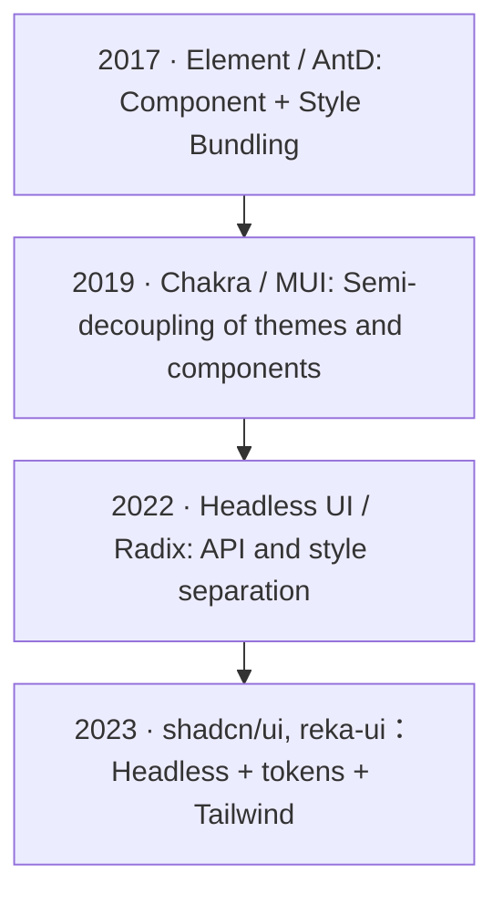

import TailwindTopicHero from '@site/src/components/docs/TailwindTopicHero'

<TailwindTopicHero topicId="tailwindcss/history/history-component-evolution" title="The evolution of component libraries" />

## Key Points

- The component library has evolved from "component + style bundling" to "theming" to "Headless Primitives", gradually decoupling APIs, styles and design tokens.
- Headless + tokens allow atomic classes/design systems to be implemented, and variants need to be declared centrally through `cva`/`tailwind-variants`, etc., in conjunction with `tailwind-merge`.
- Migration strategy: first extract public tokens, then provide class injection/styleless mode for components, and finally replace key components with Headless templates.

> For the evolution of the style scheme itself, see: [Evolution of the style scheme] (/docs/tailwindcss/history).

##  Evolution stages and comparison

| Stages | Representatives | Characteristics | Problems |
| --- | --- | --- | --- |
| Traditional UI kit | Element, AntD | Styles are bound with components, and theme switching costs are high | Customization costs are high, and overriding styles are fragile |
| Design systemization | Chakra, MUI | Themes and tokens, some can be combined | There is still style coupling, and deep transformation is difficult |
| Headless/UI primitives | Headless UI, shadcn/ui, reka-ui, Radix Primitives | Decouple API and style, leaving design layer | Need your own design system and class name constraints |

  

    
2017: Traditional component library, strong binding of styles and components. 
  

  

    
2019: Themed/designed component library. 
  

  

    
2022: Headless Primitives, API and style decoupling. 
  

  

    
2023: shadcn/ui and other template solutions, Headless + tokens + Tailwind. 
  

## Advantages and Disadvantages of Headless Combination Paradigm

- Advantages:
- API and style are split, and the style is completely handed over to Tailwind/Uno + tokens; easy to switch between multiple brands/dark colors.
- Cooperate with `cva`/`tailwind-variants` to centrally declare variants to reduce review costs.
- AI generation friendly: templates are fixed and class names are merge/lint protected.
- Disadvantages:
- You need to build your own design system and token table, otherwise different page styles will easily drift.
- Document/example construction costs are high, and "recommended class name combinations" need to be given.
- For beginners, class readability and semantics require additional training.

## Migration and implementation suggestions

- Extract tokens: Converg design variables such as color palette/spacing/font size into the configuration file, and the component only consumes tokens.
- Unstyled interface: Add `className`/`classes` injection or "unstyled" mode to existing components, gradually stripping away coupling styles.
- Variant concentration: Use `cva`/`tailwind-variants` to create variant tables of core components such as buttons, inputs, and cards, and use `tailwind-merge` to cover them all.
- Review checklist: Check whether there is still deep coverage, whether there is leakage of custom color values, and whether there are ad-hoc classes that cannot be reused.
