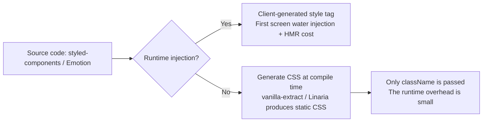

import TailwindTopicHero from '@site/src/components/docs/TailwindTopicHero'

<TailwindTopicHero topicId="tailwindcss/history/history-css-in-js" title="CSS-in-JS stage" />

## Key Points

- Component boundaries are naturally isolated, props can drive styles; dynamic themes/states are friendly.
- Cost: runtime/SSR water injection volume, complex build chain; poor readability of class names.
- Suitable for teams that require highly dynamic styles, theme switching, and strong binding of design systems and components.
- Representative packages: runtime genre (`styled-components`, `Emotion`, `JSS`), compile-time/zero runtime genre (`vanilla-extract`,

## Advantages / Disadvantages / When to use

| Item | Content |
| --- | --- |
| Advantages | Component granular isolation; props driven; logic/constants can be reused in JS |
| Disadvantages | Runtime overhead; SSR water injection; poor class name debugging; may affect HMR speed |
| Applicable | Design systems that require complex dynamic styles and themes as logic; some SSR/CSR hybrid scenarios |
| Not applicable | Multi-terminal/mini-program scenarios that are sensitive to above-the-fold content and have extremely small runtime budget |

## Representative packages and usage

- **styled-components (runtime)**: template string + props; supports `ThemeProvider` unified theme.

```tsx title="styled-components theme"
import styled, { ThemeProvider } from 'styled-components'

const theme = { primary: '#111827', radius: '12px' }
const Button = styled.button`
  padding: 10px 16px;
  border-radius: ${({ theme }) => theme.radius};
  background: ${({ theme }) => theme.primary};
`

export function Demo() {
  return (
    <ThemeProvider theme={theme}>
      <Button>Dark Button</Button>
    </ThemeProvider>
  )
}
```

- **Emotion (runtime + compilation mode)**: `css` prop and `@emotion/babel-plugin` compilation mode reduce runtime.

```tsx title="Emotion css prop"
import { css } from '@emotion/react'

const card = css({
  border: '1px solid #e5e7eb',
  borderRadius: 16,
  padding: 16,
})

export const Card = () => <section css={card}>Emotion css prop</section>
```

- **vanilla-extract (zero runtime)**: TypeScript API generates CSS using only className at runtime.

```ts title="vanilla-extract button.css.ts"
import { style, createVar } from '@vanilla-extract/css'

export const color = createVar()
export const button = style({
  vars: { [color]: '#111827' },
  background: color,
  borderRadius: '8px',
  color: '#fff',
})
```

- **Panda CSS (Compilation Time/Zero Runtime)**: The TS-first atomization solution launched by the Chakra team, the `css`/`cva`/`recipes` API compiles the design token into a static class name.

```tsx title="Panda CSS recipes"
import { css, cva } from '../styled-system/css'

const badge = css({
  borderRadius: 'full',
  fontWeight: 'semibold',
  px: '3',
  py: '1.5',
  bg: 'blue.50',
  color: 'blue.700',
})

const button = cva({
  base: { borderRadius: 'xl', fontWeight: 'semibold', px: '4', py: '3' },
  variants: {
    intent: {
      solid: { bg: 'blue.600', color: 'white', _hover: { bg: 'blue.700' } },
      ghost: { color: 'blue.700', border: '1px solid #bfdbfe', bg: 'transparent' },
    },
  },
})

export function PandaSection() {
  return (
    <section className={css({ display: 'flex', gap: '3', alignItems: 'center' })}>
<span className={badge}>token driver</span>
      <button className={button({ intent: 'solid' })}>Panda Button</button>
    </section>
  )
}
```

- **styled-jsx (Next.js built-in, compile-time scope + lightweight runtime injection)**: JSX inline `<style jsx>`, Babel generates scope class names at compile time, and inserts local styles at runtime.

```tsx title="styled-jsx local scope"
export default function StyledJsxCard({ title }: { title: string }) {
  return (
    <div className="card">
      <h3>{title}</h3>
<p>Next.js supports it by default and automatically collects styles during SSR. </p>
      <style jsx>{`
        .card {
          padding: 16px;
          border-radius: 12px;
          background: #fff;
          box-shadow: 0 10px 30px rgba(0, 0, 0, 0.06);
        }
        h3 { margin: 0 0 8px; }
      `}</style>
    </div>
  )
}
```

- **stylex (compile-time atomization, zero runtime)**: A cross-React Web/Native tool released by Meta. The restricted StyleX syntax is split into atomic classes at compile time, and only `stylex.props` is retained at runtime.

```tsx title="stylex atomic class"
import * as stylex from '@stylexjs/stylex'

const styles = stylex.create({
  base: {
    backgroundColor: 'var(--blue-600)',
    borderRadius: 12,
    color: '#fff',
    paddingBlock: 10,
    paddingInline: 16,
    transitionDuration: '150ms',
  },
  hoverable: {
    ':hover': { backgroundColor: 'var(--blue-700)' },
  },
})

export function StylexButton({ hoverable = true }) {
  return <button {...stylex.props(styles.base, hoverable && styles.hoverable)}>StyleX</button>
}
```

## <span className="mr-2 inline-block align-middle text-primary dark:text-primary-200 icon-[mdi--layers-triple-outline]"></span> runtime vs compile time (explanation)



<div className="mt-3 grid gap-2 text-sm text-muted-foreground">
  <div className="flex items-start gap-2">
    <span className="icon-[mdi--download] text-lg text-primary dark:text-primary-200" aria-hidden="true" />
<span> runtime injection: generate style on the client, first screen water injection + HMR has additional cost. </span>
  </div>
  <div className="flex items-start gap-2">
    <span className="icon-[mdi--file-code-outline] text-lg text-primary dark:text-primary-200" aria-hidden="true" />
<span> compile-time generation: static CSS is generated in advance, and JS only retains className mapping. </span>
  </div>
</div>

### Scheme comparison (runtime/compile time, seven choices)

| Plan | Type | Writing method/entry | Dynamics and themes | Products/performance | Applicability |
| --- | --- | --- | --- | --- | --- |
| styled-components | Runtime | `styled` template string | Strong: props +
| Emotion | Runtime/compilation hybrid | `css` prop /
| styled-jsx | Compile-time scope + lightweight runtime |
| Panda CSS | Compilation time / zero runtime |
| stylex | Compile-time atomization / zero runtime | `stylex.create` +
| vanilla-extract | Compilation time / zero runtime |
| Linaria | Compilation time/zero runtime |

### Comparison between writing method and product

- Runtime (styled-components/Emotion):
- Writing method: template string or object style, allowing to use props / theme to calculate the style; insert `<style>` in development mode, and may extract critical CSS in production mode.
- Product: JS bundle + inline style tag, class name is generated at runtime (`sc-abc123`), first screen water injection and HMR require style injection overhead.
- Compile time (Linaria/vanilla-extract):
- Writing method: restricted template string or TS API (`css`/`style`), the compiler evaluates in advance and generates `.css`, and only retains the `className` mapping in JS.
- Product: static CSS file (or inline chunk) + extremely thin className mapping, style is no longer injected at runtime, and SSR directly links CSS.

### Linaria example (compilation time)

Source code (before compilation):

```tsx title="card.tsx"
import { css } from '@linaria/core'

const card = css`
  border: 1px solid #e5e7eb;
  border-radius: 16px;
  padding: 16px;
  background: white;
  transition: box-shadow 150ms ease;

  &:hover {
    box-shadow: 0 10px 30px rgba(0, 0, 0, 0.06);
  }
`

export function Card({ children }: { children: React.ReactNode }) {
  return <section className={card}>{children}</section>
}
```

Compile product (example):

```css title="card.linaria.css"
.card_h3dj1z {
  border: 1px solid #e5e7eb;
  border-radius: 16px;
  padding: 16px;
  background: white;
  transition: box-shadow 150ms ease;
}
.card_h3dj1z:hover {
  box-shadow: 0 10px 30px rgba(0, 0, 0, 0.06);
}
```

```js title="card.tsx (compiled excerpt)"
import './card.linaria.css'
const card = 'card_h3dj1z'
export function Card({ children }) {
  return <section className={card}>{children}</section>
}
```

Features: CSS is generated in advance, JS only retains the class name string; `<style>` is no longer injected at runtime, similar to traditional static CSS links.

## Example (styled-components)

```tsx
import styled from 'styled-components'

const Card = styled.section`
  border: 1px solid #e5e7eb;
  border-radius: 16px;
  padding: 16px;
  box-shadow: ${({ elevated }) => (elevated ? '0 10px 30px rgba(0,0,0,0.06)' : 'none')};
`

const Button = styled.button`
  padding: 10px 16px;
  border-radius: 8px;
  border: 1px solid #111827;
  background: #111827;
  color: #fff;
  &:hover { background: #0f172a; }
`

export const Demo = () => (
  <Card elevated>
    <p className="eyebrow">CSS-in-JS</p>
<h2> dynamic style, component boundary </h2>
<Button>View details</Button>
  </Card>
)
```

### SWC plugin tips for styled-components

`@swc/plugin-styled-components` (or Next.js `compiler.styledComponents`) handles tag templates during compilation, maintaining the runtime link but optimizing readability and SSR stability:

```json title=".swcrc"
{
  "jsc": {
    "experimental": {
      "plugins": [
        ["@swc/plugin-styled-components", { "displayName": true, "ssr": true, "minify": true, "pure": true }]
      ]
    }
  }
}
```

- `displayName`: easy to debug in development state; `ssr`: ensure stable class name/injection order and reduce hydration inconsistency.
- `minify`/`pure`: Compress template output to help tree shake reduce runtime volume, but it still belongs to the runtime injection genre.

## Common pitfalls and countermeasures

- Runtime volume: Prioritize compilation mode or zero runtime solution (such as vanilla-extract), or enable Babel SWC optimization.
- SSR water injection: measure the volume of first-screen style injection; extract static styles or enable style caching if necessary.
- Class name debugging: open displayName/label in the development environment; enable minimization in the production environment.
- HMR performance: reduce overly deep dynamic expressions; split components to reduce hot update range.
