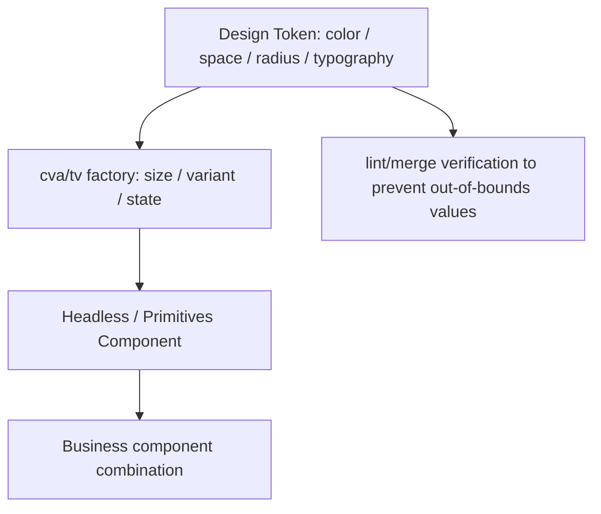

import TailwindTopicHero from '@site/src/components/docs/TailwindTopicHero'

<TailwindTopicHero topicId="tailwindcss/history/history-headless-tokens" title="Token chemical and Headless component stage" />

## Key Points

- Headless components (Radix, Headless UI, shadcn/ui, reka-ui) + Tailwind/Uno that decouple API and style, allowing design tokens to be directly connected to class names.
- `cva` /
- Suitable for multi-brand/dark/large-scale design systems; the premise is that tokens, lint/merge/review chain are in place.
- Representative packages: Primitives (`@radix-ui/react-*`, `@ark-ui/react`, `@zag-js`), Headless component library (`@headlessui/react`), style template solutions (`shadcn/ui`,

## Advantages / Disadvantages / When to use

| Item | Content |
| --- | --- |
| Advantages | API and style separation; centralized variants; AI/automation friendly; low cost across brands/themes |
| Disadvantages | Need to maintain token tables and specifications; high mental burden for beginners; high cost of document/paradigm construction |
| Applicable | Teams that require a unified experience, multiple product lines, multiple themes/brands, and want to automatically generate UI |
| Not applicable | Minimalist sites or teams with no design system and unable to invest in standardized construction |

## What is token? What is tokenization

- **Design Token**: Abstract design attributes such as color, spacing, rounded corners, font size, shadow, and animation into named variables (such as `color-primary-500`, `radius-lg`), and centrally manage them as the only source of values.
- **Tokenization**: Translate the specific values  in the design draft (#123456, 18px, etc.) into token names, only reference the token in the code/style, and do not write the naked value; at the same time, retain the mapping table and verification chain to ensure that all values  come from the token.
- **Landing method**:
- CSS variable: `:root { --color-primary-500: #2563eb; --radius-lg: 12px; }`, read with Tailwind `@theme` or custom theme.
- Tailwind configuration: declared in `theme.colors/spacing/radius`, the corresponding atomic class is generated.
- Multi-theme/multi-brand: Switch a set of token variables through `data-theme` or class name to achieve dark/brand switching without changing the component logic.
- **Benefits**: Unify visual values  and reduce random value drift; facilitate lint/merge/script verification; support fast switching across brands/themes.
- **Note**: The token is only the cornerstone, and `cva`/`tailwind-variants` is needed to weave the token into variants, which are then consumed by the Headless component.

## Representative packages and combination methods

- **Radix Primitives / Ark UI**: Provides styleless, fully accessible component primitives.

```tsx title="Radix + Tailwind"
import * as Tabs from '@radix-ui/react-tabs'

export function TabsDemo() {
  return (
    <Tabs.Root defaultValue="code" className="w-full">
      <Tabs.List className="inline-flex gap-2 rounded-lg bg-muted p-1">
        <Tabs.Trigger value="code" className="rounded-md px-3 py-2 text-sm data-[state=active]:bg-card data-[state=active]:shadow">
code
        </Tabs.Trigger>
        <Tabs.Trigger value="preview" className="rounded-md px-3 py-2 text-sm data-[state=active]:bg-card data-[state=active]:shadow">
Preview
        </Tabs.Trigger>
      </Tabs.List>
    </Tabs.Root>
  )
}
```

- **Headless UI**: Vue/React composable styleless components, often paired with Tailwind.

```tsx title="Headless UI + Tailwind"
import { Menu } from '@headlessui/react'

export function MenuDemo() {
  return (
    <Menu as="div" className="relative inline-block text-left">
<Menu.Button className="inline-flex items-center gap-2 rounded-lg border px-3 py-2"> operates</Menu.Button>
      <Menu.Items className="absolute right-0 mt-2 w-40 rounded-xl border bg-card p-2 shadow-xl">
        <Menu.Item>
{(</button>) => `w-full rounded-lg px-3 py-2 text-sm ${active ? 'bg-muted' : ''}`edit<button className={__PROTECTED_0__}>}
        </Menu.Item>
      </Menu.Items>
    </Menu>
  )
}
```

- **shadcn/ui / reka-ui templating**: based on Tailwind + `cva`/`tailwind-variants` preset class, copied directly to the project.

```tsx title="tailwind-variants combination"
import { tv } from 'tailwind-variants'
import { Slot } from '@radix-ui/react-slot'
import { cn } from '@/lib/utils'

const badge = tv({
  base: 'inline-flex items-center gap-1 rounded-full px-3 py-1 text-xs font-medium',
  variants: {
    tone: {
      neutral: 'bg-muted text-foreground',
      success: 'bg-emerald-50 text-emerald-700 dark:bg-emerald-900/30 dark:text-emerald-100',
      danger: 'bg-rose-50 text-rose-700 dark:bg-rose-900/30 dark:text-rose-100',
    },
  },
  defaultVariants: { tone: 'neutral' },
})

export function Badge({ asChild, className, ...props }: { asChild?: boolean } & React.HTMLAttributes<HTMLElement>) {
  const Comp = asChild ? Slot : 'span'
  return <Comp className={cn(badge(props), className)} {...props} />
}
```

## <span className="mr-2 inline-block align-middle text-primary dark:text-primary-200 icon-[mdi--link]"></span> tokens → variants → primitives process (illustration)



<div className="mt-3 grid gap-2 text-sm text-muted-foreground">
  <div className="flex items-start gap-2">
    <span className="icon-[mdi--palette-swatch] text-lg text-primary dark:text-primary-200" aria-hidden="true" />
<span>Tokens: Unify color palette/spacing/rounded corners/typesetting as the only source of value. </span>
  </div>
  <div className="flex items-start gap-2">
    <span className="icon-[mdi--widgets] text-lg text-primary dark:text-primary-200" aria-hidden="true" />
<span>Factory: Use cva/tv to centrally declare size, semantics, and status. </span>
  </div>
  <div className="flex items-start gap-2">
    <span className="icon-[mdi--layers] text-lg text-primary dark:text-primary-200" aria-hidden="true" />
<span>Primitives/UI: Headless component consumption variants, combined into business UI. </span>
  </div>
  <div className="flex items-start gap-2">
    <span className="icon-[mdi--check-circle-outline] text-lg text-primary dark:text-primary-200" aria-hidden="true" />
<span>Lint/Merge: Verify that the value is legal and merge class names to prevent out-of-bounds and conflicts. </span>
  </div>
</div>

## Example (Button with cva, React)

```tsx
import { cva } from 'class-variance-authority'
import { cn } from '@/lib/utils'

const button = cva(
  'inline-flex items-center gap-2 rounded-lg border bg-primary px-4 py-2 text-sm text-primary-foreground shadow-sm transition',
  {
    variants: {
      variant: { default: '', outline: 'bg-transparent text-foreground border-border', ghost: 'bg-transparent hover:bg-muted' },
      size: { sm: 'h-8 px-3', md: 'h-10 px-4', lg: 'h-11 px-5' },
    },
    compoundVariants: [{ variant: 'outline', size: 'lg', class: 'shadow-none' }],
    defaultVariants: { variant: 'default', size: 'md' },
  }
)

export function Button({ className, ...props }: React.ButtonHTMLAttributes<HTMLButtonElement>) {
  return <button className={cn(button(props), className)} {...props} />
}
```

## Alignment suggestions

- Tokens: Color/spacing/rounded corners/shadow/font size are written as tokens (CSS variables or `@theme`), and the mapping of "design draft → token name" is maintained.
- variants: All states/sizes/semantics are centralized into factories (`cva`/`tv`), and business components only consume the builder; the default values  are hard-coded.
- merge: Use `cn` (including `tailwind-merge`) uniformly to avoid class conflicts.
- Assets: Record recommended combinations (such as standard class names of buttons/forms/cards) to facilitate AI/newcomers to use them.
