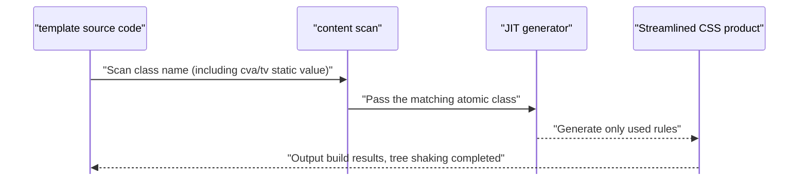

import TailwindTopicHero from '@site/src/components/docs/TailwindTopicHero'

<TailwindTopicHero topicId="tailwindcss/history/history-utility-first" title="Utility-first / Tailwind / UnoCSS stage" />

## Key Points

- The class name is the style, JIT + content accurately shakes the tree; it is easy to align with the design tokens/variants.
- Ecological differences: Tailwind (plug-ins/merge/community assets) vs UnoCSS (highly customized, requiring self-supporting rules).
- Risks: readability, class explosion, content too wide, dynamic classes out of control; tokens/variants/merge constraints are required.
- Representative packages: `Tailwind CSS` (JIT + official plug-in), `Windi CSS` (early instant mode), `UnoCSS` (preset/attributify + custom rules), `twin.macro` (write Tailwind in CSS-in-JS).

## Advantages / Disadvantages / When to use

| Item | Content |
| --- | --- |
| Advantages | Low cognitive switching; small JIT products; rich ecology; good combination with Headless |
| Disadvantages | Poor readability when constraints are missing; dynamic class expansion; lint/merge/review cooperation required |
| Applicable | High iteration speed, design system alignment required, cross-end/multi-product line scenarios |
| Not applicable | Minimalist static site, team unable to establish tokens/standards |

## Representative packages and usage

- **Tailwind CSS**: The official plug-in/merge/IDE has the most complete prompts and is suitable for team baselines.

```js title="tailwind.config.ts"
export default {
  content: ['./src/**/*.{ts,tsx,html}'],
  theme: {
    extend: {
      colors: { brand: '#111827' },
      borderRadius: { xl: '16px' },
    },
  },
  plugins: [require('@tailwindcss/typography'), require('@tailwindcss/forms')],
}
```

- **UnoCSS**: preset + custom rules; `attributify` lets the attribute be the class name.

```ts title="UnoCSS configuration unocss.config.ts"
import { defineConfig, presetUno, presetAttributify, presetIcons } from 'unocss'

export default defineConfig({
  presets: [presetUno(), presetAttributify(), presetIcons()],
  rules: [['btn', { padding: '10px 16px', 'border-radius': '8px', background: '#111827', color: '#fff' }]],
})
```

```html title="UnoCSS attributify"
<section grid gap-3 rounded-2xl border p-4 shadow-sm>
  <p text="xs muted uppercase" tracking="0.2em">UnoCSS</p>
  <h2 text="lg semibold">Attributify + Preset</h2>
<button btn hover="bg-#0f172a">View details</button>
</section>
```

- **twin.macro**: Write Tailwind in styled-components/Emotion, taking into account both atomization and CSS-in-JS development experience.

```tsx title="twin.macro"
import tw, { styled } from 'twin.macro'

const Card = styled.section(() => [tw`grid gap-3 rounded-2xl border bg-white/80 p-4 shadow-sm`])

export function TwinDemo() {
  return (
    <Card>
      <p tw="text-xs uppercase tracking-[0.2em] text-gray-500">twin.macro</p>
<h2 tw="text-lg font-semibold">Tailwind is written in CSS-in-JS </h2>
    </Card>
  )
}
```

## <span className="mr-2 inline-block align-middle text-primary dark:text-primary-200 icon-[mdi--flash]"></span> JIT tree shaking process diagram



<div className="mt-3 grid gap-2 text-sm text-muted-foreground">
  <div className="flex items-start gap-2">
    <span className="icon-[mdi--magnify] text-lg text-primary dark:text-primary-200" aria-hidden="true" />
<span>Scanner: Only scan the static class names in the template (including cva/tv output) to avoid excessive content. </span>
  </div>
  <div className="flex items-start gap-2">
    <span className="icon-[mdi--code-tags] text-lg text-primary dark:text-primary-200" aria-hidden="true" />
<span>JIT: Generate rules on demand and delete missed atomic classes. </span>
  </div>
  <div className="flex items-start gap-2">
    <span className="icon-[mdi--check-circle-outline] text-lg text-primary dark:text-primary-200" aria-hidden="true" />
<span> product: The constructed CSS only retains the used classes, and the size is controllable. </span>
  </div>
</div>

## Example (Tailwind basic card)

```tsx
export function TailwindCard() {
  return (
    <section className="grid gap-3 rounded-2xl border bg-card/80 p-4 shadow-sm">
      <p className="text-xs uppercase tracking-[0.2em] text-muted-foreground">Tailwind</p>
<h2 className="text-lg font-semibold"> class name is style </h2>
<p className="text-sm text-muted-foreground">JIT + tokens; the class name is clear at a glance, and the product is small after shaking the tree. </p>
      <button className="inline-flex items-center gap-2 rounded-lg bg-primary px-4 py-2 text-sm text-primary-foreground hover:bg-primary/90">
check the details
      </button>
    </section>
  )
}
```

## Tailwind vs UnoCSS (Additional points)

- Ecology: Tailwind has plug-ins such as typography/forms/animate, `tailwind-merge`, rich presets and component paradigms; UnoCSS is more flexible but rules/merge/IDE prompts need to be self-supported.
- Type tip: Tailwind official language-service has comprehensive coverage; UnoCSS relies on preset/plug-in quality.
- Merge deduplication: Tailwind cooperates with `tailwind-merge` rules to improve it; Uno does not handle class deduplication by default and needs to be customized.
- Runtime: Tailwind v4 product is stable and adapts to RSC/SSR; UnoCSS real-time mode is extremely fast and suitable for high customization.

## Common pitfalls and countermeasures

- Content is too wide: accurate to the template directory to avoid product expansion caused by global wildcarding.
- Dynamic class: Prioritize `cva`/`tailwind-variants` parameterization, disable string free splicing.
- Readability: Establish tokens/variants/recommended combinations and align them during review; add comments for complex relationship classes when necessary.
- Volume: View CSS volume or browser coverage after build; enable analysis tools if necessary.
- Design draft mapping: Extract commonly used spacing/color/rounded corners into design tokens, and lock them on the default value of `cva` to avoid "taking values  at will".
