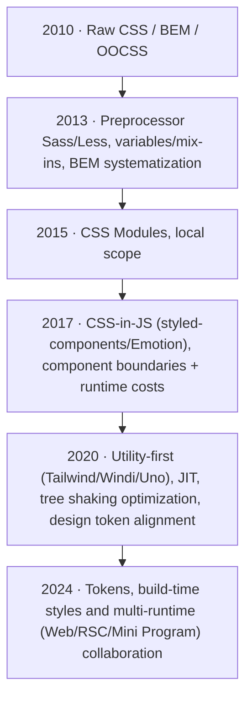
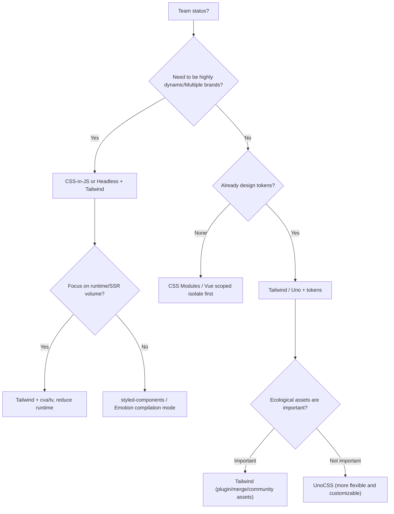

import TailwindTopicHero from '@site/src/components/docs/TailwindTopicHero'

<TailwindTopicHero topicId="tailwindcss/history/history-style-evolution" title="The evolution of style schemes" />

## Key Points

- This page is not to memorize history, but to answer a real question: why more and more teams today are moving towards atomic CSS.
- The mainstream practice of style schemes has indeed moved from "global naming" to "modularization/componentization" to stronger combination and atomization, but this is more like a common evolution path rather than a single line of history that all teams follow.
- The value of atomic CSS is not only that it can be written quickly, but also that it is more suitable for connecting with modern workflows such as tokens, JIT, component variants, and AI generation.
- But it's not the end either. In multi-runtime (Web, RSC, applet) scenarios, the truly stable core is usually token, component boundaries and construction constraints, rather than a specific writing method.

## Suggested ways to read this page

- If you are making technology selection, focus on the “advantages/disadvantages/applicable scenarios of each stage”.
- If you are doing team sharing, focus on the timeline and "Atomized CSS Resolved/Unresolved Issues".
- If you've decided to use Tailwind, this page can help you explain to your team "why you want to build constraints" instead of just saying it's popular.

> The component library part has been split into an independent page: [Evolution of the component library] (/docs/tailwindcss/history/component-evolution).
>
> Note: The timeline on this page is more suitable as a "common evolution path". As of the official Next.js documentation updated on February 27, 2026, Tailwind CSS, CSS Modules, Global CSS, Sass and CSS-in-JS are still listed as current options, rather than linear alternatives.

:::info information reference
- [Next.js: How to use CSS in your application](https://nextjs.org/docs/app/getting-started/css)
- [Next.js: CSS Modules](https://nextjs.org/docs/14/app/building-your-application/styling/css-modules)
- [State of CSS 2024: Tools](https://2024.stateofcss.com/en-US/tools/)
:::

## <span className="mr-2 inline-block align-middle text-primary dark:text-primary-200 icon-[mdi--calendar-month]"></span> Style scheme timeline



<div className="mt-3 grid gap-2 text-sm text-muted-foreground">
  <div className="flex items-start gap-2">
    <span className="icon-[mdi--pencil] text-lg text-primary dark:text-primary-200" aria-hidden="true" />
<span>2010: Raw CSS/BEM/OOCSS, semantic naming + handwritten hierarchy. </span>
  </div>
  <div className="flex items-start gap-2">
    <span className="icon-[mdi--layers] text-lg text-primary dark:text-primary-200" aria-hidden="true" />
<span>2013: Sass/Less variables and mix-ins, BEM systematization. </span>
  </div>
  <div className="flex items-start gap-2">
    <span className="icon-[mdi--shield-check] text-lg text-primary dark:text-primary-200" aria-hidden="true" />
<span>2015: CSS Modules scope isolation. </span>
  </div>
  <div className="flex items-start gap-2">
    <span className="icon-[mdi--code-tags] text-lg text-primary dark:text-primary-200" aria-hidden="true" />
<span>2017: CSS-in-JS, component boundaries + runtime costs. </span>
  </div>
  <div className="flex items-start gap-2">
    <span className="icon-[mdi--star-four-points] text-lg text-primary dark:text-primary-200" aria-hidden="true" />
<span>2020: Utility-first, JIT, tree shaking, tokens alignment. </span>
  </div>
  <div className="flex items-start gap-2">
    <span className="icon-[mdi--timeline-clock-outline] text-lg text-primary dark:text-primary-200" aria-hidden="true" />
<span>2024: Tokens, build-time styles, and multi-runtime collaboration continue to be enhanced. </span>
  </div>
</div>

### A few common "reasons for upgrading"

The following is better understood as common drivers rather than uniform migration paths that all teams will experience.

- When refactoring the BEM project, I encountered that `.btn--primary` was overwritten in four files, and the hover colors were inconsistent; after introducing Utility-first, the button was split into variants, and the class name was assigned to the `cva` factory. The status combination can be seen at a glance during review.
- The CSS-in-JS solution injects 60KB of water into the first screen under SSR. After changing to Tailwind + tokens, the CSS on the first screen is controlled within 8KB, and dynamic expansion is avoided through `content` precise scanning.
- Mini Program scene class has a limited length, and atomic classes + pre-generated templates replace dynamically spliced  style strings, which improves stability and builds faster.

## Common misunderstandings

- Do not interpret this page as "the industry has completed replacement along this route". The reality is closer to the long-term parallelization of multiple solutions, but in different stages and scenarios, teams are more likely to take this path.
- Don't interpret "Utility-first is more popular" to mean "CSS Modules, Sass, CSS-in-JS are outdated". They are still very common in component libraries, content sites, legacy systems, and specific framework ecosystems.
- Don't understand `Headless + tokens` as a new style language. It is more like a layered approach to design system and component abstraction, and can be combined with a variety of style solutions.

## Advantages/Disadvantages/Applicable Scenarios of Each Stage

If you are scanning quickly on your mobile phone, it is enough to read these 6 items:

- `Raw CSS + BEM/OOCSS`: The most intuitive and suitable for small pages; the problem is global pollution and naming drift.
- `Sass/Less`: It has stronger reusability and is suitable for projects that have not yet entered componentization; the problem is that it is still easy to fall into global and nested hell.
- `CSS Modules`: Better isolation, suitable for medium and large projects and component libraries; the problem is that cross-component reuse and theme switching will rely more on additional abstractions.
- `CSS-in-JS`: It has strong dynamic capabilities and is suitable for design systems with many themes and states; the problem is that the runtime, compilation chain and volume costs are higher.
- `Utility-first`: fast iteration, aligned with tokens, and strong ecology; the problem is that class drift is easy when there are no constraints.
- `Token + Headless`: This is not a separate style paradigm, but more like a component encapsulation trend that develops in parallel with multiple style schemes; the advantage is that it is more suitable for unified experience and AI collaboration, but the price is that the design system must be carefully maintained.

If you need a more detailed judgment, you can take a look at the segmented version below:

### Raw CSS + BEM/OOCSS

- Advantages: simple and intuitive, naming has its own semantics.
- Disadvantages: Global pollution is obvious, style coverage is difficult to troubleshoot, and reusability is weak.
- Suitable for: small-volume pages and low-complexity sites.
- Avoidance: Set prefix and naming rules first to avoid long selector chains.

### Preprocessor (Sass/Less)

- Advantages: Variables, mix-ins, and functions improve reuse, making BEM easier to implement.
- Disadvantages: It is still a global style, prone to nesting hell and compilation volume expansion.
- Applicable to: projects that require certain reuse but do not have strong component boundary requirements.
- Circumvention: Limit nesting levels, lint disables `#id` and deep selectors, keep palettes focused.

### CSS Modules

- Advantages: clear scope isolation, naturally reducing global pollution.
- Disadvantages: Styles are more tightly bound to components, and cross-component reuse and theme switching require extra abstraction.
- Applicable to: medium and large applications, releasable component libraries, and projects that require style isolation.
- Avoidance: Use shared variables to avoid declaring global variables in components.

### CSS-in-JS

- Advantages: Component boundaries are naturally clear, suitable for strong dynamic styles and theme systems.
- Disadvantages: The runtime and compilation chain are more complex, and class names are generally less readable.
- Applicable to: Design systems that require strong dynamic styles, multiple brands, and multiple themes.
- Avoidance: Try to choose zero runtime solution or compilation mode, and strictly limit the dynamic style range.

### Utility-first (Tailwind / Uno)

- Advantages: low-cognition switching, JIT, tree-shaking optimization, alignment with tokens, rich ecosystem.
- Disadvantages: Readability is highly dependent on team constraints, and the volume of `content` can easily get out of control if it is not punctual.
- Applicable to: front-end or multi-end projects with high iteration speed, design system alignment, and obvious component combination.
- Circumvention: Establish tokens and variants specifications, unify `cn` + merge, and prohibit string spelling.

> On the other hand, content-based sites, low-complexity backends or strong isolation component libraries may not necessarily regard it as the default optimal solution.

### Token + Headless component trend

- Positioning: It is more like the component abstraction and design system trend, not a "next generation style solution" that independently replaces Tailwind, CSS Modules or CSS-in-JS.
- Advantages: Component API is decoupled from styles, variants are managed centrally, and it is suitable for unified design language.
- Disadvantages: The design system requires continuous maintenance and will still drift when there are no constraints.
- Applicable to: teams with multiple product lines, requiring pluggable themes, and hoping to be stably consumed by AI or scripts.
- Avoidance: maintain tokens table, review class names and variant factories, and retain merge / lint verification chain.

> Reference direction: `Headless UI`, `Radix Primitives`, `shadcn/ui` Such solutions are essentially more component abstraction and design system layering than a separate style language.

> Migration suggestion: If you already have CSS Modules/component libraries and want to embrace atomization, you can first extract the public tokens, then overlay `cva`/`tailwind-variants` on the Headless component, and gradually replace the local styles.

## In-depth reading (split by stages)

- [Raw CSS / BEM / OOCSS](/docs/tailwindcss/history/raw-css)
- [Sass / Less Preprocessing](/docs/tailwindcss/history/preprocessors)
- [CSS Modules Stage](/docs/tailwindcss/history/css-modules)
- [CSS-in-JS stage](/docs/tailwindcss/history/css-in-js)
- [Utility-first / Tailwind / UnoCSS](/docs/tailwindcss/history/utility-first)
- [Tokenization and Headless components](/docs/tailwindcss/history/headless-tokens)
- [Generative CSS / native capability fusion](/docs/tailwindcss/history/future-generative-css)

## A quick overview of representative packages in each stage

- `Raw CSS`: `normalize.css`, `Bootstrap`, `Bulma`
Common usage: global naming + component class.
- `preprocessor`: `Sass`, `Less`, `PostCSS`, `Stylus`
Common usage: variables, mix-ins, theme customization.
- `CSS Modules`: Vite / webpack modules, Next.js, `vanilla-extract`
Common usage: scope hashing, compile-time isolation.
- `CSS-in-JS`: `styled-components`, `Emotion`, `JSS`, `vanilla-extract`
Common usage: runtime or compile-time dynamic styling.
- `Utility-first`: `Tailwind`, `Windi`, `UnoCSS`, `twin.macro`
Common usage: JIT atomic class, attributeify, macro mode.
- `Headless + tokens`: `Radix`, `Headless UI`, `shadcn/ui`, `tailwind-variants`
Common usage: As a component abstraction layer, cooperate with Tailwind, CSS Modules, vanilla-extract and other solutions.

## Stage Demo: Put the "method" into the mechanism

### Raw CSS/BEM: Zero Build + Conventions

```html title="index.html"
<link rel="stylesheet" href="/reset.css" />
<section class="card card--elevated">
  <p class="card__eyebrow">Raw CSS</p>
<h2 class="card__title"> global naming </h2>
</section>
```

### Preprocessor: scripted compilation and tokens reuse

```json title="package.json"
{
  "scripts": {
    "build:css": "sass src/styles/index.scss dist/index.css --no-source-map && postcss dist/index.css -o dist/index.css",
    "watch:css": "sass --watch src/styles/index.scss:dist/index.css"
  }
}
```

```scss title="src/styles/index.scss"
@use './tokens' as *;
.card { border: 1px solid lighten($color-primary, 65%); border-radius: $radius-lg; }
```

### CSS Modules: compile-time isolation + component consumption

```ts title="vite.config.ts"
export default { css: { modules: { generateScopedName: '[name]__[local]___[hash:base64:5]' } } }
```

```tsx title="Card.tsx"
import styles from './card.module.css'
export const Card = () => <section className={__PROTECTED_0__}>CSS Modules</section>
```

### CSS-in-JS: theme runtime + compiled mode

```tsx title="styled-components + ThemeProvider"
import styled, { ThemeProvider } from 'styled-components'
const theme = { primary: '#111827', radius: '12px' }
const Button = styled.button`border-radius: ${({ theme }) => theme.radius}; background: ${({ theme }) => theme.primary};`
export const Demo = () => <ThemeProvider theme={theme}><Button> dynamic theme</Button></ThemeProvider>
```

### Utility-first: Tailwind + cva generation variant

```ts title="tailwind.config.ts"
export default { content: ['./src/**/*.{ts,tsx,html}'], theme: { extend: { colors: { brand: '#111827' } } } }
```

```tsx title="components/button.tsx"
import { cva } from 'class-variance-authority'
const button = cva('rounded-lg px-4 py-2 text-sm font-medium', { variants: { tone: { brand: 'bg-brand text-white' } }, defaultVariants: { tone: 'brand' } })
export const Button = ({ tone = 'brand', ...props }) => <button className={button({ tone })} {...props} />
```

### Token + Headless: as a component abstraction layer to match the style scheme

```css title="src/styles/tokens.css"
:root { --color-primary: #111827; --radius-lg: 12px; }
[data-theme="dark"] { --color-primary: #e5e7eb; }
```

```tsx title="components/menu.tsx"
import { Menu } from '@headlessui/react'
import { tv } from 'tailwind-variants'
const item = tv({ base: 'flex items-center rounded-lg px-3 py-2 text-sm', variants: { active: { true: 'bg-muted text-foreground' } } })
export const MenuDemo = () => (
  <Menu>
<Menu.Button className="rounded-lg border px-3 py-2"> operates</Menu.Button>
    <Menu.Items className="mt-2 w-40 rounded-xl border bg-card p-2 shadow-xl">
<Menu.Item>{({ active }) => <button className={item({ active })}>edit</button>}</Menu.Item>
    </Menu.Items>
  </Menu>
)
```

### <span className="mr-2 inline-block align-middle text-primary dark:text-primary-200 icon-[mdi--source-branch]" aria-hidden="true" /> Decision tree: Select style scheme



## Semantic vs. Information Density (Cross-Program Perspective)

- Semantic: Whether the class name, file name, and component name can express the intention, and whether it is easy to locate during debugging.
- Information density: The same information has been written several times, whether it is concentrated in tokens / variants instead of scattered in the template.

For quick judgment, you can directly look at these items:

- `Raw CSS / BEM`: Highly semantic, but information is easily scattered.
- `preprocessor`: Reuse is better than Raw CSS, but it’s easy to hide complexity in nesting.
- `CSS Modules`: The isolation is stronger, and the semantics are mainly compensated by the component name and file name.
- `CSS-in-JS`: Strong dynamic capabilities, but runtime solutions usually have average information density.
- `Utility-first`: A single class name has weak semantics, but the overall information density is high, suitable for cooperation with component factories.
- `Token + Headless`: The semantics and information density are high, but it is more suitable to be understood as a "design system and component abstraction layer" rather than a separate style era.

## Atomized CSS resolved/unresolved issues

- ✅Solution:
- Cognitive load: In many scenarios, the class name is the style, which reduces the need to jump back and forth between templates and style files.
- Drift and coverage: Reduce some global leaks and duplicate declarations through more fine-grained classes, `content` scanning and component factories.
- Design alignment: Working with tokens and variants, it is easier to create mappings for "Design → Component Interface/Class Name".
- ⚠️ Risks:
- Readability: The class name is too long and unconstrained, making it difficult to review.
- Consistency: Different people take values  arbitrarily, causing the color palette/spacing to get out of control.
- Volume: If dynamic classes or content are too wide, tree-shaking benefits will be lost.
- 🚫 Scenarios where it is not recommended to be used directly as the only solution:
- Publishable component libraries that require strong isolation (often better suited to CSS Modules, vanilla-extract, or combined with Tailwind).
- Minimalist static site, no need for runtime, long template class names will make the cost high.
- It is impossible to establish a team with design tokens/standards, and atomic classes can easily get out of control.

## Adaptation to runtime/platform

- Web/RSC: Give priority to static generation, `content` accurately matches the server-side template; avoid calculating random class names on the server.
- Mini program/multi-terminal: Pay attention to the class length limit; pre-generate static classes and do not rely on dynamic template splicing.
- SSR/HMR: Tailwind v4 JIT is fast enough; UnoCSS has a more flexible real-time mode, but the ecological/plug-in differences need to be weighed.
