import TailwindTopicHero from '@site/src/components/docs/TailwindTopicHero'

<TailwindTopicHero topicId="tailwindcss/merge-and-variants" title="tailwind-merge, cva, and tailwind-variants Essentials" />

## Key Points

- `tailwind-merge` is responsible for class conflict/duplication removal and is the base for safe class combination; it is recommended to encapsulate `cn = twMerge(clsx(...))`.
- `cva`/`tailwind-variants` centrally declare variants/default/compound and output class builder to avoid scattered states; `tv` has built-in merge + slots, which is suitable for multi-slot components.
- Closed loop: tokens → atomic class/variants → builder → component → content scan → JIT → merge → product.

## If you just want to read the conclusion first

- When the component needs to be covered by `className`, connect `tailwind-merge` first.
- `cva` is preferred for single-slot components, and `tailwind-variants` is considered for multi-slot components.
- Don't scatter variants in business components, they should be concentrated in builder files.

## Common misunderstandings

- Don’t misunderstand `cva` or `tailwind-variants` as Tailwind’s official built-in capabilities. They are a very common way to organize component variants in the community, but they are not the only way.
- Don't understand `tailwind-merge` as a "dispensable small optimization". As long as a component allows external `className` overrides, it is generally a stable infrastructure.
- Don't understand "using builder" as "no need to review class names from now on". The builder only expresses variations in a centralized manner and does not automatically establish design constraints for you.

## tailwind-merge: deduplication and boundaries

- You can think of it as a "Tailwind class name referee".
- It will decide which classes should be retained and which classes should be deleted based on Tailwind's conflict rules.
- In this way, you can truly achieve "the last intention passed by the caller takes effect" instead of leaving the results to Tailwind's internal sorting to try.
- The most common usage is to encapsulate `cn = twMerge(clsx(...))` and use it as a unified entry point for all class splicing.

### Why it is the "cornerstone"

- The component library must open `className` for consumers to customize. If there is no merge, any "backup style" may be overwritten by the caller's conflicting class, and the coverage relationship depends on Tailwind's internal ordering rather than the caller's intention.
- All components of shadcn/ui expose coverage points through `cn`. Only by using `tailwind-merge` can the "library default + user override" be expected; otherwise, the caller needs to be prohibited from using partial class names or write a large number of `!important`.
- When customizing tokens (such as adding `radius-4xl` or brand colors), `tailwind-merge` can also correctly identify conflicts based on the extension configuration, avoiding the problem of "customized classes never overwrite the default classes".
- Function: `p-4 p-2` → `p-2`; synchronization rules are required when customizing tokens/sizes.
- Recommendation: Use `cn` for all class splicing entries; write additional merge config for common customizations (swatches, spacing, radius) and add use case verification.
- Quick test: deliberately write `p-4 p-2` in the Demo button and observe the output; also do a coverage test on the custom color palette class.

If you just glance at it on your mobile phone, the core of this section is actually one sentence: without `tailwind-merge`, component opening `className` is often not reliable enough.

### Without tailwind-merge

```tsx
import clsx from 'clsx'

function Button({ size = 'md', className, ...props }) {
// It is difficult to guarantee that the caller will not pass in conflicting classes (such as px-2), we can only rely on agreement
  const base = 'inline-flex items-center rounded-md px-3 py-2 text-sm font-medium'
  const sizeClass = size === 'lg' ? 'px-4 py-2.5 text-base' : 'px-3 py-2 text-sm'
  return <button className={clsx(base, sizeClass, className)} {...props} />
}

//User
// px-2 is passed here, the final output class order depends on the props position, and the style is uncontrollable
;<Button className="px-2 text-red-600" />
```

#### Example: "Sequence Trap" of generating products

Tailwind will sort candidates according to internal rules (such as `p-0 → p-1 → p-2 → p-4 ...`), regardless of the order of class strings:

```html
<!-- Expect p-2 to override p-4, but generated CSS still places p-2 before p-4. -->
<button class="p-4 p-2 bg-blue-500 bg-red-500">Example</button>
```

```css
/* Fragment generated by Tailwind (excerpt) */
.p-2 { padding: 0.5rem; }
.p-4 { padding: 1rem; } /* appears later and still takes effect, covering p-2 */
.bg-blue-500 { background-color: #3b82f6; }
.bg-red-500 { background-color: #ef4444; } /* Also covers blue */
```

Even if the class is written as "the latter wants to overwrite the former", it is still ultimately determined by Tailwind's sorting, which cannot satisfy the demand of "the caller's last item wins".

### After introducing tailwind-merge

```tsx
import { twMerge } from 'tailwind-merge'
import clsx from 'clsx'
const cn = (...inputs: clsx.ClassValue[]) => twMerge(clsx(...inputs))

function Button({ size = 'md', className, ...props }) {
  const base = 'inline-flex items-center rounded-md px-3 py-2 text-sm font-medium'
  const sizeClass = size === 'lg' ? 'px-4 py-2.5 text-base' : 'px-3 py-2 text-sm'
  return <button className={cn(base, sizeClass, className)} {...props} />
}

//User
// Even if px-2 is passed in, tailwind-merge will retain the "last valid value" and change it to px-2, with predictable behavior
;<Button className="px-2 text-red-600" />
```

#### Example: the product after merge

```html
<button class="p-2 bg-red-500">Example</button>
```

```css
.p-2 { padding: 0.5rem; }
.bg-red-500 { background-color: #ef4444; }
```

By removing conflicting classes, the final product only contains the "last statement" expected by the user and is no longer affected by Tailwind's internal ordering.

### Common patterns for shadcn style components

```tsx
// utils/cn.ts
import { clsx, type ClassValue } from 'clsx'
import { twMerge } from 'tailwind-merge'
export const cn = (...inputs: ClassValue[]) => twMerge(clsx(...inputs))

// components/button.tsx
const base = 'inline-flex items-center gap-2 rounded-md px-3 py-2 text-sm font-medium'
const tones = {
  default: 'bg-primary text-primary-foreground hover:bg-primary/90',
  ghost: 'bg-transparent text-foreground hover:bg-accent',
}
const sizes = { sm: 'h-8 px-2.5', md: 'h-10 px-3', lg: 'h-12 px-4 text-base' }

export function Button({ tone = 'default', size = 'md', className, ...props }) {
  return (
    <button
      className={cn(base, tones[tone], sizes[size], className)}
      {...props}
    />
  )
}

// User: Pass in a custom class at will, the default and override are predictable
;<Button tone="ghost" className="px-10 bg-yellow-400 text-black" />
```

In the above example, the `px-10` passed in by the caller will remove the default `px-3/px-4`, and `bg-yellow-400` will also overwrite the default `bg-primary`. `tailwind-merge` makes "library's default + user's override" a reliable combination, avoiding the need to write `!important` or rigidly prohibit certain class names in constraint documents, thus becoming the cornerstone of this type of extensible component pattern.


## cva: lightweight variant factory

```ts
import { cva } from 'class-variance-authority'

export const badge = cva('inline-flex items-center rounded-md text-xs font-medium', {
  variants: {
    tone: {
      subtle: 'bg-muted text-muted-foreground border border-border',
      brand: 'bg-primary text-primary-foreground',
      danger: 'bg-destructive text-white',
    },
    size: { sm: 'px-2 py-1', md: 'px-2.5 py-1.5' },
  },
  compoundVariants: [{ tone: 'brand', size: 'md', class: 'shadow-sm' }],
  defaultVariants: { tone: 'subtle', size: 'md' },
})
```

- Scenario: Single-slot components (Button, Badge, Input, etc.); combined with `cn` to resolve conflicts.

## tailwind-variants (tv): built-in merge + slots

```ts
import { tv } from 'tailwind-variants'

export const card = tv({
  base: 'rounded-2xl border bg-card/80 shadow-sm transition',
  slots: {
    header: 'flex items-center justify-between gap-2',
    body: 'space-y-2 text-sm text-muted-foreground',
    footer: 'flex items-center gap-2',
  },
  variants: {
    tone: { neutral: 'border-border', brand: 'border-primary/40 shadow-lg', subtle: 'border-muted bg-muted/60' },
    interactive: { true: 'hover:-translate-y-0.5 hover:shadow-md' },
  },
  defaultVariants: { tone: 'neutral', interactive: true },
})
```

- Scenario: multi-slot components (Card, Modal, List item), requiring slots/recipes and automatic merge.

## cva vs tv comparison

| items | cva | tailwind-variants |
| --- | --- | --- |
| Merge | No built-in, requires `cn` package | Built-in tailwind-merge |
| Multi-slot | Does not support slots | Supports slots/recipes |
| Mental load | Light, simple syntax | Slightly heavier, more strict types |
| Applicable | Button/Badge and other single slots | Card/modal/multi-slot components, design system |

If you don’t want to memorize the form, you can just memorize this:

- `cva`: lighter and more suitable for single-slot components such as buttons, logos, and input boxes.
- `tailwind-variants`: more complete and more suitable for multi-slot components such as cards, pop-ups, and menus.

```mermaid
%%{ init: { "flowchart": { "curve": "basis" } } }%%
flowchart LR
Tokens["Design Tokens / @theme"] --> Variants["Atomic + variants"]
  Variants --> Builders["cva / tailwind-variants"]
Builders --> Components["React/Vue components"]
Components --> Content["content precise scanning"]
Content --> JIT["Tailwind JIT generates on-demand CSS"]
JIT --> Merge["tailwind-merge remove duplicates"]
Merge --> Output["Final CSS/HTML product"]
```

## <span className="mr-2 inline-block align-middle text-primary dark:text-primary-200 icon-[mdi--chart-timeline]" aria-hidden="true" /> From design to product (schematic diagram)



<div className="mt-3 grid gap-2 text-sm text-muted-foreground">
  <div className="flex items-start gap-2">
    <span className="icon-[mdi--palette-swatch] text-lg text-primary dark:text-primary-200" aria-hidden="true" />
<span>Tokens: Design variables such as color palette/spacing/radius/typesetting. </span>
  </div>
  <div className="flex items-start gap-2">
    <span className="icon-[mdi--widgets] text-lg text-primary dark:text-primary-200" aria-hidden="true" />
<span>Variants/Builders: Use cva/tv to encapsulate size, tone, state and other variants. </span>
  </div>
  <div className="flex items-start gap-2">
    <span className="icon-[mdi--monitor] text-lg text-primary dark:text-primary-200" aria-hidden="true" />
<span>Components/Content/JIT: component consumption builder, content precise scanning drives JIT generation. </span>
  </div>
  <div className="flex items-start gap-2">
    <span className="icon-[mdi--check-circle-outline] text-lg text-primary dark:text-primary-200" aria-hidden="true" />
<span>Merge/Output: tailwind-merge cleans up conflicts and produces a predictable final style. </span>
  </div>
</div>

## Practical Checklist

- Are all dynamic classes merged by `cn` (including `tailwind-merge`)?
- Are there scattered `clsx`/string concatenation classes? Is it possible to migrate to `cva`/`tv`?
- `variants/defaultVariants/compoundVariants` Is it concentrated in the builder file and the business components are no longer assembled?
- Are custom tokens synchronized to merge rules? Is there a use case to verify the coverage order?
