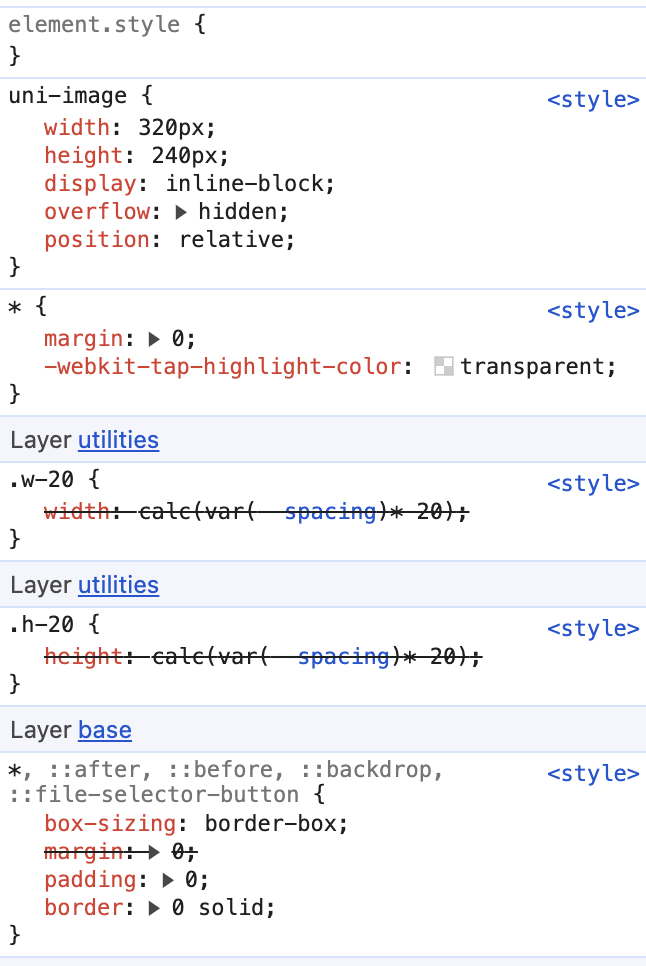

# Tailwind CSS 4 Default Mode Reference

:::info
The current version of `weapp-tailwindcss` has organized configuration and documents according to the Tailwind CSS 4 generation mode by default. This page is not a new quick start entry, but a supplementary explanation of CSS-first, `@source`, `cssEntries`, `@apply`, `@layer`, IntelliSense and multi-port compatibility details that still need to be understood in default mode.

When accessing for the first time, please start from [Installation Dependencies] (/docs/quick-start/install) and the corresponding framework registration page; when migrating from v3 or old v4 examples, return to this page to check the configurations that need to be retained or deleted.
:::

<!-- Legacy compatibility instructions have been removed.

Currently, users have reported that on some mobile phones, the problem may be that the `webview` version used internally is too low, or some other factors, causing the style to not take effect, especially on Huawei phones.

The styles generated by `tailwindcss@4.x` are just right for modern browsers, but not necessarily for those mobile devices. -->

This page only maintains instructions related to the default generation mode of Tailwind CSS 4; for Tailwind CSS 3 or historical experiment access methods, please refer to the migration document first.

## Positioning changes: style preprocessor

`tailwindcss@4` has significant changes in positioning

It directly becomes a style preprocessor, which is combined with the native `css` and its specifications to complement each other.

So you should not use `4.x` with `tailwindcss`, `sass`, `less` in the `stylus` version

See: https://tailwindcss.com/docs/compatibility#sass-less-and-stylus

## Integration selection

Various options are available on `tailwindcss` integration (`cli`, `vite`, `postcss`). In the generation mode of `weapp-tailwindcss@5`, most small program projects no longer directly register these official Tailwind build plug-ins, but only register `weapp-tailwindcss`'s own builder plug-in:

1. Vite project registers `weapp-tailwindcss/vite` of `WeappTailwindcss`.
2. Webpack project registers `weapp-tailwindcss/webpack` of `WeappTailwindcss`.
3. Tailwind CSS 4 reads the configuration and generates the target CSS by `WeappTailwindcss`.
4. The `postcss.config.js` or `@tailwindcss/postcss` PostCSS plug-ins are no longer registered in `tailwindcss`.

This can avoid having two sets of Tailwind generation links in the same build at the same time: the official Tailwind plug-in generates the browser CSS once, and `weapp-tailwindcss` tries to post-process it twice. The generation mode will directly output the applet target CSS, and let the template/JS class name translation share the same `classSet`.

Mpx also uses `weapp-tailwindcss/webpack`'s `WeappTailwindcss` to take over CSS generation, templates and JS transpilation. Do not register additional PostCSS generation plugins for Tailwind CSS.

## Mini program style entrance

In the v5 generation mode, the mini program CSS entry directly writes `@import "tailwindcss"`, and `WeappTailwindcss` will generate the mini program target CSS according to the default `target: 'weapp'`. If you still see `@import "weapp-tailwindcss/index.css"` in existing projects, it is recommended to migrate to Tailwind’s official CSS-first entry writing method.

### Why write `@import "tailwindcss"` uniformly?

`tailwindcss@4`'s configuration, theme variables, and scan scope are all read from the CSS entry. Unified use of `@import "tailwindcss"` allows Tailwind official IntelliSense, `@source`, `@theme` and `WeappTailwindcss` generators to read the same entry. Selectors, `@layer` and browser preflights that are not supported by the mini program or are not suitable for direct retention will be processed when `WeappTailwindcss` outputs the mini program CSS.

### Multi-terminal development

If you need to carry out multi-terminal development, you can use the style conditional compilation writing method of the corresponding framework, such as `uni-app`:

For multi-terminal or multi-build entry projects such as `uni-app` / `uni-app x` / `Taro` / Both ends can share the same CSS file containing `Mpx`, `Weapp-vite` and `WeappTailwindcss`, but do not register two sets of Tailwind generation plug-ins in the same multi-end build at the same time. Only when independent web applications do not build links through mini programs, it is suitable to continue to use Tailwind's official Vite/PostCSS plug-in alone.

See https://uniapp.dcloud.net.cn/tutorial/platform.html for details

## css as configuration file

Since in `tailwindcss@4`, the configuration file defaults to an `css` file, you need to allow `weapp-tailwindcss` to stably find your entry `css` file.

Tailwind CSS 4 projects should explicitly configure `cssEntries` to maintain consistent processing modes for `weapp-tailwindcss` and `tailwindcss`. Multiple entries, sub-packaging, independent sub-packaging, Webpack, Gulp, custom builds and multi-platform builds should clearly write these entries and use the absolute path resolved from the project root directory. `cssEntries` is only responsible for entry identification, and the entry CSS still needs to be actually imported by the project or included in the build diagram.

> `cssEntries` is an array, which is the CSS entry files you write `@import "tailwindcss";` in. There can be multiple. Please use absolute paths.

```ts
{
  cssEntries: [
// Tailwind CSS entry file
// Such as tarojs
    path.resolve(__dirname, '../src/app.css')
// For example, uni-app (no app.css needs to be created first, and then imported by the `main` entry file)
    // path.resolve(__dirname, './src/app.css')
  ],
}
```

Don't leave out `cssEntries`. Once the building diagram is split, sub-packaged CSS is output independently, or the platform product name changes, the lack of explicit entry may result in CSS not being generated and JS string classes being translated but lacking corresponding styles.

:::warning Only register to CSS, do not register to preprocessed style files
Please only place the entry of `tailwindcss@4` in the `.css` file, such as `app.css`.

Do not point `@import "tailwindcss"` or the corresponding `cssEntries` to preprocessed style files such as `scss`,

The recommended approach is:

1. Create a new pure `css` entry file, such as `src/app.css`
2. Only write `css` in this `@import "tailwindcss";` file
3. Let `scss` / `less` in the business indirectly reference this `css`, or introduce it from the main entry file
   :::

> The plug-in will automatically enable v4 mode based on the installed Tailwind version. Only when debugging a custom `tailwindcss` directory or when multiple versions coexist, you need to manually specify `tailwindcss` in the `version` configuration.

## Use @apply

If you want to use `CSS` or `@apply` in a page or component-independent `@variant` module, you need to use the `@reference` directive to import theme variables, custom tools, and custom variants to make these values available in that context.

```css
/* Relative path to the css you introduced tailwindcss */
@reference "../../app.css";
/* If you only use the default theme without customization, you can directly reference tailwindcss */
@reference "tailwindcss";
```

See: https://tailwindcss.com/docs/functions-and-directives#reference-directive

## @layer downgrade plan in mini program

`tailwindcss@4` uses native `@layer` to control style priority

> If you don’t know what `@layer` is, you can read this document https://developer.mozilla.org/zh-CN/docs/Web/CSS/@layer

However, frameworks like `uni-app` / `taro` directly introduce many built-in styles by default.

So the following embarrassing situation will occur: the `(0,1,0)` selector style of priority `class` cannot override the label selector style of `(0,0,1)`:



In this case, you really need a compatibility downgrade solution, that is, using [`postcss-preset-env`](https://www.npmjs.com/package/postcss-preset-env) (`weapp-tailwindcss` already has this plug-in built in, which can be configured through [`cssOptions.cssPresetEnv`](/docs/api/options/important#cssoptions)).

This is important when developing projects that need to be compatible with lower versions of mobile h5.

## Use pnpm

When `pnpm` is used by default, ghost dependencies cannot be used because `pnpm`

However, `uni-app`/`taro` needs ghost dependencies for some historical reasons. At this time, you can create `.npmrc` under the project and add the following content

```txt title=".npmrc"
shamefully-hoist=true
```

Then re-execute the `pnpm i` installation package to run

## Smart Tips

Currently, the VS Code `tailwindcss@4` plug-in of `Tailwind CSS IntelliSense` will give priority to deriving configuration and candidate class names from the Tailwind entry it recognizes.

In small program projects, it is now recommended to write `@import "tailwindcss";` directly. This not only complies with the CSS-first entry of Tailwind CSS 4, but also allows `WeappTailwindcss` to output the applet target CSS in generation mode.

For related fixes, please pay attention to this PR:

- https://github.com/tailwindlabs/tailwindcss-intellisense/pull/1557

According to the current implementation of `tailwindcss-intellisense`, what really works is to explicitly configure `tailwindCSS.experimental.configFile`. For `tailwindcss@4`, what is passed in here is not `tailwind.config.js`, but your **CSS entry file**.

If the project has only one entry, just point it directly to the one actually used, `app.css`:

```json title=".vscode/settings.json"
{
  "tailwindCSS.experimental.configFile": "src/app.css"
}
```

After this configuration, the extension will directly load `src/app.css` as the Tailwind 4 project entry, and restore completion, floating prompts and diagnosis.

If your project has multiple Tailwind entries, use object writing instead to map each CSS entry to the corresponding file scope:

```json title=".vscode/settings.json"
{
  "tailwindCSS.experimental.configFile": {
    "packages/a/src/app.css": "packages/a/src/**",
    "packages/b/src/app.css": "packages/b/src/**"
  }
}
```

If you still want to create an additional CSS file that is only used by the editor, you must also write this file into `tailwindCSS.experimental.configFile`. Simply introducing it in `App.vue` will not bind IntelliSense to that entry.

The following is an alternative way to write an editor-specific entry:

```css title="main.css"
@import "tailwindcss";
@source not "dist";
@source not "../src/uni_modules";
```

```json title=".vscode/settings.json"
{
  "tailwindCSS.experimental.configFile": "src/main.css"
}
```

This `main.css` is only used for IntelliSense and does not need to and should not be introduced in the actual application entry. The real entrance to the business is still `app.css` in your `@import "tailwindcss"`.

You must use `@import "tailwindcss"` here, not `@import "weapp-tailwindcss/index.css"` or `@import "weapp-tailwindcss/theme.css"`. The reason is that in the current source code of `tailwindcss-intellisense`, what really determines whether to load the system according to v4 design is `packages/tailwindcss-language-server/src/util/v4/design-system.ts` in `isMaybeV4()`, which only checks:

- `@import "tailwindcss"`
- `@theme {}`

That is to say:

- `@import "weapp-tailwindcss/index.css"`: This v4 recognition will not be triggered
- `@import "weapp-tailwindcss/theme.css"`: also does not trigger
- `@import "tailwindcss"`: v4 IntelliSense can be triggered stably

If your project is not the `dist` directory, but other output directories such as `unpackage`, `build`, etc., please change `@source not "dist";` to your actual product directory.

## `uni-app` scan range troubleshooting in `uni-app x` / `@source` projects

### Problem phenomenon

When the `uni-app` project places third-party plug-ins or dependencies under `src/uni_modules`, or the `HBuilderX` /

The end result is usually not that the business code actually writes these class names, but that there are many meaningless styles in the product, which increases the cost of troubleshooting.

### Root cause

The root cause is that the scanning scope is too wide, and third-party source code, README sample text or built products are mistakenly regarded as candidates.

### Recommended configuration

Command line `uni-app` project recommendation:

```css
@source not "../src/uni_modules";
```

`HBuilderX` / `uni-app x` project recommendations:

```css
@source not "uni_modules";
```

Also retain the exclusion of the actual build product directory, for example:

```css
@source not "dist";
```

or:

```css
@source not "unpackage";
```

### Best Practices

- `@source` should try to only cover the business source code directory
- Exclude `uni_modules`, `node_modules`, `dist`, `unpackage`, documentation and build products by default
- If you must scan a certain `uni_modules` package, you should only include the exact file that actually carries the template class name, rather than scanning the entire directory

> **Note**: Judging from the source code of `tailwindcss-intellisense`, `experimental.configFile` supports two forms, `string` and `object`, under v4, and the path will be resolved relative to the workspace or `.code-workspace` file. The key is to "explicitly declare the CSS entry", and the entry itself must meet its v4 recognition conditions.

## How to remove preflight style

When using `@import "tailwindcss"`, `WeappTailwindcss` will inject the basic reset available to the applet according to the current Tailwind main version.

### What is preflight style

Some global `reset` styles are used to make some tags behave uniformly, such as what you see in your styles:

```css
view,text,::before,::after,::backdrop {
  box-sizing: border-box;
  margin: 0;
  padding: 0;
  border: 0 solid;
}
```

Something like this is the `weapp-tailwindcss` style that `preflight` injects into your application.

### Solution

If you confirm that you do not need this basic reset, you can turn it off in `WeappTailwindcss`:

```ts
WeappTailwindcss({
  cssOptions: {
    cssPreflight: false,
  },
})
```

If you only want to override part of the declaration, you can pass in an object to override the default value, for example:

```ts
WeappTailwindcss({
  cssOptions: {
    cssPreflight: {
      margin: '0',
      padding: '0',
    },
  },
})
```

## Invalid problem using uppercase units (h-[100PX])

By default, at `process.env.NODE_ENV === 'production'`, Tailwind CSS v4 will enter optimization mode and may calibrate CSS units, such as converting uppercase `PX` to lowercase `px`.

In the current default build mode, do not additionally register `@tailwindcss/postcss` or the official Vite plugin to preserve uppercase units. A safer approach is to change the business style to the `rpx` / `px` writing method recommended by the mini program, and use the target end to build the product to confirm that the final unit meets expectations.
